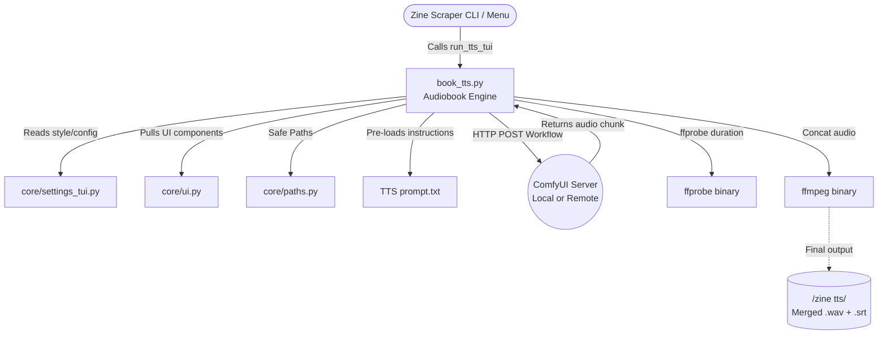

# 📌 - zine tts command is only made for custom comfi workflow .

# 🎙️ Qwen3-TTS Integration Guide

This guide covers how to download the official Qwen3-TTS models and properly set them up in your local ComfyUI environment for the Zine Scraper's audiobook TTS generator.


## 📺 Video References & Installation Guides
If you need step-by-step visual instructions on how to install ComfyUI and set up models, please refer to the following community video guides based on your operating system:

* **[Linux Manual Installation Guide](https://www.youtube.com/watch?v=Z8LR2FCZKrg)** - Command-line focused manual setup for Linux users.

## 📥 1. Downloading the Models (linux) ---- this is what i did
Qwen provides multiple variants of the TTS models depending on your goals. You will need to download the model files directly from HuggingFace.

* **[Qwen3-TTS-12Hz-0.6B-CustomVoice](https://huggingface.co/Qwen/Qwen3-TTS-12Hz-0.6B-CustomVoice)**: Lightweight preset-based inference.
* **[Qwen3-TTS-12Hz-1.7B-CustomVoice](https://huggingface.co/Qwen/Qwen3-TTS-12Hz-1.7B-CustomVoice)**: Heavyweight preset-based inference (Higher quality).
* **[Qwen3-TTS-12Hz-1.7B-VoiceDesign](https://huggingface.co/Qwen/Qwen3-TTS-12Hz-1.7B-VoiceDesign)**: Generates unique voices entirely from text descriptions/prompts (Zero-shot narrator design).

**Download Instructions:**
1. Navigate to the HuggingFace repository for your desired model (e.g. [Qwen3-TTS-12Hz-1.7B-VoiceDesign](https://huggingface.co/Qwen/Qwen3-TTS-12Hz-1.7B-VoiceDesign)).
2. Under the **Files and versions** tab, download all the `.safetensors`, `.json`, and tokenizer files for the model. 
3. *Alternative*: You can clone the repository directly using `git lfs clone https://huggingface.co/Qwen/Qwen3-TTS-12Hz-1.7B-VoiceDesign`.

## ⚙️ 2. Connecting to ComfyUI
To connect these models to your Zine Scraper setup, you must install the custom nodes and place the models in the correct ComfyUI directories.

1. **Install the Custom Node**: Inside your `/ComfyUI/custom_nodes/` directory, clone the Qwen TTS integration repository:
   ```bash
   git clone https://github.com/StartHua/ComfyUI-Qwen-TTS
   ```
2. **Install Dependencies**: Run `pip install -r requirements.txt` from inside the `ComfyUI-Qwen-TTS` folder.
3. **Place the Models**: Move the downloaded HuggingFace model folders into the proper ComfyUI directory:
   ```text
   /ComfyUI/models/LLM/Qwen3-TTS-12Hz-1.7B-VoiceDesign
   /ComfyUI/models/LLM/Qwen3-TTS-12Hz-1.7B-CustomVoice
   ```
4. **Restart ComfyUI**: Launch your server (e.g., `./start.sh` or `python main.py` on port `8188`).

## 🔗 3. Flexible Network Connectivity
By default, the Zine Scraper expects your ComfyUI server to be running on the same machine (`http://127.0.0.1:8188`). However, if you are running ComfyUI on a dedicated GPU server or a different PC on your network, you can easily change this:

1. Launch the Scraper and type `settings`.
2. Locate the **Qwen TTS Server URL** option.
3. Update it to match your remote IP (e.g., `http://192.168.1.100:8188`).
4. The Zine Scraper will dynamically re-route all audiobook chunking and generation payloads to your external GPU rig!

---

### 🤷‍♂️ P.S. What about XTTS, Parler, Bark, etc.?
*The developer (me) had alredy suffered from building this project , just cant waste too much time to add more stuff , not to mention setting them up is hassale and testing other tts will take too much time so , i just settel down for comfi cause it is easy to use and install*

---

## 🔍 Deep Dive Analysis & Module Architecture

### 🌳 Directory Tree Structure
```text
Qween tts/
├── README.md         # This documentation file
├── TTS prompt.txt    # Empty text file for custom voice instruct prompts
├── book_tts.py       # Core audiobook generation script
└── __pycache__/      # Python bytecode cache
```

### 📄 File Explanations

#### `TTS prompt.txt`
An empty, unformatted text file intended to act as a container for Voice Design prompt instructions. In a ComfyUI TTS pipeline, voice traits (e.g., "sultry", "deep voice", "energetic") are driven by textual descriptions. If the scraper settings point the `tts_voice_instruct` configuration variable to this file, the engine will read its contents and prepend those stylistic rules to the text fed into the ComfyUI API, dynamically shaping the narrator's tone without hardcoding the instructions into the Python source.

#### `book_tts.py`
This is the workhorse of the directory—a complex engine script designed to convert full `.txt` book files into fully synchronized, fully stitched `.wav` audiobooks with accompanying `.srt` subtitle files, all while utilizing a ComfyUI server for inference.

**What it actually does:**
1. **Logging Initialization:** `init_tts_logger` sets up a dedicated JSON log file (`zine tts/logs/<filename>_<timestamp>.log`), keeping TTS inference logs completely separate from the scraper's standard logger.
2. **Semantic Text Parsing & Chunking (`split_text_into_chunks` & `_is_narratively_special`):** It doesn't just cut strings by character length. It parses paragraphs into semantic kinds—detecting if a paragraph is a chapter title, a system notification, an energetic one-liner, a verse/poem, or quoted dialogue. It tags each chunk with an invisible preamble (via `_tag_chunk` and `_KIND_INSTRUCT_SUFFIX`) so that the Qwen TTS LLM automatically shifts its intonation to match the narrative context. Pure markdown noise (like `***` or `[Words: 1200]`) is intelligently discarded.
3. **ComfyUI API Interaction:** It formulates specific node workflows based on the user's config mode (`Voice Design`, `Voice Cloning`, or `Custom Voice`). It sends these JSON workflows to `http://<comfyui_url>:8188/prompt` using standard `urllib`. If voice cloning is enabled, it uses `upload_audio_to_comfy` to post multipart form-data to `/upload/image`. It then aggressively polls the `/history` endpoint to detect when generation is completed, finally downloading the resulting `.wav` chunk via `/view`.
4. **Live TUI Processing (`process_book_live`):** Wraps the entire loop in a gorgeous `rich` Terminal User Interface. It creates a temporary directory (`zine tts/_temp_/<book_name>`) and caches generated chunks there. If a chunk already exists, it skips generation. This prevents data loss on crashing. It uses a separate thread (`monitor_keyboard`) listening to `sys.stdin` to detect `Ctrl+R` for early abortion and emergency audio merging.
5. **Subtitles & FFmpeg Assembly:** As chunks complete, it runs `ffprobe` to find the exact audio duration in milliseconds, appending lines to an `.srt` subtitle array. Once all chunks finish, it dynamically writes an absolute-path `concat.txt` and calls system `ffmpeg` to stitch the files together. Crucially, it forces the codec to `pcm_s16le` and sample rate to `24000`, rectifying Qwen's broken wrapper output. It then destroys the temporary `_temp_` chunks and finally hits the ComfyUI `/free` endpoint to flush the VRAM.

**Web-Like Connections:**

