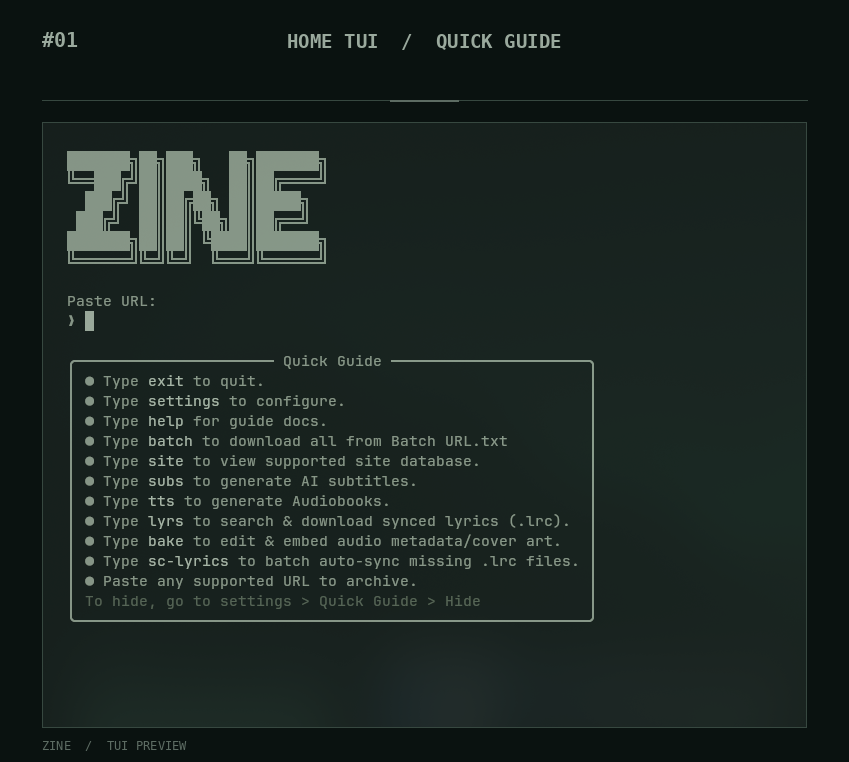
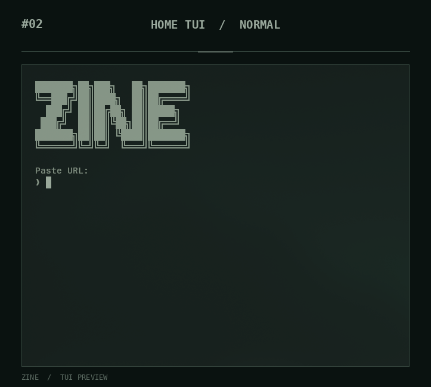
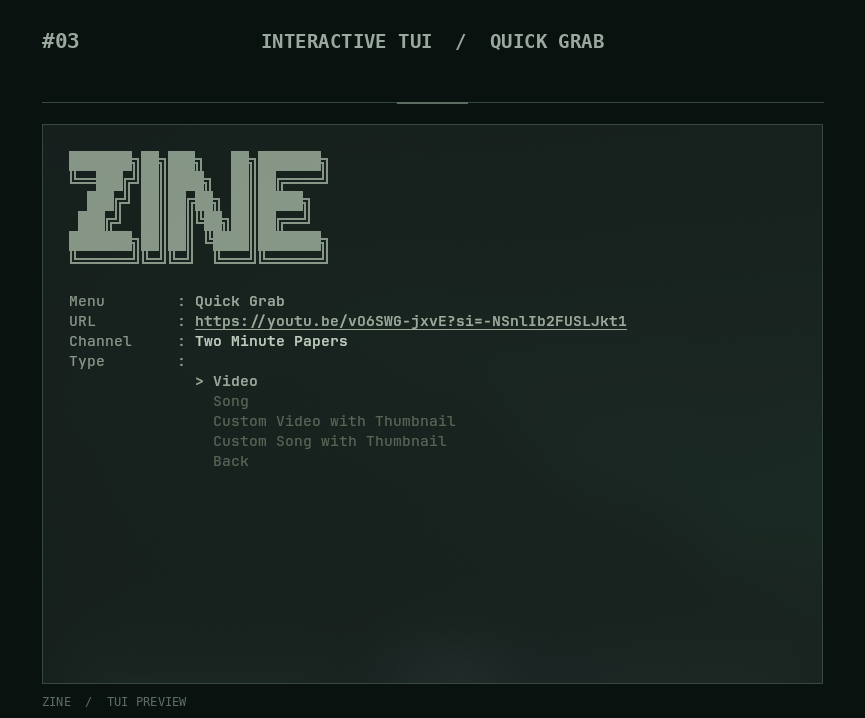
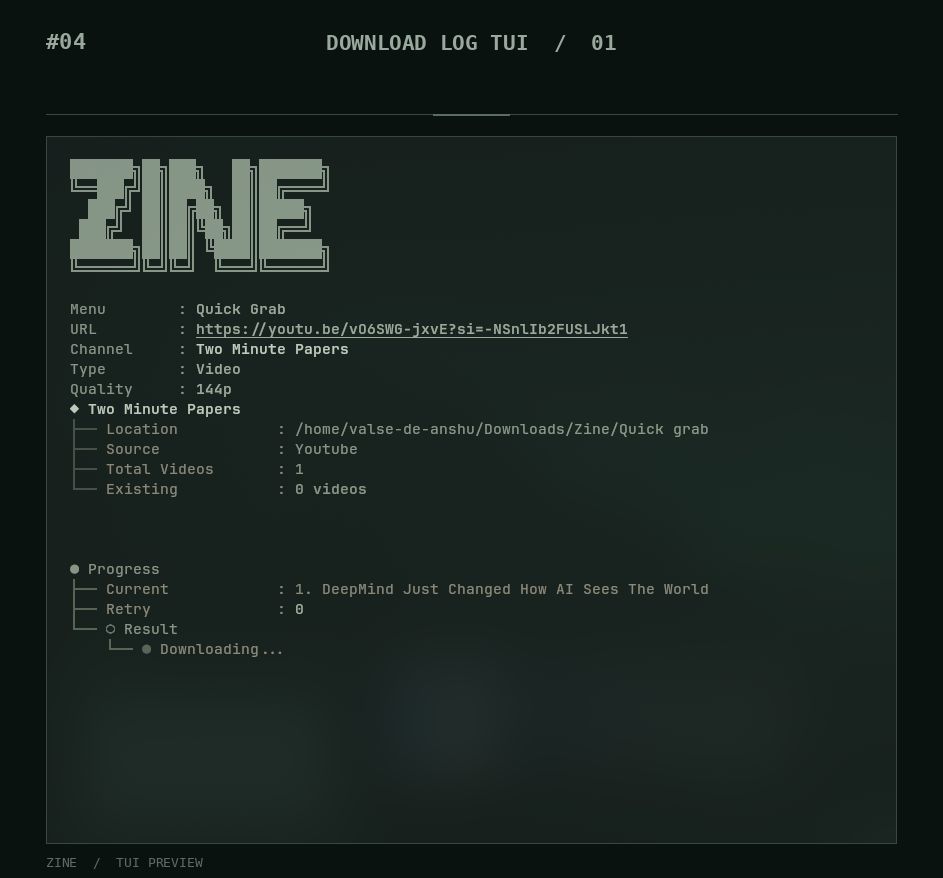
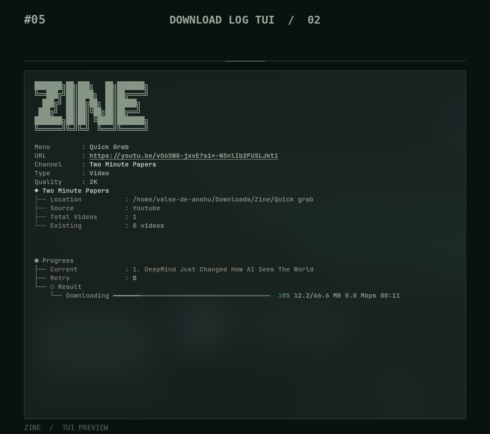
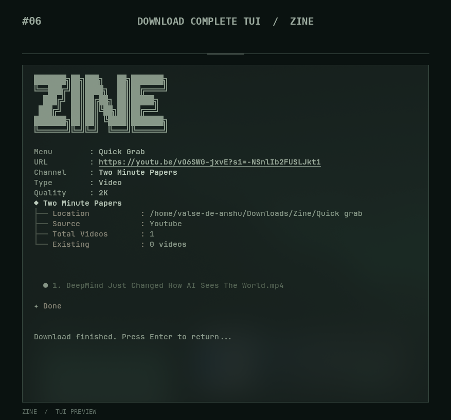
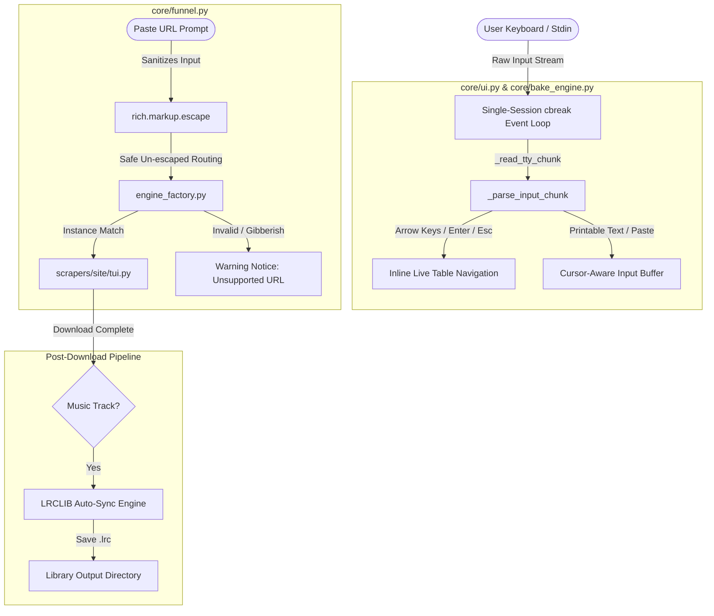

# Zine Scraper Suite

<div align="center">

```text
███████╗██╗███╗   ██╗███████╗
╚══███╔╝██║████╗  ██║██╔════╝
  ███╔╝ ██║██╔██╗ ██║█████╗  
 ███╔╝  ██║██║╚██╗██║██╔══╝  
███████╗██║██║ ╚████║███████╗
╚══════╝╚═╝╚═╝  ╚═══╝╚══════╝
```

**A high-performance, modular desktop media archiver & TUI suite.**  
Download and permanently archive manga, webtoons, anime, videos, music, lyrics, metadata, light novels, and image galleries — all from a single terminal prompt.


[](https://discord.gg/suJD5xtFj)


</div>

---

<a id="table-of-contents"></a>
## 📋 Table of Contents

1. [Requirements & Prerequisites (Fresh OS / VM)](#requirements--prerequisites-fresh-os--virtualbox)
2. [Installation Guide](#installation)
3. [How to Launch](#how-to-launch)
4. [TUI Showcase & Previews](#tui-showcase--previews)
5. [New Audio & Metadata Engines](#new-audio--metadata-engines)
6. [AI Speech & Subtitle Models Guide (Whisper)](#ai-speech--subtitle-models-guide-models)
7. [Available Commands](#available-commands)
8. [Themes & Browser Cookies](#themes--browser-cookies)
9. [Supported Platforms](#supported-platforms)
10. [Behind The Doors — Underground Engineering](#behind-the-doors--underground-engineering)
11. [Project Architecture](#project-architecture)
12. [Developer Guide — Adding a New Site](#developer-guide--adding-a-new-site)
13. [A Message From The Creator & Contribution](#a-message-from-the-creator-anshu--valse)
14. [Credits & Acknowledgments](#credits--acknowledgments)

---

<a id="requirements--prerequisites-fresh-os--virtualbox"></a>
## ⚙️ Requirements & Prerequisites (Fresh OS / VirtualBox)

If you just installed a fresh copy of **Linux**, **macOS**, or **Windows** (e.g. in VirtualBox, VMware, or bare-metal), you only need two basic tools installed before cloning: **Git** and **Python 3.10+**. The Zine one-click installer handles all other heavy lifting automatically.

### 🐧 Linux (Ubuntu / Debian / Arch / Fedora / openSUSE)
Open your terminal and run the prerequisite command for your distro:
* **Ubuntu / Debian / Mint:**
  ```bash
  sudo apt update && sudo apt install -y git python3 python3-pip python3-venv curl
  ```
* **Arch Linux / Manjaro:**
  ```bash
  sudo pacman -Sy --noconfirm git python python-pip curl
  ```
* **Fedora / RHEL:**
  ```bash
  sudo dnf install -y git python3 python3-pip curl
  ```
* **openSUSE:**
  ```bash
  sudo zypper install -y git python3 python3-pip python3-venv curl
  ```

### 🍏 macOS
1. Open the Terminal application.
2. If you don't have Homebrew installed, install it:
   ```bash
   /bin/bash -c "$(curl -fsSL https://raw.githubusercontent.com/Homebrew/install/HEAD/install.sh)"
   ```
3. Install Git and Python:
   ```bash
   brew install git python
   ```

### 🪟 Windows 10 / 11
1. **Install Git**: Download and install from [git-scm.com](https://git-scm.com/) (or run in PowerShell: `winget install Git.Git`).
2. **Install Python 3.10+**: Download from [python.org](https://www.python.org/downloads/) or run:
   ```cmd
   winget install Python.Python.3.11
   ```
   > [!IMPORTANT]
   > When installing Python on Windows, **MAKE SURE TO CHECK THE BOX**: ☑️ **"Add Python to PATH"**!

---

<a id="installation"></a>
## 🚀 Installation Guide

### Step 1 — Clone the repository
Open your terminal / command prompt and clone the repository:
```bash
git clone https://github.com/<your-username>/zine-scraper.git
cd "zine scraper"
```

### Step 2 — Run the 1-Click Automated Installer
Zine provides auto-installers in the `run me/` folder that automatically set up the entire environment:

**🐧 Linux / 🍏 macOS:**
```bash
cd "run me"
chmod +x install.sh run.sh
./install.sh
```

**🪟 Windows:**
* Open the `zine scraper\run me` folder in File Explorer and double-click **`install.bat`** (or open Command Prompt):
  ```cmd
  cd "run me"
  install.bat
  ```

---

### 🛠️ What the Automated Installer Does:
1. **Installs System Binaries**: Automatically fetches and configures `ffmpeg` (audio/video merging & tag baking), `aria2` (multi-threaded acceleration), `atomicparsley`, and `unzip`.
2. **Installs Deno Runtime**: Sets up the Deno JavaScript engine required for stream decryption on sites like `hanime.tv`.
3. **Creates Isolated Python VENV**: Creates an isolated `venv/` environment so dependencies never collide with your global Python system packages.
4. **Installs 40+ Python Libraries**: Installs all required modules from `requirements.txt` (`yt-dlp`, `curl_cffi`, `playwright`, `mutagen`, `rich`, `deep-translator`, `faster-whisper`, etc.).
5. **Downloads Playwright Chromium**: Fetches stealth browser binaries for scraping JavaScript-heavy single-page applications.
6. **Boots the 1-Time Setup Wizard**: Launches the interactive wizard to let you pick your **Library Root Folder**, **Tokyo Night / Dark Theme**, and rate-limiting delay preferences!

---

<a id="how-to-launch"></a>
## ▶️ How to Launch

After installation is complete, launch Zine Scraper anytime using the universal launchers:

**🐧 Linux / 🍏 macOS:**
```bash
cd "zine scraper"
./"run me"/run.sh
```
*(Or simply: `source venv/bin/activate && python orchestrator.py`)*

**🪟 Windows:**
* Double-click **`run.bat`** inside the `run me\` folder.
* Or in Command Prompt:
  ```cmd
  cd "zine scraper"
  "run me\run.bat"
  ```

---

<a id="tui-showcase--previews"></a>
## 🖼️ TUI Showcase & Previews

Experience the zero-leak raw TTY cbreak interface and rich dark mode aesthetics in action:

| Interface State | Preview Screenshot |
|---|---|
| **Main Prompt (Quick Guide)** |  |
| **Main Prompt (Clean)** |  |
| **Interactive Scraper Selector** |  |
| **Live Multi-Thread Download Log** |  |
| **Active Extraction Pipeline** |  |
| **Download Complete & Summary** |  |

---

<a id="new-audio--metadata-engines"></a>
## 🎵 New Audio & Metadata Engines

Zine Scraper Suite now features three dedicated audio & lyrics modules directly accessible from the main terminal prompt:

```
  ┌───────────────────────────────────────────────────────────────────────────────────┐
  │ ❖ AUDIO SUITE TOOLKIT                                                             │
  ├───────────────┬───────────────────────────────────────────────────────────────────┤
  │ Command       │ Description                                                       │
  ├───────────────┼───────────────────────────────────────────────────────────────────┤
  │ bake          │ Audio Metadata & Cover Art Baking Engine (FFmpeg / Mutagen)       │
  │ lyrs          │ Synced .LRC Lyrics Search & Downloader Engine (LRCLIB API)        │
  │ sc-lyrics     │ Folder Batch Scanner & Synced .LRC Auto-Sync Engine               │
  └───────────────┴───────────────────────────────────────────────────────────────────┘
```

### 1. Audio Metadata & Cover Art Baking Engine (`bake`)
View, edit, and bake metadata tags (**Title**, **Artist**, **Album**, **Year**, **Genre**, **Track Number**) and embed high-resolution **Cover Art** into audio files (`.flac`, `.mp3`, `.m4a`, `.wav`, `.ogg`, `.opus`).
- **Inline Editing Table**: Edit all tag fields directly inside an interactive Rich Live table using `↑↓` navigation.
- **Smart Path Resolution**: Supports drag-and-drop paths, `file://` URIs, URL-encoded spaces (`%20`), and `~` home expansion.
- **Recent Downloads Picker**: Pressing `Enter` on an empty prompt scans your `~/Downloads/Zine` directory and opens a `Selector` menu to pick audio tracks without typing any paths.
- **In-Place Preservation**: Modifies audio files directly in their original directory without creating duplicate files.

### 2. Synced Lyrics Downloader (`lyrs`)
Search for synchronized `.lrc` lyrics for any track or artist using fuzzy query matching against the LRCLIB API.
- Live timestamped preview of lyrics.
- Automatic filename matching to your local audio tracks.
- Exports `.lrc` files right next to the target audio file.

### 3. Folder Batch Lyrics Auto-Sync (`sc-lyrics`)
Scans entire music folders for downloaded audio tracks missing `.lrc` files and automatically fetches and saves synced lyrics in bulk.
- Live scrolling log of scanned files and sync statuses.
- Automatic background lyric sync during music downloads (`youtube`, `soundcloud`).

---

<a id="ai-speech--subtitle-models-guide-models"></a>
## 🎙️ AI Speech & Subtitle Models Guide (`Models/`)

This directory is the local storage hub for offline AI Speech-to-Text models used by Zine Scraper's built-in **AI Subtitle Generator** (`subs` command).

### 📋 What is Faster-Whisper?
Zine uses **`faster-whisper`** (powered by CTranslate2), a reimplementation of OpenAI's Whisper model that runs up to **4x faster with lower memory usage**.

### Required Model Files
A valid model folder must contain these essential files:
```text
Models/faster-whisper-large-v3-turbo/
├── config.json
├── model.bin                      (~1.6 GB)
├── preprocessor_config.json
├── tokenizer.json
└── vocabulary.json
```

### 🚀 How to Download & Install the Model
Choose **ANY** of the 4 simple installation methods below:

#### Method 1 — 1-Click Python Download (Recommended)
Run this single command from your `zine scraper` root directory (inside your activated `venv`):
```bash
python -c "from huggingface_hub import snapshot_download; snapshot_download(repo_id='deepdml/faster-whisper-large-v3-turbo', local_dir='Models/faster-whisper-large-v3-turbo')"
```

#### Method 2 — Hugging Face CLI
If you have `huggingface-hub` installed (`pip install huggingface_hub`):
```bash
# Large-v3-Turbo (~1.6 GB) — State-of-the-art accuracy & ultra-fast inference:
huggingface-cli download deepdml/faster-whisper-large-v3-turbo --local-dir Models/faster-whisper-large-v3-turbo

# Standard Large-v3 (~3.1 GB) — Maximum multi-lingual fidelity:
huggingface-cli download Systran/faster-whisper-large-v3 --local-dir Models/faster-whisper-large-v3

# Medium (~1.5 GB) — Optimized for 4GB VRAM GPUs:
huggingface-cli download Systran/faster-whisper-medium --local-dir Models/faster-whisper-medium

# Small (~480 MB) — Lightweight for CPU-only inference:
huggingface-cli download Systran/faster-whisper-small --local-dir Models/faster-whisper-small
```

#### Method 3 — High-Speed Download via `aria2c` / `curl` / `wget`
* **🐧 Linux / 🍏 macOS:**
  ```bash
  mkdir -p Models/faster-whisper-large-v3-turbo
  cd Models/faster-whisper-large-v3-turbo
  BASE="https://huggingface.co/deepdml/faster-whisper-large-v3-turbo/resolve/main"
  curl -L -O "$BASE/config.json"
  curl -L -O "$BASE/model.bin"
  curl -L -O "$BASE/preprocessor_config.json"
  curl -L -O "$BASE/tokenizer.json"
  curl -L -O "$BASE/vocabulary.json"
  cd ../..
  ```
* **🪟 Windows (PowerShell):**
  ```powershell
  New-Item -ItemType Directory -Force -Path "Models\faster-whisper-large-v3-turbo"
  cd "Models\faster-whisper-large-v3-turbo"
  $base = "https://huggingface.co/deepdml/faster-whisper-large-v3-turbo/resolve/main"
  Invoke-WebRequest -Uri "$base/config.json" -OutFile "config.json"
  Invoke-WebRequest -Uri "$base/model.bin" -OutFile "model.bin"
  Invoke-WebRequest -Uri "$base/preprocessor_config.json" -OutFile "preprocessor_config.json"
  Invoke-WebRequest -Uri "$base/tokenizer.json" -OutFile "tokenizer.json"
  Invoke-WebRequest -Uri "$base/vocabulary.json" -OutFile "vocabulary.json"
  cd ..\..
  ```

#### Method 4 — Git LFS Clone
```bash
git lfs install
git clone https://huggingface.co/deepdml/faster-whisper-large-v3-turbo Models/faster-whisper-large-v3-turbo
```

### 📊 Hardware Requirements & Comparison
| Model | Disk Size | Recommended VRAM | Precision | Recommended Hardware |
|---|---|---|---|---|
| **`large-v3-turbo`** *(Default)* | **~1.6 GB** | **4GB - 6GB** | INT8 / FP16 | **NVIDIA RTX 20/30/40 Series, Apple M-Series, Fast CPU** |
| **`large-v3`** | ~3.1 GB | 6GB - 8GB | INT8 / FP16 | NVIDIA RTX 3080/4080 or higher |
| **`medium`** | ~1.5 GB | 3GB - 4GB | INT8 | GTX 1660 / RTX 3050 laptops |
| **`small`** | ~480 MB | 2GB / CPU | INT8 | Low-spec laptops & CPU-only machines |

### ⚙️ How to Configure faster-whisper in Zine Scraper
1. Launch Zine Scraper (`python orchestrator.py` or `./"run me"/run.sh` or `run me\run.bat`).
2. At the prompt, type **`settings`** and press **Enter**.
3. Under the **`AI & Subtitles`** section:
   - **AI Subtitles Mode**: Choose `Both` (Original + English Translated), `Target Only`, or `Original Only`.
   - **Target Language**: Select your preferred language (e.g. `English`, `Japanese`, `Spanish`, `French`, `German`).
   - **Model Path**: Confirm it points to your model (Default: `~/Models/faster-whisper-large-v3-turbo` or `Models/faster-whisper-large-v3-turbo`).
   - **VRAM Target**: Select `6GB (INT8)` (recommended for speed/memory balance), `8GB (FP16)`, or `CPU`.

### 🎬 How to Use the Subtitle Generator (`subs`)
1. In the main Zine terminal prompt, run:
   ```text
   ❯ subs
   ```
2. Paste the file path of any downloaded video or audio file (`.mp4`, `.mkv`, `.flac`, `.mp3`).
3. Zine will transcribe the audio track with millisecond timestamps, translate the dialogue, and output a clean `.srt` subtitle file directly next to the media file!

---

<a id="available-commands"></a>
## 💬 Available Commands

Type any of these directly at the main `Paste URL:` prompt:

| Command | Category | Description |
|---|---|---|
| `bake` | **Audio** | Launch the Audio Metadata & Cover Art Baking Engine |
| `lyrs` | **Audio** | Search and download synced `.lrc` lyrics |
| `sc-lyrics` | **Audio** | Batch scan folders and auto-sync missing `.lrc` lyrics |
| `slice` | **Tools** | Manhua Image Slicer (splits tall webtoon strips into pages) |
| `subs` | **AI Tools**| AI Subtitle Generator (faster-whisper GPU transcription — see [Models Guide](file:///home/valse-de-anshu/.config/zine%20scraper/Models/README.md)) |
| `tts` | **AI Tools**| Audiobook Synthesizer (Text-To-Speech generation) |
| `settings` | **System** | Open Settings Configurator (paths, themes, delays) |
| `site` | **System** | Open the interactive Supported Site Database |
| `batch` | **System** | Process queued URLs from `Batch URL.txt` |
| `help` | **System** | Open full markdown documentation viewer |
| `exit` / `q` | **System** | Exit Zine Scraper Suite cleanly |

---

<a id="themes--browser-cookies"></a>
## 🎨 Themes & Browser Cookies

### 80+ Built-In Color Themes
Zine ships with 80+ custom themes selectable via `settings` → **Color Theme**:  
*Tokyo Night Storm · Catppuccin · GitHub Dark · Dracula · Nord · One Dark · Rose Pine · Monokai Pro · Ayu Dark · Solarized Dark · Horizon · Oxocarbon*

### Automatic Cookie Pass-Through
Scrapers automatically extract session cookies from your default local browser (**Zen, Firefox, Chrome, Edge**) via `browser_cookie3` to bypass login walls, Cloudflare checks, or age restrictions seamlessly without requiring passwords.

---

<a id="supported-platforms"></a>
## 🌐 Supported Platforms ( In future these sites may be taken down or shutdown )

### Manga / Webtoon / Comics
| Site | Domains | Features |
|---|---|---|
| Asura Scans | `asurascans.com`, `asuracomic.net` | Manhwa chapters & batch download |
| Omega Scans | `omegascans.org` | Manhwa chapters |
| Manhwa US | `manhwaus.net` | Manhwa chapters |
| Weeb Central | `weebcentral.com` | Manga chapters |
| Manhua Plus | `manhuaplus.org` | Manhua chapters |
| Kunmanga | `kunmanga.co.uk` | Manga chapters |
| Mangak | `mangak.io` | Manga chapters |
| Project Suki | `projectsuki.com` | Manga chapters |
| Fanfox | `fanfox.net` | Manga chapters |

### Anime / Video
| Site | Features |
|---|---|
| HiAnime | Episode resolution selection + HLS extraction |
| Anitaku | Anime stream downloading |
| Anikai, Anikoto, Anineko | Alternate anime mirror scrapers |
| Miruro | Anime stream scraping |
| YouTube | Video/Playlist archiving via yt-dlp |
| Pornhub | Adult video archiving via yt-dlp |

### Hentai / Adult
| Site | Features |
|---|---|
| Hanime.tv | HLS + JS token extraction (via Deno) |
| Hanime.red | HLS extraction |
| HentaiHaven / Hstream / Oppai | Native yt-dlp plugins |
| NHentai / ASMHentai | Full gallery image archiving |
| Hentai18 / Hentai20 / HentaiCity | Gallery & stream scrapers |

### Audio / Music / Books / Light Novels
| Site | Features |
|---|---|
| YouTube Music | High-fidelity lossless FLAC audio, Vorbis metadata, cover art, synced `.lrc` lyrics, batch albums/playlists |
| SoundCloud | Audio downloading + auto `.lrc` lyric sync |
| IDAGIO | Classical music archiving + metadata tagging |
| Project Gutenberg | Public domain e-book archiving |
| Chikari | SvelteKit REST API chapter scraper + comic reader |
| NovelBuddy | Next.js light novel metadata, clean text, and chapter indexing |
| NovelFire | Multi-page pagination light novel reader with ad sanitization |
| NovelPhoenix | Asian web novel and cultivation aggregator scraper |
| NovelArchive | Direct REST API reader for web serials |
| Light Novel World | Legacy light novel chapter scraper (deprecated/shutting down) |

---

<a id="behind-the-doors--underground-engineering"></a>
## 🧠 Behind The Doors — Underground Engineering

Under the hood, Zine Scraper Suite implements low-level terminal cbreak processing and strict defensive sanitization:



### 1. Single-Session Cbreak Event Processing (`_read_tty_chunk` & `_parse_input_chunk`)
- **No Keystroke Locks**: Replaced per-keystroke `tty.setraw()` invocations with a single `tty.setcbreak()` session, eliminating stdin blocking locks and 30Hz loop latency.
- **Zero ANSI Sequence Leaks**: Handles multi-byte escape sequences (`\x1b[A`, `\x1b[B`, `\x1b[C`, `\x1b[D`, `\x1b[H`, `\x1b[F`) cleanly. Arrow keys, `Backspace`, `Delete`, `Home`, `End`, and `ESC` navigate without spewing control characters (`^[[D`, `^[[C`, `^[`) into your terminal.
- **Fallback Guarding**: All `termios` ioctl calls are wrapped in `try...except Exception` to prevent crashes in non-standard terminals, tmux sessions, or IDE windows.

### 2. Universal URL Route & Rich Markup Sanitization (`rich.markup.escape`)
- **Crash Prevention**: All user inputs, pasted URLs, and error tracebacks passed to `console.print()` are sanitized through `rich.markup.escape()`.
- **Bracket & Gibberish Protection**: Pasting malformed URLs, random gibberish, closing tags like `[/]`, or strings with square brackets (`[test]`) can no longer trigger `rich.errors.MarkupError` or `UnboundLocalError`. The suite safely prints a formatted `[warning]Unsupported URL or command[/warning]` notice and returns to the menu.

### 3. FFmpeg Metadata & Cover Art Baking Engine
- Audio tag baking uses FFmpeg stream copying (`-c copy`) to inject metadata tags and attached picture streams (`attached_pic`) into MP3, FLAC, M4A, OGG, and OPUS files in-place with zero quality loss.

---

<a id="project-architecture"></a>
## 🗂️ Project Architecture

```
zine-scraper/
│
├── orchestrator.py          ← Entry point — boots the suite
│
├── core/
│   ├── funnel.py            ← Command dispatcher, URL router, sanitization
│   ├── ui.py                ← Rich TUI primitives, raw TTY event parser, themes
│   ├── bake_engine.py       ← Audio Metadata & Cover Art Baking Engine
│   ├── lyrics_engine.py     ← LRCLIB Synced Lyrics Search & Auto-Sync Engine
│   ├── settings_tui.py      ← Isolated Settings Configurator TUI
│   ├── site_tui.py          ← Supported Sites Database TUI
│   ├── image_slicer.py      ← Manhua/Webtoon image strip slicer tool
│   ├── config.py            ← User preferences persistence
│   ├── paths.py             ← Library filesystem authority
│   ├── storage.py           ← File system & download history layer
│   └── history.py           ← Download tracking
│
├── scrapers/
│   └── <site>/              ← Self-contained site scraper package
│       ├── engine.py        ← Extraction & parsing logic
│       ├── tui.py           ← Site TUI workflow
│       └── workflow.py      ← Isolated download orchestrator
│
├── plugins/
│   └── yt_dlp_plugins/      ← Custom yt-dlp extractors
│
├── Models/                  ← Local offline AI Speech-to-Text models (Whisper)
│   └── README to downlode ai model.md
│
├── preview/                 ← TUI screenshots & showcase previews
│
├── theme/
│   └── registry.py          ← 80+ color themes (Tokyo Night Storm, Catppuccin, etc.)
│
├── docs/
│   └── help.md              ← In-app documentation
│
└── run me/
    ├── install.sh           ← Linux/macOS auto-installer
    ├── install.bat          ← Windows auto-installer
    ├── run.sh               ← Linux/macOS universal runner
    └── run.bat              ← Windows universal runner
```

---

<a id="developer-guide--adding-a-new-site"></a>
## 🛠️ Developer Guide — Adding a New Site

Every scraper under `scrapers/<site>/` is **completely isolated**. Adding a new platform requires zero changes to core shared loops.

### 1. Create the scraper directory
```bash
mkdir scrapers/mysite
touch scrapers/mysite/__init__.py
touch scrapers/mysite/engine.py
touch scrapers/mysite/tui.py
```

### 2. Implement `engine.py`
```python
# scrapers/mysite/engine.py

class MySiteEngine:
    def __init__(self, url: str):
        self.url = url

    def fetch_media(self) -> list:
        ...
```

### 3. Implement `tui.py`
```python
# scrapers/mysite/tui.py

from core.ui import console, Selector, set_active_live

def handle_tui(url, hist_layer, store_layer, scraper, batch_path=None, is_batch=False):
    if not is_batch and sys.stdin.isatty():
        # Interactive mode
        ...
    else:
        # Headless batch mode
        ...
```

### 4. Register in `core/site_map.py`
```python
SITE_MAP = {
    "mysite.com": "mysite",
}
```

---

<a id="a-message-from-the-creator-anshu--valse"></a>
## ✉️ A Message From The Creator (Anshu / Valse) & Contribution

> [!IMPORTANT]
> ### 📌 A Message From The Creator (Anshu / Valse)
>
> *"I am a 17-year-old developer, and I dedicated 3 full months of my life to building, refining, and perfecting Zine Scraper Suite. As I am currently preparing for competitive exams, Zine Scraper was my first and final passion project until I secure admission into my dream college.*
>
> *Due to time limitations, I have tested Zine Scraper thoroughly on my machine and a few other systems, and in my experience, it worked smoothly across all of them. However, if you happen to find any flaw, error, or bug:*<br><br>
> 1. **Join our Discord Group**: [https://discord.gg/suJD5xtFj](https://discord.gg/suJD5xtFj)<br>
> 2. **Report or explain the issue in the group**: When I have free time, I will jump in to fix it!<br>
> 3. **Or do the heavy lifting yourself**: If you are a developer and want to contribute or fix issues on your own — welcome to the family!<br><br>
> *"After dedicating myself to perfecting this TUI software, I am stepping back to focus on something crucial for my life and future. Once I accomplish this milestone, I will be back with even crazier, bigger projects in the future!"*
>
> ```
> ┌────────────────────────┐     ┌────────────────────────┐     ┌────────────────────────┐     ┌────────────────────────┐
> │ 3 Months of Dedication │ ──► │ Zine Scraper Suite TUI │ ──► │  Competitive Exam Prep │ ──► │ Future Crazy Projects  │
> │   (Building & Coding)  │     │   (Perfected & Built)  │     │     (Focusing Now)     │     │      (Will Return!)    │
> └────────────────────────┘     └────────────────────────┘     └────────────────────────┘     └────────────────────────┘
> ```

---

<a id="credits--acknowledgments"></a>
## ❤️ Credits & Acknowledgments

```
  ┌─────────────────────────────────────────────────────────────────────────────────────────────────────────────────┐
  │ ❖ CREDITS & ACKNOWLEDGMENTS                                                                                     │
  ├───────────────────┬─────────────────────────────────────────────────────────────────────────────────────────────┤
  │ Contributor       │ Role & Primary Contributions                                                                │
  ├───────────────────┼─────────────────────────────────────────────────────────────────────────────────────────────┤
  │ Anshu / Valse     │ Creator, Lead Architect & Solo Core Developer                                               │
  │                   │ • Designed & built 100% of all scraping logic, engines, and 23+ site scrapers from scratch. │
  │                   │ • Engineered the core architecture, Rich TUI framework, funnel router, and settings suite.  │
  │                   │ • Dedicated 3 months of solo engineering to create and perfect the Zine Scraper Suite.      │
  ├───────────────────┼─────────────────────────────────────────────────────────────────────────────────────────────┤
  │ Antigravity AI    │ AI Pair Programming Assistant                                                               │
  │ (Google DeepMind) │ • Debugged codebase issues, conducted empirical runtime verification & test suites.         │
  │                   │ • Refactored TUI event processing to zero-leak raw TTY cbreak loops for high responsiveness.|
  │                   │ • Assisted in architecture refactoring for site-level scraper isolation & crashproofing.    |
  └───────────────────┴─────────────────────────────────────────────────────────────────────────────────────────────┘
```

---