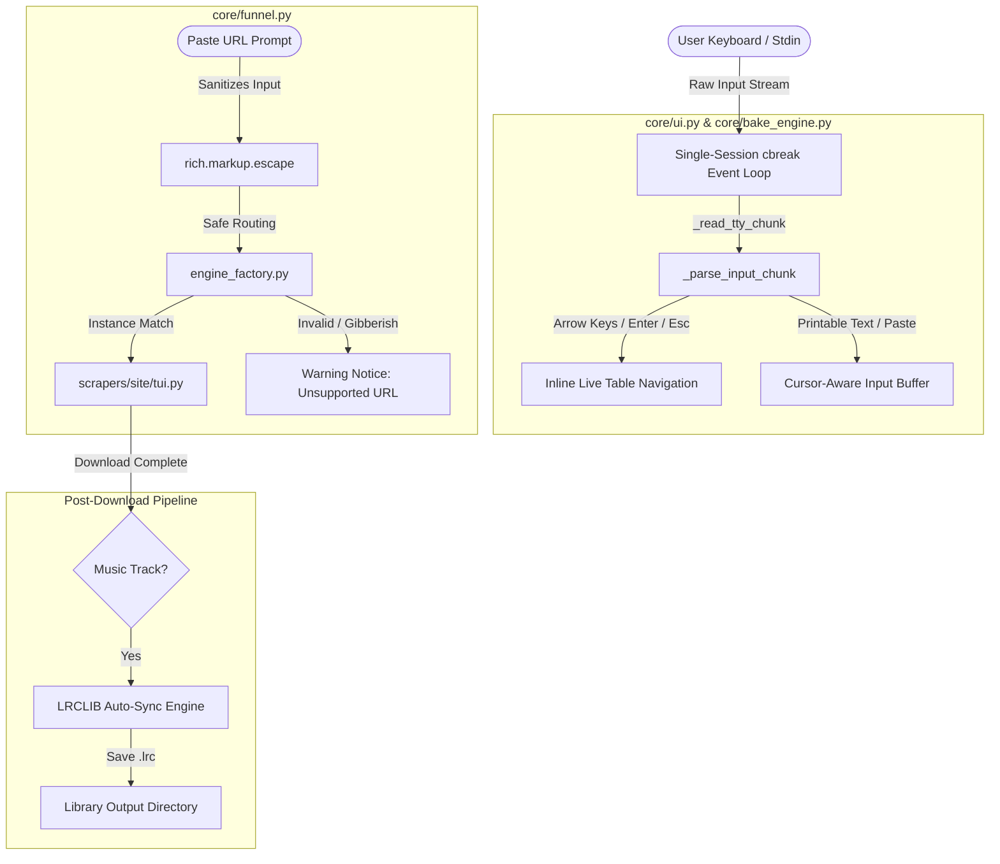

<div align="center">

<pre>
███████╗██╗███╗   ██╗███████╗
╚══███╔╝██║████╗  ██║██╔════╝
  ███╔╝ ██║██╔██╗ ██║█████╗  
 ███╔╝  ██║██║╚██╗██║██╔══╝  
███████╗██║██║ ╚████║███████╗
╚══════╝╚═╝╚═╝  ╚═══╝╚══════╝
</pre>

# Zine Scraper Suite

**A high-performance, modular desktop media archiver & rich TUI suite.**<br>
Download and permanently archive manga, webtoons, anime, videos, lossless music, synced lyrics, light novels, and image galleries — all from a single terminal prompt.

<p align="center">
  <a href="https://www.python.org/"></a>
  <a href="LICENSE"></a>
  <a href="https://discord.gg/suJD5xtFj"></a>
  <a href="https://github.com/valse-de-anshu/zine-scraper/releases"></a>
</p>

</div>

---

## 🔥 You've Been Streaming. We've Been Collecting.

There's a difference between watching something and *owning* it.

Right now, every show you love, every chapter you've been reading, every song that hits different at 2am — is being held **hostage**. One day the site goes down. One day you're on a plane with no Wi-Fi. One day the link just stops working.

**Zine Scraper gives you everything. Permanently. Offline. Yours.**

No buffering. No popups. No ads. No "this content is not available in your country."  
Just you, your media, and complete peace of mind.

---

### 🛋️ Imagine This Being Your Normal:

* 📚 **You find a manga or webtoon you like. You paste the link. That's it.**  
  Walk away. Come back to the entire series downloaded, numbered perfectly, cover art included — ready to read anywhere, even with your phone on airplane mode at 30,000 feet.

* 🎬 **You come across an anime or video you've been meaning to watch.**  
  Paste the link before you sleep. Wake up and it's already on your machine in full quality — no ads, no broken players, no "video removed" messages. Just press play.

* 🎵 **You hear a song that completely destroys you emotionally.**  
  Paste the link. Zine grabs the full-quality audio, embeds the album art and artist info, and even downloads the live synced lyrics so every word scrolls on your screen as it plays. Your music library will look and feel like you paid for a premium service.

* 📖 **You have a novel or book you've been meaning to get through, but reading off a screen kills your eyes.**  
  Paste it. Zine reads it to you — with actual expressive voices, character tone shifts, the whole thing. Close your eyes. Listen. Fall asleep to it if you want.

* 🎙️ **You find a foreign video with no subtitles and no translation.**  
  Drop it in. Zine listens to every word, understands the language, and writes you clean English subtitles automatically. On your machine. No internet needed.

* 🔞 **You find something you really don't want to lose.**  
  Paste the link. It's saved. Full quality. Before the site goes down, before the paywall hits, before it disappears forever.

* 😴 **You've got a whole list of things you want to save.**  
  Dump them all in one file, tell Zine to run, and go to sleep.  
  Wake up to your entire collection — downloaded, cleaned, organized, and ready.

> *The question isn't what Zine can do for you.*  
> *The question is — how much have you already missed without it?*

---

## 📋 Table of Contents

* [🖼️ TUI Showcase & Previews](#tui-showcase--previews)
* [🚀 Installation & Setup](#installation--setup)
  * [Prerequisites (Fresh OS / VirtualBox)](#1-prerequisites-fresh-os--virtualbox)
  * [1-Click Automated Installer](#2-run-the-1-click-installer)
  * [How to Launch](#3-how-to-launch)
* [💬 Available Commands](#available-commands)
* [🛠️ Feature Toolkit Deep Dive](#feature-toolkit-deep-dive)
  * [Audio & Metadata Suite (`bake`, `lyrs`, `sc-lyrics`)](#1-audio-suite--metadata-tagging)
  * [AI Speech & Subtitle Models (`subs`)](#2-ai-speech--subtitle-generator-subs)
  * [Qwen-TTS Audiobook Synthesizer (`tts`)](#3-qwen-tts-audiobook-generator-tts)
  * [Webtoon Image Slicer (`slice`)](#4-webtoon--manhua-image-slicer-slice)
* [🌐 Supported Platforms](#supported-platforms)
* [🧠 Behind The Doors — Underground Engineering](#behind-the-doors--underground-engineering)
* [🗂️ Project Architecture](#project-architecture)
* [✉️ Message From The Creator & Contribution](#message-from-the-creator--contribution)
* [❤️ Credits & Acknowledgments](#credits--acknowledgments)

---

<a id="tui-showcase--previews"></a>
## 🖼️ TUI Showcase & Previews

| Interactive Command Prompt | Chapter / Episode Selector |
| :---: | :---: |
|  |  |
| *Real-time URL detection & quick guide* | *Pick specific chapters or vacuum full series* |
| **Live Multi-Threaded Download Pipeline** | **Download Summary & Finished Media** |
|  |  |
| *Parallel chunk downloads with progress trees* | *Zero-loss media saved directly into your library* |

---

<a id="installation--setup"></a>
## 🚀 Installation & Setup

<a id="1-prerequisites-fresh-os--virtualbox"></a>
### 1. Prerequisites (Fresh OS / VirtualBox)

You only need **Git** and **Python 3.10+** installed before cloning. The automated installer handles all other tools and libraries automatically.

#### 🐧 Linux
```bash
# Ubuntu / Debian / Mint:
sudo apt update && sudo apt install -y git python3 python3-pip python3-venv curl

# Arch Linux / Manjaro:
sudo pacman -Sy --noconfirm git python python-pip curl

# Fedora / RHEL:
sudo dnf install -y git python3 python3-pip curl

# openSUSE:
sudo zypper install -y git python3 python3-pip python3-venv curl
```

#### 🍏 macOS
```bash
# Install Homebrew (if not already installed):
/bin/bash -c "$(curl -fsSL https://raw.githubusercontent.com/Homebrew/install/HEAD/install.sh)"

# Install Git and Python:
brew install git python
```

#### 🪟 Windows 10 / 11
1. **Install Git**: Download from [git-scm.com](https://git-scm.com/) or run `winget install Git.Git`.
2. **Install Python 3.10+**: Download from [python.org](https://www.python.org/downloads/) or run `winget install Python.Python.3.11`.
   > [!IMPORTANT]
   > On Windows, ensure you check the box: ☑️ **"Add Python to PATH"** during installation!

---

<a id="2-run-the-1-click-installer"></a>
### 2. Run the 1-Click Installer

```bash
# 1. Clone the repository:
git clone https://github.com/valse-de-anshu/zine-scraper.git
cd "zine-scraper"

# 2. Run the automated installer:
# On Linux / macOS:
cd "run me" && chmod +x install.sh run.sh && ./install.sh

# On Windows:
# Double-click "run me\install.bat" (or run in CMD: cd "run me" && install.bat)
```

**What the installer does automatically:**
1. Installs system binaries: `ffmpeg`, `aria2`, `atomicparsley`, and `unzip`.
2. Installs the Deno runtime for stream token decryption on sites like `hanime.tv`.
3. Creates an isolated virtual environment (`venv/`).
4. Installs all 40+ Python modules from `requirements.txt`.
5. Downloads Playwright stealth browser binaries for JavaScript single-page scrapers.
6. Boots the interactive First-Launch Setup Wizard to configure your library folders and color themes.

---

<a id="3-how-to-launch"></a>
### 3. How to Launch

After installation, launch Zine Scraper anytime using the universal launcher scripts:

* **🐧 Linux / 🍏 macOS:**
  ```bash
  cd "zine-scraper"
  ./"run me"/run.sh
  ```
  *(Or: `source venv/bin/activate && python orchestrator.py`)*

* **🪟 Windows:**
  ```cmd
  cd "zine-scraper"
  "run me\run.bat"
  ```

---

<a id="available-commands"></a>
## 💬 Available Commands

Type any of the following commands directly at the main `Paste URL:` prompt:

| Command | Category | Description |
|---|---|---|
| **`bake`** | **Audio** | Launch Audio Metadata & Cover Art Baking Engine (FFmpeg / Mutagen) |
| **`lyrs`** | **Audio** | Search and download synced `.lrc` lyrics for any song (LRCLIB) |
| **`sc-lyrics`** | **Audio** | Batch scan folders and auto-sync missing `.lrc` lyrics in bulk |
| **`slice`** | **Tools** | Webtoon Image Slicer (splits tall vertical strips into readable pages) |
| **`subs`** | **AI Tools** | AI Subtitle Generator (Faster-Whisper local GPU transcription & translation) |
| **`tts`** | **AI Tools** | Qwen-TTS Audiobook Synthesizer (voice design & character acting) |
| **`settings`** | **System** | Open Settings Configurator (download roots, themes, delays) |
| **`site`** | **System** | Open interactive Supported Sites Database catalog |
| **`batch`** | **System** | Automatically process all URLs queued in `Batch URL.txt` |
| **`help`** | **System** | Open full in-app markdown documentation viewer |
| **`exit` / `q`** | **System** | Exit Zine Scraper Suite cleanly |

---

<a id="feature-toolkit-deep-dive"></a>
## 🛠️ Feature Toolkit Deep Dive

<a id="1-audio-suite--metadata-tagging"></a>
### 1. Audio Suite & Metadata Tagging

```text
  ┌───────────────────────────────────────────────────────────────────────────────────┐
  │ ❖ AUDIO SUITE TOOLKIT                                                             │
  ├───────────────┬───────────────────────────────────────────────────────────────────┤
  │ Command       │ Description                                                       │
  ├───────────────┼───────────────────────────────────────────────────────────────────┤
  │ bake          │ Audio Metadata & Cover Art Baking Engine (FFmpeg / Mutagen)       │
  │ lyrs          │ Synced .LRC Lyrics Search & Downloader Engine (LRCLIB API)        │
  │ sc-lyrics     │ Folder Batch Scanner & Synced .LRC Auto-Sync Engine               │
  └───────────────┴───────────────────────────────────────────────────────────────────┘
```

* **`bake`**: Inspect, edit, and inject metadata (**Title**, **Artist**, **Album**, **Year**, **Genre**, **Track Number**) and attach high-res **Cover Art** into `.flac`, `.mp3`, `.m4a`, `.wav`, `.ogg`, and `.opus` files with zero quality loss.
* **`lyrs`**: Real-time fuzzy query search against the LRCLIB database with timestamped preview and instant `.lrc` companion export.
* **`sc-lyrics`**: Bulk scanner that scans music folders for tracks missing lyrics and downloads synced `.lrc` files automatically.

---

<a id="2-ai-speech--subtitle-generator-subs"></a>
### 2. AI Speech & Subtitle Generator (`subs`)

Zine uses **`faster-whisper`** (powered by CTranslate2), running up to **4x faster than standard OpenAI Whisper** with low VRAM usage.

#### 🚀 Quick Model Download
Run this command from your activated `venv` to fetch the default flagship model:
```bash
python -c "from huggingface_hub import snapshot_download; snapshot_download(repo_id='deepdml/faster-whisper-large-v3-turbo', local_dir='Models/faster-whisper-large-v3-turbo')"
```

> [!TIP]
> Read the complete [**AI Models Installation Guide**](Models/README%20to%20downlode%20ai%20model.md) for HuggingFace CLI, aria2c/curl, and Git LFS instructions, plus model sizing comparisons (small, medium, large-v3-turbo).

---

<a id="3-qwen-tts-audiobook-generator-tts"></a>
### 3. Qwen-TTS Audiobook Generator (`tts`)

Converts any downloaded `.txt` novel or chapter into high-fidelity `.wav` audiobooks with synchronized `.srt` subtitles.
* **Semantic Context Splitting**: Intelligently detects chapter headings, character dialogue, poetry, and narrative action to adjust vocal inflection.
* **Auto-Resume Caching**: Caches intermediate chunks in temporary storage to prevent progress loss on network interruptions.
* **ComfyUI Integration**: Seamlessly communicates with local or remote GPU servers running Qwen-TTS custom nodes.

---

<a id="4-webtoon--manhua-image-slicer-slice"></a>
### 4. Webtoon & Manhua Image Slicer (`slice`)

Automatically detects tall, unbroken vertical image strips and slices them into perfectly proportioned 2000px height pages (numbered `001.jpg`, `002.jpg`), leaving normal ratio pages untouched.

---

<a id="supported-platforms"></a>
## 🌐 Supported Platforms

### 📖 Manga, Manhwa & Comics
| Platform | Domains | Capabilities |
|---|---|---|
| **Asura Scans** | `asurascans.com`, `asuracomic.net` | Full chapter discovery, decimal parsing & batch download |
| **Weeb Central** | `weebcentral.com` | Fast CDN extraction & high-res pages |
| **Omega Scans** | `omegascans.org` | Full series archiving |
| **Manhua Plus** | `manhuaplus.org` | High-resolution manhua chapters |
| **Manhwa US** | `manhwaus.net` | Manhwa series scraping |
| **Kunmanga** | `kunmanga.co.uk` | Multi-chapter batching |
| **MangaK** | `mangak.io` | Manga chapters & cover extraction |
| **Project Suki** | `projectsuki.com` | Webtoon & comic reading |
| **Fanfox** | `fanfox.net` | Manga chapter archives |

### 🎬 Anime & Video
| Platform | Capabilities |
|---|---|
| **YouTube** | High-speed video, playlist, and channel archiving via yt-dlp |
| **HiAnime** | Multi-resolution selector (360p - 1080p) with direct HLS stream extraction |
| **Anitaku** | Fast anime video stream downloading |
| **Miruro** | Direct SSR payload extraction with AniList GraphQL fallback |
| **Anikai / Anikoto / Anineko** | Resilient multi-mirror video stream extractors |
| **Pornhub** | Full video & playlist archiving via yt-dlp |

### 🎵 Music & Audio
| Platform | Capabilities |
|---|---|
| **YouTube Music** | Lossless FLAC, Vorbis tagging, embedded cover art, auto LRCLIB synced `.lrc` lyrics, 3-tier client rotation |
| **SoundCloud** | Audio stream downloading with automated lyric synchronization |
| **IDAGIO** | Classical music streaming archive & comprehensive metadata tagging |

### 📚 Light Novels & E-Books
| Platform | Capabilities |
|---|---|
| **Chikari** | SvelteKit REST API chapter scraping + comic reader support |
| **NovelBuddy** | Next.js API chapter discovery, clean text formatting & synopsis extraction |
| **NovelFire** | Multi-page pagination scraper with aggressive ad element sanitization |
| **NovelPhoenix** | Asian web novel & cultivation story aggregator |
| **NovelArchive** | Direct REST API reader for web serials |
| **Project Gutenberg** | Public domain e-book archiving |

### 🔞 Adult & Hentai
| Platform | Capabilities |
|---|---|
| **Hanime.tv** | HLS stream extraction + automated Deno JavaScript token decryption |
| **Hanime.red** | Direct HLS stream extraction |
| **NHentai / ASMHentai** | Full image gallery and tankōbon manga archiving |
| **HentaiHaven / Hstream / Oppai** | Native yt-dlp plugin extractors |
| **Hentai18 / Hentai20 / HentaiCity** | Gallery and streaming scrapers |

---

<a id="behind-the-doors--underground-engineering"></a>
## 🧠 Behind The Doors — Underground Engineering



1. **Single-Session cbreak Event Processing**: Replaced per-keystroke `tty.setraw()` invocations with a single persistent `tty.setcbreak()` session, eliminating stdin blocking locks and 30Hz loop latency.
2. **Zero ANSI Sequence Leaks**: Multi-byte escape sequences (`\x1b[A`, `\x1b[B`, `\x1b[C`, `\x1b[D`) are cleanly buffered so arrow keys, `Backspace`, `Home`, and `End` never spew control characters into the terminal.
3. **Universal Rich Markup Sanitization**: All pasted inputs and exception messages are passed through `rich.markup.escape()` to prevent syntax crashes from square brackets or URL tags.
4. **Intermediate Temp Directory (`💩/`)**: All video fragments, image chunks, and tag buffers stay contained in temporary storage until validation is complete.

---

<a id="project-architecture"></a>
## 🗂️ Project Architecture

```text
zine-scraper/
│
├── orchestrator.py          ← Main entry point — launches the suite
│
├── core/
│   ├── funnel.py            ← Command router & input sanitization
│   ├── ui.py                ← Rich TUI primitives & raw TTY event parser
│   ├── bake_engine.py       ← Audio Metadata & Cover Art Baking Engine
│   ├── lyrics_engine.py     ← LRCLIB Synced Lyrics Search & Batch Sync Engine
│   ├── subtitle_engine.py   ← Faster-Whisper GPU Subtitle Generator
│   ├── settings_tui.py      ← Interactive Settings Configurator TUI
│   ├── site_tui.py          ← Supported Sites Database TUI
│   ├── image_slicer.py      ← Manhua & Webtoon Image Strip Slicer Tool
│   ├── config.py            ← Persistent configuration layer
│   ├── paths.py             ← Filesystem authority & path resolution
│   ├── storage.py           ← Low-level disk I/O layer
│   └── history.py           ← Download registry & duplicate protection
│
├── scrapers/                ← Isolated site scraper packages
│   └── <site>/
│       ├── engine.py        ← Extraction logic & API queries
│       ├── scraper.py       ← Scraper interface definition
│       ├── tui.py           ← Site TUI entrypoint
│       └── workflow.py      ← Multi-threaded download orchestrator
│
├── Models/                  ← Local storage hub for offline AI models
│   └── README to downlode ai model.md
│
├── Qween tts/               ← Qwen-TTS Audiobook Synthesizer Engine
│   └── book_tts.py
│
├── preview/                 ← TUI screenshots & showcase gallery
│
├── theme/                   ← 80+ custom Tokyo Night & Dark color palettes
│   └── registry.py
│
├── docs/                    ← Comprehensive in-app guides
│   └── help.md
│
└── run me/                  ← Cross-platform automated installers & runners
    ├── install.sh           ← Linux / macOS installer
    ├── install.bat          ← Windows installer
    ├── run.sh               ← Linux / macOS launcher
    └── run.bat              ← Windows launcher
```

---

<a id="message-from-the-creator--contribution"></a>
## ✉️ Message From The Creator & Contribution

> [!NOTE]
> ### 📌 A Message From The Creator (Anshu / Valse)
>
> *"I am a 17-year-old developer, and I dedicated 3 full months of my life to building, refining, and perfecting Zine Scraper Suite. As I am currently preparing for my competitive exams, this project was my first and last passionate project for now. I will start releasing bangers again after I achieve my dream college! Till then enjoy, use Zine, and share your experience with everyone!"*
>
> 1. **Join our Discord Community**: [https://discord.gg/suJD5xtFj](https://discord.gg/suJD5xtFj)
> 2. **Email Me Directly**: [valsedeanshu@gmail.com](mailto:valsedeanshu@gmail.com)
> 3. **Contribute**: Check out [CONTRIBUTING.md](CONTRIBUTING.md) to add features or new scrapers!

---

<a id="credits--acknowledgments"></a>
## ❤️ Credits & Acknowledgments

```text
  ┌─────────────────────────────────────────────────────────────────────────────────────────────────────────────────┐
  │ ❖ CREDITS & ACKNOWLEDGMENTS                                                                                     │
  ├───────────────────┬─────────────────────────────────────────────────────────────────────────────────────────────┤
  │ Contributor       │ Role & Primary Contributions                                                                │
  ├───────────────────┼─────────────────────────────────────────────────────────────────────────────────────────────┤
  │ Anshu / Valse     │ Creator, Lead Architect & Solo Core Developer                                               │
  │                   │ • Designed & built 100% of all scraping logic, engines, and 34+ site scrapers from scratch. │
  │                   │ • Engineered the core architecture, Rich TUI framework, funnel router, and settings suite.  │
  │                   │ • Dedicated 3 months of solo engineering to create and perfect the Zine Scraper Suite.      │
  ├───────────────────┼─────────────────────────────────────────────────────────────────────────────────────────────┤
  │ Antigravity AI    │ AI Pair Programming Assistant                                                               │
  │ (Google DeepMind) │ • Debugged codebase issues, conducted empirical runtime verification & test suites.         │
  │                   │ • Refactored TUI event processing to zero-leak raw TTY cbreak loops for high responsiveness.|
  │                   │ • Assisted in architecture refactoring for site-level scraper isolation & crashproofing.    |
  └───────────────────┴─────────────────────────────────────────────────────────────────────────────────────────────┘
```

---

<p align="center">
  Licensed under <a href="LICENSE">Creative Commons Attribution-NonCommercial-ShareAlike 4.0 International (CC BY-NC-SA 4.0)</a>.<br>
  Strictly for personal, non-commercial archival use. Commercial resale or unauthorized rebranding is strictly prohibited.
</p>