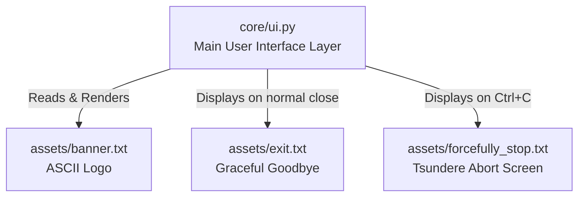

# 📂 Assets Directory

This directory contains static text files and ASCII art assets used to build the terminal user interface (TUI) for the Zine Scraper CLI.

## 🌳 Visual Tree Output

```text
/home/valse-de-anshu/.config/zine scraper/assets
├── README.md
├── banner.txt
├── exit.txt
└── forcefully_stop.txt
```

## 🕸️ Web-Like Structure & Connections



## 📄 File Explanations

### 1. `banner.txt`
* **File Type**: ASCII Art Text
* **What it does**: This file contains the primary "ZINE" text logo styled in ASCII block art. It serves as the primary brand graphic displayed at the top of the console when users launch the Zine Scraper application.
* **Web-like Structure & Connections**: 
  - **Called by**: `core/ui.py`
  - **Function**: `get_banner_renderable()` (around line 153)
  - **Condition**: It is read and parsed as a rich text element. However, it is only loaded if the terminal window height is greater than or equal to 35 lines. If the terminal is too small, a single-line compact title string is shown instead to prevent UI layout issues.

### 2. `exit.txt`
* **File Type**: ASCII Art Text
* **What it does**: This file contains an elaborate ASCII art rendering of an anime character. It acts as a polite, stylish goodbye screen that is printed to the terminal when the scraper naturally finishes its queue or when the user gracefully closes the application.
* **Web-like Structure & Connections**:
  - **Called by**: `core/ui.py`
  - **Function**: `clean_exit(forceful: bool = False)` (around line 529)
  - **Condition**: It is dynamically loaded into memory and printed after the terminal is cleared, provided the exit sequence is triggered with `forceful=False`.

### 3. `forcefully_stop.txt`
* **File Type**: ASCII Art Text
* **What it does**: Similar to `exit.txt`, this file contains another elaborate ASCII art of an anime character, but specifically designed with a "tsundere" personality. Embedded at the right edge of the text art is a reprimanding message: *"Baka! Seriously, Don't quit me like that ! You're so annoying!"*. It adds a humorous and personalized touch when the application is abruptly killed.
* **Web-like Structure & Connections**:
  - **Called by**: `core/ui.py`
  - **Function**: `clean_exit(forceful: bool = False)` (around line 529)
  - **Condition**: It is loaded and displayed to the terminal during an abnormal, forced, or interrupted shutdown (e.g., when the user issues a keyboard interrupt like `Ctrl+C` or a kill signal), which causes `clean_exit` to be called with `forceful=True`.
