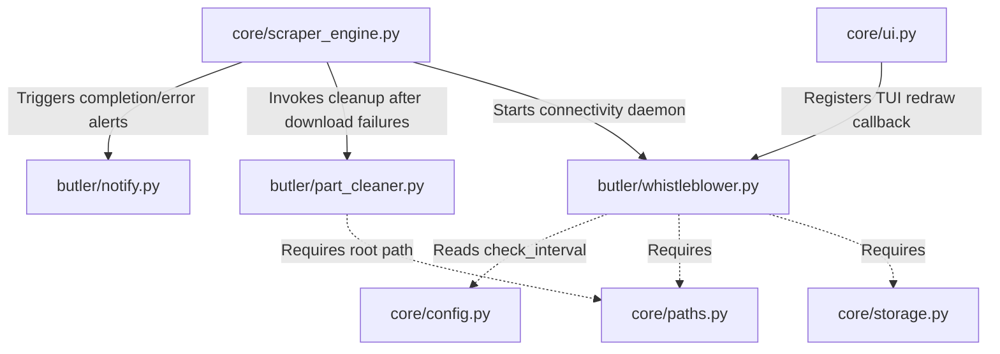

# 🤵 Zine Scraper Suite: Butler

## 🌳 Directory Tree
```text
butler/
├── README.md
├── notify.py
├── part_cleaner.py
└── whistleblower.py
```

## 🕸️ Web-Like Connection Structure

The `butler/` module acts as a suite of background daemons and helper scripts that integrate with the core scraper and UI layers without having inter-dependencies amongst themselves. They are invoked by external modules.



* **`notify.py`** is an isolated utility that does not call any other custom project files; it operates purely on built-in OS libraries (`subprocess`, `sys`, `os`). It is consumed broadly across the scraper logic to alert the user.
* **`part_cleaner.py`** relies on `core.paths.PathAuthority` to locate the global temporary directory (`💩`) and takes a `folder` argument to clean up target download directories. 
* **`whistleblower.py`** depends on `core.config.ConfigLayer`, `core.paths.PathAuthority`, and `core.storage.StorageLayer` to fetch the custom internet check interval. It receives external callbacks (e.g., from `core/ui.py`) to refresh the TUI when connections are restored.

---

## 🔍 File Explanations

### 1. `notify.py`
**Overview:**
A lightweight, cross-platform notification dispatcher responsible for popping up desktop alerts.

**What it actually does:**
It exposes a single function: `send_os_notification(title: str, message: str, is_success: bool = True)`.
When this function is called, it identifies the host operating system using `sys.platform`. 
- **Linux (`linux`):** It shells out to `notify-send`, using the `dialog-information` or `dialog-error` icon depending on the `is_success` flag.
- **macOS (`darwin`):** It invokes `osascript` to run AppleScript that triggers a native Mac desktop notification (`display notification`).
- **Windows (`win32`):** It generates an inline PowerShell script that bypasses the need for external executables. It constructs a raw XML Toast Notification (`Windows.UI.Notifications.ToastNotificationManager`) dynamically and executes it via `powershell -Command` using a hidden window (`CREATE_NO_WINDOW`).
It swallows any exceptions (using a blanket `try-except: pass`) to ensure that notification failures never crash the main scraper workflow.

### 2. `part_cleaner.py`
**Overview:**
A filesystem sanitation module designed to sweep away incomplete, orphaned, or temporary download fragments.

**What it actually does:**
It exports the function `clean_part_files(folder: Path, videos: list, tracker, scraper_url: str)`. When invoked, it executes two separate cleaning operations:
1. **Global Temp Sweep:** It locates a hardcoded central junk directory (named `💩`) located at the application root (via `PathAuthority().get_app_root()`). If this directory exists, it ruthlessly deletes the entire folder tree using `shutil.rmtree` and immediately recreates it as an empty directory.
2. **Target Folder Sweep:** It iterates over the target `folder` passed as an argument. 
   - **Safety Lock:** Before proceeding, it ensures that the `folder` is not on the external SSD mount `/mnt/maiden`. If it is, the process immediately aborts to prevent accidental catastrophic data loss.
   - It iterates through every file in the directory. If a file is identified as a temporary artifact (matching extensions like `.part`, `.ytdl`, `.aria2`, `.tmp`, `.meta.tmp`, `_batch.txt`, or regex patterns mapping to `yt-dlp` fragmented chunks like `.f137.mp4`), it attempts to delete them individually using `file.unlink()`.
   - Any deleted files or errors encountered are logged using the native `logging` library.

### 3. `whistleblower.py`
**Overview:**
A background connectivity monitor that watches for the restoration of internet access during network outages, subsequently firing callbacks to refresh the application state.

**What it actually does:**
It maintains a global registry for an active TUI callback (`_active_tui_callback`) and a state boolean (`_whistleblower_active`) to prevent duplicate daemon threads.
- **Callback Registration:** `set_tui_callback(callback)` allows the UI layer to register a function that redraws the interface when network status changes.
- **Network Check (`is_internet_restored`):** It attempts to open a quick, low-timeout (3 seconds) TCP socket connection to Google's Public DNS (`8.8.8.8` on port `53`).
- **Configuration Parsing:** `get_check_interval()` invokes `ConfigLayer` (wiring through `PathAuthority` and `StorageLayer`) to read `internet_check_interval` from the user's settings, defaulting to 10 seconds if unconfigured.
- **Daemon Thread (`start_whistleblower`):** It spawns a detached background `threading.Thread(daemon=True)` running a `while` loop. In this loop, it sleeps for the configured interval, pings the DNS, and if the ping succeeds, it stops itself, sets its state to inactive, and executes the provided `on_restored()` callback to notify the core scraper that the internet is back up. `stop_whistleblower()` provides a manual killswitch for the loop.