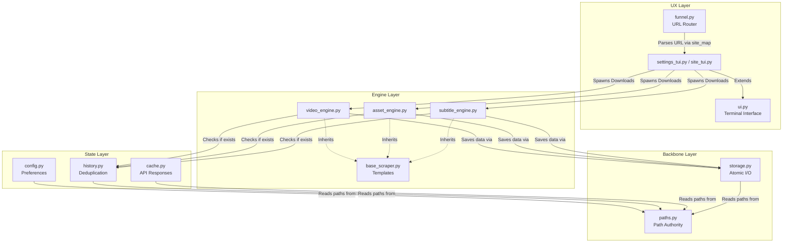

# Zine Scraper Suite: Core Architecture

This directory (`core/`) serves as the central brain and foundation of the Zine Scraper Suite. It is responsible for orchestrating file system operations, dynamic routing, terminal user interfaces (TUIs), configuration management, and the actual downloading engines (video, audio, images). All site-specific scrapers depend entirely on this core foundation.

## 🌳 Directory Tree

```text
core/
├── __init__.py
├── asset_engine.py
├── base_scraper.py
├── cache.py
├── config.py
├── domain_manager.py
├── funnel.py
├── history.py
├── history_links.py
├── image_slicer.py
├── import_tui.py
├── library.py
├── paths.py
├── playwright_interceptor.py
├── settings_tui.py
├── site_map.py
├── site_tui.py
├── storage.py
├── subtitle_engine.py
├── ui.py
└── video_engine.py
```

## 🕸️ System Architecture & Web of Connections



## 📄 File-by-File Breakdown

### `paths.py`
**Purpose**: The central directory registry (`PathAuthority`).
**Details**: Exposes dynamic getters for paths (e.g., `get_downloads_root()`, `get_logs_root()`). It guarantees that no other module hardcodes an absolute or relative directory path. The system `.zine` folder (for configs/history) and the temp `💩` folder are strictly managed here.

### `storage.py`
**Purpose**: Safe file I/O (`StorageLayer`).
**Details**: Replaces native `open()` and `os.rename()` logic with robust, atomic write functions. It ensures that downloads in progress do not corrupt files by writing them to `.part` or temp directories first, then atomically moving them to their final destination upon success.

### `config.py`
**Purpose**: Configuration manager (`ConfigLayer`).
**Details**: Interacts with `storage.py` to save user settings as a JSON file. It caches settings in memory to reduce disk hits and supports deferred saving so that bulk config changes only trigger one disk write. 

### `history.py`
**Purpose**: Tracking system for scraped assets (`HistoryLayer`).
**Details**: Maintains a per-site/per-directory JSON tracking file (`history.json`). Before an engine starts downloading, it asks the `HistoryLayer` if the item is already present. This enables seamless pause and resume features.

### `history_links.py`
**Purpose**: Interactive prompt history (`URLHistoryManager`).
**Details**: Provides up/down arrow memory for URLs and commands pasted into the main TUI terminal prompt, similar to `.bash_history`.

### `cache.py`
**Purpose**: Network and lookup cache (`CacheLayer`).
**Details**: Temporarily saves video/image metadata or parsed m3u8 playlist data. It prevents duplicate identical HTTP requests during batch mode processing or retries.

### `ui.py`
**Purpose**: Custom `rich` styling and TUI event handling.
**Details**: This massive file defines custom progress bar columns (like `MbpsColumn`), parses raw ANSI terminal inputs (for non-blocking key presses like `ESC`, `CTRL+C`, `Arrows`), handles gradients, and overrides standard stdout behavior. It houses the infamous `Ctrl+R` "Revolt" background thread that allows users to gracefully pause operations, and a background thread monitoring internet connectivity.

### `funnel.py`
**Purpose**: The global routing layer and main application loop.
**Details**: Boots up the application. It takes the URL pasted by the user, queries the `domain_manager.py` or `site_map.py` to identify the target domain, dynamically loads the correct isolated module from `scrapers/[site]/`, and calls that module's `tui.py`. It is also the brain behind "Batch Mode," consuming URLs from a text file automatically.

### `site_map.py` & `domain_manager.py`
**Purpose**: URL parsing and domain routing.
**Details**: `domain_manager.py` dynamically scans the `scrapers/` directories for `manifest.yaml` files and extracts supported domain names. `site_map.py` contains helper functions that use this manager to map an arbitrary URL string to a specific folder name (e.g., `hianime.to` -> `hianime`).

### `settings_tui.py`
**Purpose**: Settings visualizer and editor.
**Details**: A self-contained module that uses `Selector` from `ui.py` to render the configuration menu. It allows the user to edit paths, download delays, Whisper AI configuration, and Qwen TTS settings.

### `site_tui.py`
**Purpose**: The Supported Sites Database TUI.
**Details**: A complex 3-column TUI showing all SFW/NSFW sites supported by the scraper. It implements custom horizontal/vertical scrolling logic using raw terminal mode to avoid scrolling issues. 

### `import_tui.py`
**Purpose**: Category and Quality Selection Wizard.
**Details**: Renders the "Phase 1 / Phase 2" interactive prompt for scrapers to determine whether the user is downloading Anime, Manga, Music, etc. It enforces the `Common Structure` directory naming conventions.

### `base_scraper.py`
**Purpose**: The Object-Oriented Framework for all scrapers.
**Details**: Contains abstract base classes like `BaseScraper`, `VideoBaseScraper`, and `AssetBaseScraper`. Site-specific scrapers must inherit from these. It enforces a standard interface (`download_video`, `fetch_manga_chapter`) ensuring that the Liskov Substitution Principle is maintained across the suite.

### `asset_engine.py`
**Purpose**: The image and file downloader.
**Details**: Optimized to fetch raw HTTP assets concurrently (e.g., manga panels). Handles user-agent spoofing, concurrent limits, and chunked saving.

### `video_engine.py`
**Purpose**: Advanced `yt-dlp` and `ffmpeg` orchestrator.
**Details**: The most complex engine. It wraps `yt-dlp` with advanced logging, intercepts output to feed into the custom `ui.py` progress bars, and handles merging video and audio via subprocess calls to `ffmpeg`. It checks `butler.whistleblower` to gracefully pause downloads if the internet drops, and handles the "Revolt" logic to gracefully shut down the engine on user request.

### `subtitle_engine.py`
**Purpose**: AI Subtitle Generator.
**Details**: Spawns `multiprocessing.Process` workers to transcribe downloaded video/audio files into `.srt` files using `faster-whisper`. It specifically enforces VRAM optimizations (INT8, FP16) to prevent Out of Memory errors on consumer GPUs.

### `image_slicer.py`
**Purpose**: Webtoon processing engine.
**Details**: A utility that loads massive, vertical Korean webtoon images and slices them horizontally into standard-sized chunks to ensure they load properly in mobile e-reader applications.

### `playwright_interceptor.py`
**Purpose**: JavaScript execution layer.
**Details**: Spawns headless Chromium via `playwright` to bypass Cloudflare or execute complex JS-rendered pages. Features self-bootstrapping logic to find site-packages in the virtual environment.

### `library.py`
**Purpose**: Library scaffolding and cleanup.
**Details**: Bootstraps the base directory structures when the app launches (e.g., ensuring `Anime/`, `Manga/`, `Books/` folders exist) and scrubs the `💩` temporary folder for any orphaned chunk files left over from an unexpected crash.
