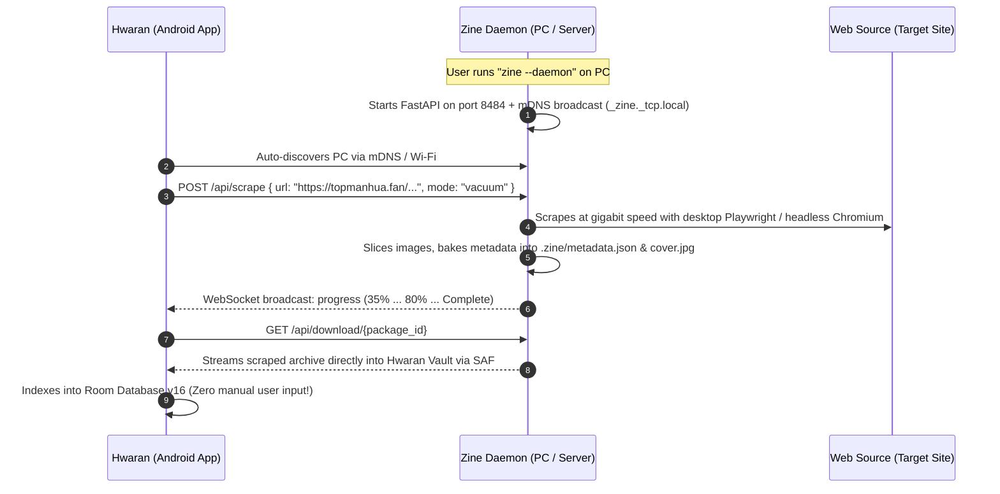

# Zine Scraper & Hwaran Symbiosis: Theories, Innovations & Proposals

## Strategic Vision

This document articulates the theories, architectural models, and practical engineering proposals to evolve **Zine Scraper** and **Hwaran** from two independent applications into an **atomic-level, synchronized media ecosystem**.

---

## 💡 Proposal 1: The Atomic `MetadataEngine` (`core/metadata_engine.py`)

### Theoretical Foundation
Currently, metadata generation is decentralized across 49 scrapers. Each scraper constructs its own arbitrary dictionary, causing field discrepancies (`alt_titles` vs `alt_title`, `genres` vs `tags`, omission of `type`, etc.). 

To achieve 100% atomic compatibility with Hwaran's `ZineMetadataExtractor.kt`, Zine Scraper must introduce a centralized, typed `MetadataEngine` in `core/`.

### Practical Architecture

```python
"""
core/metadata_engine.py
-----------------------
Single source of truth for all metadata manifests across Zine Scraper.
Outputs standard .zine/metadata.json matching Hwaran's Room v16 EntryMetadata.
"""

from dataclasses import dataclass, field, asdict
from pathlib import Path
from typing import List, Optional, Dict, Any
import json

@dataclass
class VideoItemPayload:
    id: str = ""
    title: str = ""
    view_count: int = 0
    like_count: int = 0
    duration: int = 0
    upload_date: str = ""
    url: str = ""

@dataclass
class ZineMetadataPayload:
    title: str
    alt_title: Optional[str] = ""
    author: Optional[str] = ""
    artist: Optional[str] = ""
    description: Optional[str] = ""
    type: str = "Manga"  # "Manga", "Manhua", "Manhwa", "Novel", "Book", "Series", "Channel", "Song"
    status: Optional[str] = "Ongoing"  # "Ongoing", "Completed", "Hiatus"
    rating: Optional[str] = ""
    tags: List[str] = field(default_factory=list)
    publisher: Optional[str] = ""
    serialization: Optional[str] = ""
    year: Optional[str] = ""
    language: Optional[str] = "en"
    pages: Optional[str] = ""
    total_chapters: int = 0
    cover: str = "cover.jpg"
    url: Optional[str] = ""
    views: Optional[str] = ""
    likes: Optional[str] = ""
    comments: Optional[str] = ""
    # Structured video items for ChannelDescriptionView and rankings
    videos: List[Dict[str, Any]] = field(default_factory=list)
    most_viewed: List[Dict[str, Any]] = field(default_factory=list)
    top_rated: List[Dict[str, Any]] = field(default_factory=list)
    latest: List[Dict[str, Any]] = field(default_factory=list)
    # Franchise relations for SeriesRelatedView
    related_series: List[Dict[str, str]] = field(default_factory=list)

class MetadataEngine:
    @staticmethod
    def write(folder: Path, meta: ZineMetadataPayload) -> Path:
        zine_dir = folder / ".zine"
        zine_dir.mkdir(parents=True, exist_ok=True)
        manifest_file = zine_dir / "metadata.json"

        # Sanitize empty values while preserving core keys
        data = asdict(meta)
        clean_payload = {k: v for k, v in data.items() if v not in [None, "", []]}
        clean_payload["title"] = meta.title
        clean_payload["type"] = meta.type
        clean_payload["cover"] = meta.cover

        # Guarantee tags is always a JSON array of strings
        if "tags" in clean_payload and isinstance(clean_payload["tags"], str):
            clean_payload["tags"] = [t.strip() for t in clean_payload["tags"].split(",") if t.strip()]

        with open(manifest_file, "w", encoding="utf-8") as f:
            json.dump(clean_payload, f, indent=4, ensure_ascii=False)
            
        return manifest_file
```

### Direct Hwaran Impact
* Every field required by `ToonDescriptionView`, `BookDescriptionView`, `SeriesDescriptionView`, `ChannelDescriptionView`, and `PlaylistDetailScreen` is populated deterministically.
* Zero heuristic guessing required by Hwaran.

---

## 💡 Proposal 2: Zero-Loss "Quick Grab" Architecture

### The Problem
Currently, scrapers contain guard statements:
```python
is_quick_grab = "Quick grab" in folder.parts or "Quick grab" in str(folder)
if not is_quick_grab:
    # write metadata...
```
This causes any ad-hoc download (e.g., downloading Chapter 4 of a manhwa, a single YouTube video, or an audio track) to produce a raw folder with **no metadata** and **no cover**. When imported into Hwaran, it displays as an empty card.

### The Solution
* Remove the `if not is_quick_grab` suppression entirely.
* When downloading a single item, `MetadataEngine.write()` writes `.zine/metadata.json` into the item's target folder.
* For single chapters, `total_chapters: 1` and `title: "<Series Title> - Ch.<N>"` are stored alongside the series synopsis and cover art.
* **Result:** Hwaran renders a rich Hero Card even for single-chapter downloads.

---

## 💡 Proposal 3: Automated Franchise Hierarchy for Anime & Series

### Theoretical Foundation
Hwaran possesses a powerful franchise linking engine (`SeriesDescriptionView` and `SeriesRelatedView`) supporting 11 distinct relationship types:
* `Season`, `Sequel`, `Prequel`, `Movie`, `OVA`, `ONA`, `Special`, `Blu-ray`, `Spinoff`, `Recap`, `Alt Version`.

Currently, users must manually link related series using Hwaran's in-app linking dialog.

### Practical Architecture
Zine Scraper's anime engines (`hianime`, `miruro`, `anitaku`) already have access to franchise relationship data via AniList / MAL / internal APIs.

1. **Structured Folder Layout:**
   ```text
   Vacuum/Anime/SFW/HiAnime/Frieren Beyond Journey's End/
   ├── .zine/
   │   └── metadata.json         <-- Declares type="Series", total_episodes=28
   ├── cover.jpg
   ├── Season 1/
   │   ├── Episode 01.mp4
   │   └── Episode 02.mp4
   └── Specials/
       └── Mini Anime 01.mp4
   ```
2. **Franchise Linking Manifest:**
   In `.zine/metadata.json`:
   ```json
   {
       "title": "Frieren: Beyond Journey's End",
       "type": "Series",
       "status": "Completed",
       "year": "2023",
       "rating": "9.1",
       "tags": ["Adventure", "Drama", "Fantasy"],
       "related_series": [
           {
               "title": "Frieren Mini Anime",
               "relation": "Special",
               "folder": "Specials"
           }
       ]
   }
   ```
3. Hwaran's `SeriesStructureImporter.kt` reads `related_series` and automatically creates linked child boxes in Room, instantly creating a multi-season franchise hub.

---

## 💡 Proposal 4: Creator Channel Manifests for Video Platforms

### Theoretical Foundation
Hwaran has a specialized `ChannelDescriptionView` designed for YouTube creators, model channels, and video hubs (`contentType = 2`, `boxPurpose = "channel"`). It features:
* Subscriber/video counts, view count statistics, like counts, and comments.
* Tri-tab sorting: **Most Viewed**, **Top Rated**, and **Latest**.

### Practical Architecture
When Zine Scraper scrapes a YouTube channel or creator portfolio:
1. `scrapers/youtube` records video metrics into `.zine/metadata.json`:
   ```json
   {
       "title": "Kurzgesagt – In a Nutshell",
       "alt_title": "@kurzgesagt",
       "type": "Channel",
       "description": "Videos explaining things with optimistic nihilism.",
       "views": "2.8B",
       "likes": "140M",
       "total_chapters": 194,
       "cover": "cover.jpg",
       "url": "https://www.youtube.com/@kurzgesagt",
       "videos": [
           {
               "id": "78nZpW2wR44",
               "title": "What If We Detonated All Nuclear Bombs at Once?",
               "view_count": 34800000,
               "like_count": 1200000,
               "duration": 650,
               "upload_date": "2019-03-31"
           }
       ]
   }
   ```
2. When imported into Hwaran, `VideoChannelBackend` detects `type: "Channel"` and automatically populates the hero banner, stats pills, and ranking tabs.

---

## 💡 Proposal 5: Music Album Manifests & Synced LRC Engine

### Theoretical Foundation
Hwaran's music engine (`contentType = 3`) pairs an audio player with **8 reactive Canvas shaders** (*Liquid, Constellation, Crystal Snow, etc.*) and a real-time karaoke lyrics display driven by `.lrc` files.

### Practical Architecture
1. **Audio File Pairing:**
   * For every `Track 01 - Song.flac`, Zine's `core/lyrics_engine.py` generates `Track 01 - Song.lrc` directly in the same folder.
2. **Album Manifest:**
   Zine writes `.zine/metadata.json` for the album:
   ```json
   {
       "title": "Random Access Memories",
       "artist": "Daft Punk",
       "year": "2013",
       "type": "Song",
       "tags": ["Electronic", "Disco", "Funk"],
       "total_chapters": 13,
       "cover": "cover.jpg"
   }
   ```
3. Hwaran imports the album with full metadata, sets up playlist tracks with exact durations, and activates the synced karaoke shader player upon opening.

---

## 💡 Proposal 6: The Zine Bridge Daemon (`zine --daemon`) & Hwaran Wi-Fi Companion

### Theoretical Foundation
The primary usability friction between Zine Scraper (desktop CLI) and Hwaran (Android mobile) is the manual transfer step (MTP USB cable, copying files over adb, or swapping SD cards).

### Practical Architecture



### Endpoints
1. `GET /api/discovery`: Returns system status, active downloads, and media library roots.
2. `POST /api/scrape`: Accepts URL, category, and options. Queues scrape task.
3. `WS /ws/progress`: Real-time WebSocket stream of progress trees (transmitting current chapter, total pages, downloaded, retry, missing, and baking status).
4. `GET /api/sync/packages`: Lists completed media packages ready for wireless transfer.
5. `GET /api/sync/pull/{id}`: High-speed local HTTP streaming endpoint for Hwaran to pull media directly into its local vault.

---

## 💡 Proposal 7: Bidirectional Reading & Watch History Synchronization

### Theoretical Foundation
Hwaran tracks user progress with granular accuracy:
* Toon / Manga: `lastReadTitle`, `lastReadPage`, `openCount`.
* Novels: Checkpoint paragraph markers (`+ Mark Here`).
* Videos: Timestamp offsets in ExoPlayer.
* Audio: Play counts and favorites.

### Practical Architecture
1. In Hwaran, a "Sync with Zine" action exports a lightweight `.zine/progress.json`:
   ```json
   {
       "last_read_chapter": "14",
       "last_read_page": 22,
       "completed_chapters": ["1", "2", "3", "...", "14"],
       "last_updated": 1726618400
   }
   ```
2. When Zine Scraper runs in update mode (`zine update` or `--sync`), it reads `progress.json` and skips re-downloading existing chapters, fetching **only new chapters** published since the user's last reading session.

---

## 💡 Proposal 8: Mobile Scraper Engine Analysis: "Can a Phone Scrape?"

### Definitive Engineering Evaluation

| Dimension | Option A: Embedded Python (Chaquopy) | Option B: Native Kotlin + WebView Engine | Option C: Zine Companion Bridge |
| :--- | :--- | :--- | :--- |
| **Playwright / Headless Browser** | ❌ **Impossible.** Android sandboxed APKs cannot run headless Chromium / Node.js. | ✅ **Native.** Uses Android System WebView to pass Cloudflare Turnstile with 100% genuine Chrome signatures. | ✅ **Full Power.** Runs Playwright on PC CPU with zero mobile constraints. |
| **APK Size Impact** | ❌ **Bloated (+120MB)** (CPython + FFmpeg + PyO3 + heavy dependencies). | ✅ **Minimal (+3MB)** (Pure Kotlin + OkHttp + QuickJS). | ✅ **0 MB** (Runs entirely over local Wi-Fi API). |
| **Battery & Thermal Throttling** | ❌ **Severe.** Long Python scraping loops cause Android battery-saver to kill the process. | ✅ **Excellent.** Managed via Android `WorkManager` with wake-lock and foreground service. | ✅ **Zero Phone Load.** Desktop handles decoding, stitching, and compression. |
| **Coverage Parity** | ~35% (Fails on JS/Cloudflare-protected sites). | Requires re-authoring scrapers in Kotlin/JS. | **100% (All 49 scrapers work out of the box).** |

### Strategic Recommendation
1. **Short & Medium Term:** **Proposal 6 (Zine Companion Bridge)** provides an immediate, 100% working ecosystem without rewriting 49 scrapers.
2. **Long Term:** For lightweight, offline-on-the-go scraping, add a **Native Kotlin/WebView Scraper Module** inside Hwaran for high-traffic sites (MangaDex, NovelBuddy), while utilizing Zine Desktop Daemon for heavy video, audio baking, and mass harvesting.
