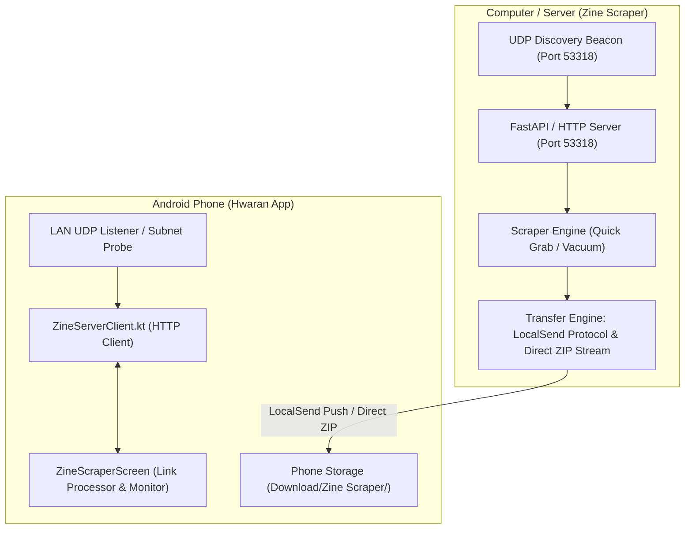
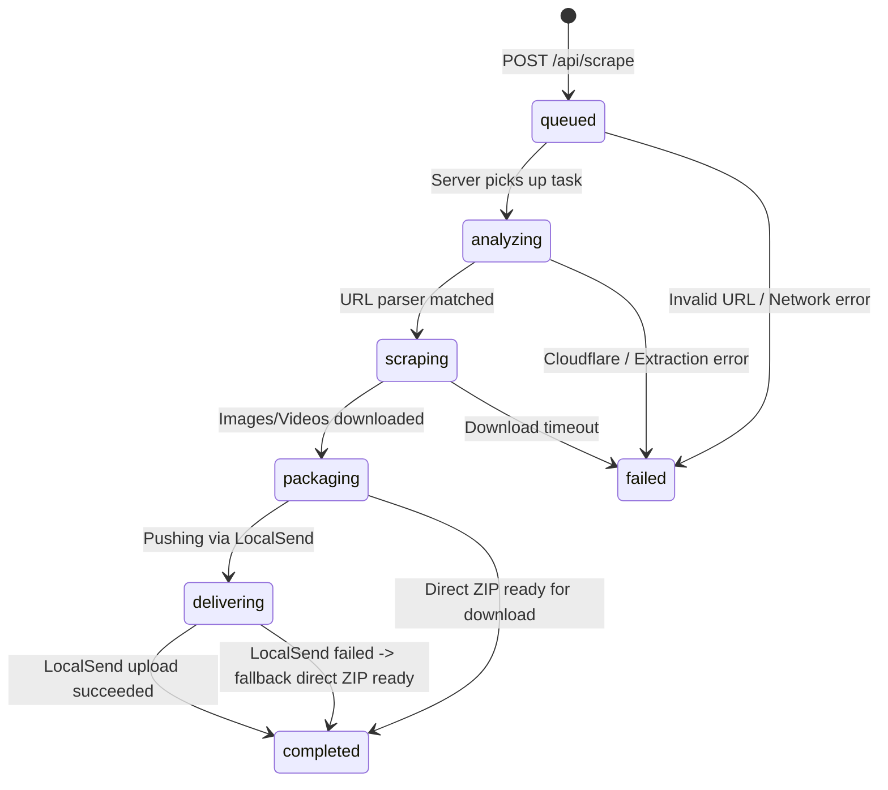

# Zine Scraper Server Protocol & Integration Specification

> **Target Audience**: Companion Agent building the server implementation in the [`zine-scraper`](https://github.com/valse-de-anshu/zine-scraper.git) repository.  
> **Client Application**: Hwaran Android App (`com.ballade.hwaran`)  
> **Author**: Antigravity Assistant (Hwaran Client Team)  
> **Date**: September 22, 2026  

---

## 1. Executive Summary & Purpose

The **Hwaran Android App** now features a dedicated **Zine Scraper Screen** and home dashboard shortcut that allows users to paste media URLs (MangaDex, Asura Scans, YouTube, Webtoons, etc.), select a harvest scope (**Quick Grab** vs. **Vacuum**), and monitor the real-time download and transfer progress into their phone's local storage (`Download/Zine Scraper/`).

To make this end-to-end flow operational, the companion Python application (`zine-scraper`) needs a **headless background server** launched via:
```bash
python orchestrator.py --server
```

This document details the exact REST endpoints, JSON payloads, UDP multicast/broadcast discovery beacons, LocalSend v2 push protocols, and direct ZIP download streaming fallbacks that the `zine-scraper` server agent must implement.

---

## 2. Server Architecture & Network Discovery

### 2.1 Ports & Networking
* **Default Port**: `53318` (TCP for HTTP API, UDP for Discovery Beacon).
* **LocalSend Port**: `53317` (TCP for pushing to official LocalSend app / phone receiver).
* **Binding**: Listen on `0.0.0.0:53318`.



### 2.2 Automatic LAN Discovery Beacon
When `python orchestrator.py --server` starts, it must broadcast a heartbeat beacon every **2 seconds**:
- **Protocol**: UDP broadcast to `255.255.255.255:53318` (and optionally multicast to `224.0.0.167:53318`).
- **Payload** (JSON UTF-8 string):
```json
{
  "service": "zine-scraper-server",
  "port": 53318,
  "version": "2.1",
  "alias": "Zine Scraper Workstation"
}
```

> **Client Fallback**: If the router blocks UDP broadcast/multicast packets, Hwaran automatically performs a concurrent subnet scan on `192.168.x.x:53318` calling `GET /api/ping`.

---

## 3. Required REST Endpoints

### 3.1 Health & Connectivity Check: `GET /api/ping`
Used by Hwaran to test server availability, measure latency, and populate connection status pills.

* **Method**: `GET`
* **Path**: `/api/ping`
* **Response Status**: `200 OK`
* **Response Body**:
```json
{
  "status": "ok",
  "version": "2.1",
  "alias": "Zine Scraper Server",
  "active_tasks": 0
}
```

---

### 3.2 Submit Scrape Task: `POST /api/scrape`
Triggered when the user taps "Fetch & Ingest Media" in Hwaran.

* **Method**: `POST`
* **Path**: `/api/scrape`
* **Headers**: `Content-Type: application/json; charset=utf-8`
* **Request Body**:
```json
{
  "url": "https://mangadex.org/title/...",
  "mode": "quick_grab",
  "target_ip": "192.168.29.105",
  "transfer": "hybrid"
}
```

#### Field Specifications:
| Field | Type | Allowed Values | Description |
| :--- | :--- | :--- | :--- |
| `url` | `String` | Valid HTTP/HTTPS URL | The media URL entered by user. |
| `mode` | `String` | `"quick_grab"` \| `"vacuum"` | **quick_grab**: Only scrape the target single chapter/clip.<br>**vacuum**: Deep harvest entire series/run. |
| `target_ip` | `String` | IPv4 address (optional) | The phone's IP on the Wi-Fi network. |
| `transfer` | `String` | `"hybrid"` \| `"localsend"` \| `"direct"` | **hybrid**: Attempt LocalSend push; if phone unreachable, flag for direct ZIP pull.<br>**localsend**: Only push via LocalSend REST.<br>**direct**: Package into ZIP and let phone stream via `GET /api/download/{taskId}`. |

* **Response Status**: `200 OK` (or `202 Accepted`)
* **Response Body**:
```json
{
  "task_id": "tsk_8941940b-71da",
  "url": "https://mangadex.org/title/...",
  "mode": "quick_grab",
  "status": "queued",
  "progress": 0.0,
  "message": "Scrape task initialized...",
  "file_count": 0,
  "media_title": "Resolving metadata...",
  "error": ""
}
```

---

### 3.3 Task Status Polling: `GET /api/tasks/{taskId}`
Hwaran polls this endpoint every **1.2 seconds** to drive the live progress bar, file count badges, and status indicators.

* **Method**: `GET`
* **Path**: `/api/tasks/{taskId}`
* **Response Status**: `200 OK`
* **Response Body**:
```json
{
  "task_id": "tsk_8941940b-71da",
  "url": "https://mangadex.org/title/...",
  "mode": "quick_grab",
  "status": "scraping",
  "progress": 0.65,
  "message": "Harvesting chapter 15/22 images...",
  "file_count": 34,
  "media_title": "Chainsaw Man - Chapter 120",
  "error": ""
}
```

#### Status Lifecycle:


#### Status String Values:
* `"queued"`: Task placed in background queue.
* `"analyzing"`: Resolving target website, bypassing bot protections, extracting title.
* `"scraping"`: Downloading pages, chapters, or video streams. `progress` should be between `0.05` and `0.85`.
* `"packaging"`: Compressing into structured ZIP archive (`Download/Zine Scraper/`).
* `"delivering"`: Initiating LocalSend upload handshake to phone.
* `"completed"`: Transfer finished. If using direct download fallback, set `message` to `"Direct download archive ready"`.
* `"failed"`: Unrecoverable error occurred. Fill the `error` string with user-readable details.

---

### 3.4 Direct ZIP Archive Download Fallback: `GET /api/download/{taskId}`
If LocalSend upload fails, or if user selects "Direct HTTP" mode, Hwaran calls this endpoint to stream the media ZIP file directly onto the phone and extract it.

* **Method**: `GET`
* **Path**: `/api/download/{taskId}`
* **Headers returned by server**:
  - `Content-Type: application/zip`
  - `Content-Disposition: attachment; filename="media_{taskId}.zip"`
  - `Content-Length: <file size in bytes>` (CRITICAL for phone progress bar!)
* **Response Status**: `200 OK`
* **Response Body**: Binary stream of the ZIP archive.

---

## 4. LocalSend Protocol Implementation Guide

To push files natively from the Python server to the phone without opening LocalSend GUI:

### Step 1: Discover Receiver (Phone)
Send a UDP multicast to `224.0.0.167:53317` with server device info:
```json
{
  "alias": "Zine Scraper",
  "version": "2.1",
  "deviceModel": "Linux Workstation",
  "deviceType": "desktop",
  "fingerprint": "zine-scraper-server-node-1",
  "port": 53318,
  "protocol": "https",
  "download": false
}
```
Or directly target the phone IP provided in `target_ip`: `http://<phone-ip>:53317`.

### Step 2: Prepare Upload Handshake
Send `POST http://<phone-ip>:53317/api/localsend/v2/prepare-upload`:
```json
{
  "info": {
    "alias": "Zine Scraper",
    "version": "2.1",
    "deviceModel": "Linux",
    "deviceType": "desktop",
    "fingerprint": "zine-scraper-server-node-1"
  },
  "files": {
    "file_01": {
      "id": "file_01",
      "fileName": "Chainsaw_Man_c120.cbz",
      "size": 18450123,
      "fileType": "application/zip",
      "sha256": "..."
    }
  }
}
```
*Phone returns `sessionId` and a `token` for each file.*

### Step 3: Stream File
Send `POST http://<phone-ip>:53317/api/localsend/v2/upload?sessionId=<sessionId>&fileId=file_01&token=<token>` with the file binary stream.

> [!IMPORTANT]
> **Fallback Requirement**: If `prepare-upload` returns HTTP 403 (rejected) or connection times out after 10 seconds, the Python server **must not crash**. Instead, mark task as `status = "completed"`, update message to `"LocalSend rejected/timed out: direct download archive ready"`, and keep the file available at `GET /api/download/{taskId}`.

---

## 5. Storage Directory Standards on Phone

When Hwaran receives or extracts the files, it saves them into:
1. **Quick Grab**:
   `Download/Zine Scraper/Quick grab/<Media Title>/`
2. **Vacuum**:
   `Download/Zine Scraper/Vacuum/<Media Title>/`

The server should name files cleanly inside the ZIP:
* Manga / Manhua: `Chapter_001.cbz` or folder `Chapter_001/001.jpg, 002.jpg...`
* Video / Series: `Episode_01.mp4`, `Episode_02.mp4`
* Audio: `01_Track_Title.mp3`

---

## 6. What Has Been Implemented in Hwaran (`valse-de-anshu/hwaran`)

1. **Home Screen Shortcut**:
   - Added `ShortcutCard(title = "Zine", subtitleText = "Scraper")` prepended to the media category row before `"All"`.
   - Smooth transition into `ZineScraperScreen`.
2. **Dedicated Aesthetic Screen (`ZineScraperScreen.kt`)**:
   - Strictly styled in **Obsidian Onyx** dark luxury theme (`0xFF090A0F`, `0xFF141721`, `AccentTitanium = 0xFFD4D8E0`).
   - Central Link Processor with clipboard paste.
   - Detailed Harvest Scope selector (Quick Grab vs. Vacuum) with detailed feature badges.
   - Live Harvest Monitor showing title, animated progress bar, item counts, and status badges.
   - Connection loss detector with auto-reconnect and LAN subnet probing.
   - Setup guide with clickable GitHub repository link and one-tap command copy.
   - Post-download one-tap import into Hwaran library.
3. **Build & Tests**:
   - Verified clean compilation with `assembleDebug` and passing tests with `testDebugUnitTest`.
   - Merged into both `nightingale` and `main` branches.
