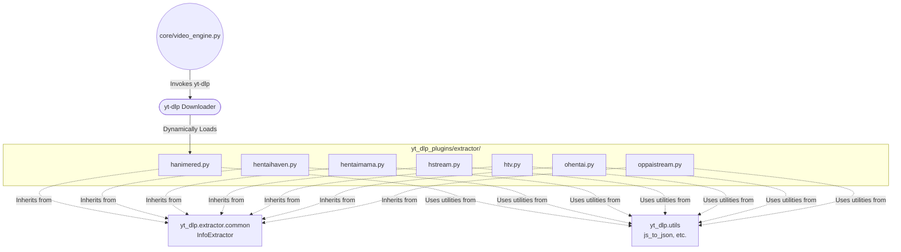

# Plugins Directory

This directory contains custom extension plugins utilized by the application, specifically targeting `yt-dlp`. By structuring them under the `yt_dlp_plugins` namespace, `yt-dlp` automatically discovers and loads these custom extractors, allowing Zine Scraper to bypass standard extractions and handle highly protected or non-standard hosting sites.

## Visual Directory Tree

```text
plugins/
├── README.md
└── yt_dlp_plugins/
    └── yt_dlp_plugins/
        ├── __init__.py
        └── extractor/
            ├── hanimered.py
            ├── hentaihaven.py
            ├── hentaimama.py
            ├── hstream.py
            ├── htv.py
            ├── ohentai.py
            └── oppaistream.py
```

## 🕸️ Web-Like Structure & Connections


---

## File Explanations

### `yt_dlp_plugins/yt_dlp_plugins/__init__.py`
**What it does:** Marks the folder as a Python package.
**Super Detailed Explanation:** This is an empty initialization file. Its sole purpose is to instruct the Python interpreter to treat the directory as a recognizable module namespace. Without this, `yt-dlp` would not be able to traverse the directory structure and dynamically import the sub-packages located inside the `extractor/` folder.

### `yt_dlp_plugins/yt_dlp_plugins/extractor/hanimered.py`
**What it does:** Extracts video streams from `hanime.red` by bypassing complex anti-bot mechanisms.
**Super Detailed Explanation:** 
Defines the `HanimeRedIE` class. This script handles sophisticated server challenges designed to block scraping. 
1. It downloads the webpage to find a hidden embedded iframe player (`nhplayer.com`).
2. It parses the JavaScript powering the player to locate dynamic "Challenge Tokens" and hidden HTML payload fragments.
3. It performs a **Proof of Work (PoW)** via the `_proof_of_work` method, which brute-forces a SHA-256 hash collision starting with two null bytes (`0x00`).
4. It calls `_generate_fingerprint` to spoof a legitimate browser environment (e.g., screen dimensions, touch capabilities) serialized into a base64 string.
5. Finally, it bundles the PoW and the fingerprint into an `XMLHttpRequest` sent to an API endpoint (`get-video-url-v2.php`) to retrieve the direct unencrypted video URL.

### `yt_dlp_plugins/yt_dlp_plugins/extractor/hentaihaven.py`
**What it does:** Extracts HLS manifest URLs from `hentaihaven.com` and `hentaihaven.xxx` by breaking custom cryptography.
**Super Detailed Explanation:**
Defines the `HentaiHavenIE` class.
1. The site obscures its video streams behind a JWPlayer implementation that requires an encrypted authorization token.
2. The script extracts an `x-secure-token` meta-tag from the PHP player page.
3. It passes the token to the `_decipher_sec_token` method, which decrypts it using a customized 3-pass Caesar cipher substitution (via a custom `_CIPHER_MAP` byte translation table) combined with base64 decoding.
4. The decrypted JSON yields an initialization vector (`iv`) and encrypted payload (`en`), which are formatted as `multipart/form-data` and posted to an `api.php` endpoint.
5. The API returns JWPlayer sources, which the script reformats and hands off to the internal `_parse_jwplayer_data` method to scrape the underlying HLS stream manifest.

### `yt_dlp_plugins/yt_dlp_plugins/extractor/hentaimama.py`
**What it does:** Extracts video information and stream formats from `hentaimama.io`.
**Super Detailed Explanation:**
Defines the `HentaimamaIE` class.
1. It loads the episode page, using regex to extract the video title and the thumbnail/poster image.
2. It locates an inline JavaScript block declaring an `ajax_data` variable and parses it securely using `js_to_json`.
3. It sends this extracted payload as an `application/x-www-form-urlencoded` POST request to a WordPress backend (`wp-admin/admin-ajax.php`).
4. The backend replies with a secondary JWPlayer URL. The script downloads this secondary page and leverages `yt-dlp`'s built-in `_extract_jwplayer_data` helper to automatically retrieve the actual video streams, merging them with the earlier scraped metadata.

### `yt_dlp_plugins/yt_dlp_plugins/extractor/hstream.py`
**What it does:** Extracts MPEG-DASH (`.mpd`) streaming manifests from `hstream.moe`.
**Super Detailed Explanation:**
Defines the `HstreamIE` class.
1. It scrapes the initial HTML page to locate a hidden `episode_id`.
2. It interacts directly with the `yt-dlp` HTTP cookie jar (`_extract_cookie` method) to fetch an active `XSRF-TOKEN` assigned to the session.
3. It constructs a JSON API POST request sent to `hstream.moe/player/api`, injecting the `XSRF-TOKEN` into the HTTP headers to bypass CSRF protection.
4. The API response provides a base CDN domain. The script then iterates through standard resolutions (720p, 1080p, 2160p), dynamically constructs the URLs for the `manifest.mpd` files, and passes them to `yt-dlp`'s `_extract_mpd_formats` to collect every available video/audio track combination.

### `yt_dlp_plugins/yt_dlp_plugins/extractor/htv.py`
**What it does:** Uses a Deno JavaScript runtime to bypass client-side signature generation on `hanime.tv`.
**Super Detailed Explanation:**
Defines the `HanimeTVIE` class. This is an advanced extractor that actively executes server-provided JavaScript natively.
1. It initializes `yt_dlp.utils._jsruntime.DenoJsRuntime`. If the user does not have Deno installed, it throws a fatal error.
2. The `hanime.tv` frontend heavily relies on Astro. The script extracts JSON-like Astro props from the page HTML to find the actual API `video_id`.
3. To communicate with the video API, requests must be signed with dynamic `X-Signature` and `X-Time` headers. The script downloads the site's official vendor JS.
4. It prepends a custom polyfill (`_JS_PREAMBLE`) that mocks the browser's `window` object using a JavaScript `Proxy`. When the vendor JS attempts to set the signature credentials, the proxy intercepts and prints them to `stdout`.
5. The Python script spawns a `subprocess` to run Deno, captures the signature, and uses it to query the guest video manifest API (`h.freeanimehentai.net`), finally structuring the returned JSON streams for download.

### `yt_dlp_plugins/yt_dlp_plugins/extractor/ohentai.py`
**What it does:** Simple JWPlayer data extraction for `ohentai.org`.
**Super Detailed Explanation:**
Defines the `OhentaiIE` class.
1. It downloads the webpage matching the video ID.
2. It utilizes regex to parse out the video title from a dedicated `<h1>` tag.
3. It targets a `SendPlay.setup(...)` block in the HTML source code, slicing it out and passing it through `js_to_json` to turn the JS object into a readable Python dictionary.
4. It feeds this configuration into the native `_parse_jwplayer_data` method.
5. Crucially, before returning the formats, it injects an `http_headers: {'Referer': 'https://ohentai.org/'}` property into each stream track. The host CDN uses hotlink protection and instantly drops connections missing this header.

### `yt_dlp_plugins/yt_dlp_plugins/extractor/oppaistream.py`
**What it does:** Extracts MPEG-DASH manifest URLs from `oppai.stream`.
**Super Detailed Explanation:**
Defines the `OppaiStreamIE` class.
1. Sends an HTTP request to the video page, specifically permitting `302 Redirect` statuses to allow seamless domain routing.
2. Employs regex against inline script tags (`_MANIFEST_RE`) to dynamically locate the active CDN server base URL and the manifest string for that session.
3. Iterates over predefined resolution formats (720, 1080, 4k) to build the explicit URLs for the `.mpd` files.
4. Similar to `ohentai.py`, it injects a strict `Referer` header into the manifest requests (`_extract_mpd_formats`) and into every resulting stream format dictionary to evade anti-hotlinking middleware.
