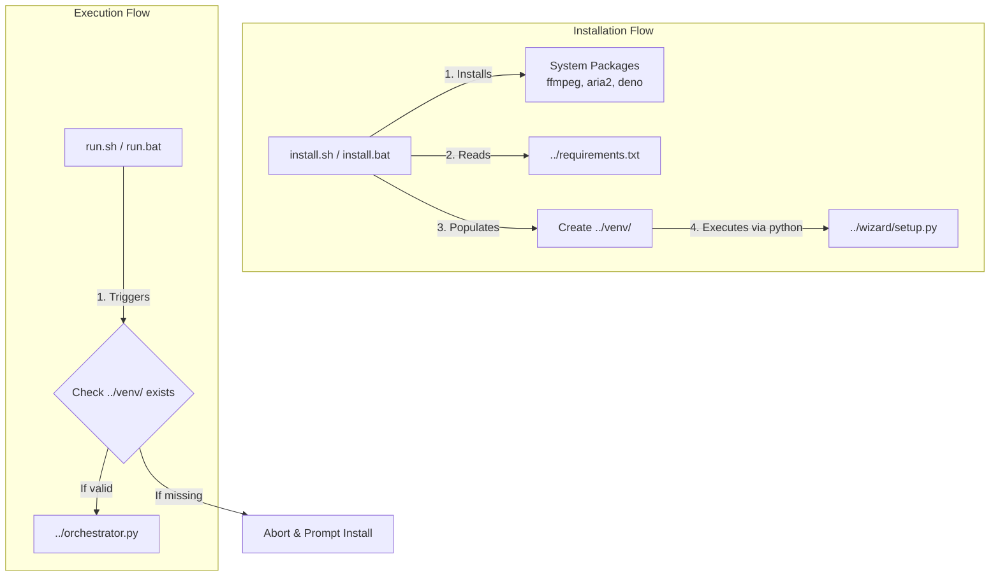

# Zine Scraper Setup Guide

Welcome! This folder (`run me`) contains the automated setup scripts required to install and run the Zine Scraper Suite. 

We know that setting up Python virtual environments and external dependencies can be a headache, especially on a completely barebones OS. So, we've automated the entire process.

---

## 🐧 Linux & 🍏 macOS

### Step 1: Install
Open your terminal, navigate to this `zine scraper/run me` folder, and run:
```bash
./install.sh
```
**What this does:**
1. Detects your package manager (`apt`, `pacman`, `dnf`, or `brew`).
2. Installs required system packages (`curl`, `unzip`, `ffmpeg`, `aria2`, `atomicparsley`).
3. Installs the `deno` Javascript runtime (required for some scrapers).
4. Creates an isolated Python virtual environment (`venv`) in the project root.
5. Installs all Python dependencies from `requirements.txt`.
6. Downloads Playwright browser binaries.

### Step 2: Run
Whenever you want to start the scraper, simply execute:
```bash
./run.sh
```
*(This automatically boots the scraper using the isolated `venv` so it doesn't conflict with your global Python!)*

---

## 🪟 Windows

### Step 1: Install
Double-click the following file (or run it in Command Prompt/PowerShell):
```text
install.bat
```
**What this does:**
1. Uses `winget` (Windows Package Manager) to natively install `ffmpeg`, `aria2`, and `deno`.
2. Creates an isolated Python virtual environment (`venv`) in the project root.
3. Installs all Python dependencies from `requirements.txt`.
4. Downloads Playwright browser binaries.

### Step 2: Run
Whenever you want to start the scraper, simply double-click:
```text
run.bat
```
*(This automatically boots the scraper using the isolated `venv` so it doesn't conflict with your global Python!)*

---

## 🔍 Deep Dive Analysis

### 📂 Visual Tree Output

```text
run me/
├── install.bat
├── install.sh
├── README.md
├── run.bat
└── run.sh
```

### 📄 File Explanations

#### 1. `install.bat`
* **What it does:** The automated installation and bootstrapping script for Windows environments.
* **Explanation:**
  1. Initializes the local environment (`setlocal`) and maps the working directory to the project's root folder (`..`) relative to the script's location (`%~dp0`).
  2. Uses the `where winget` command to check if the Windows Package Manager is available.
  3. If `winget` is found, it silently installs core external dependencies: `Gyan.FFmpeg` (media manipulation), `aria2.aria2` (high-speed downloading), and `DenoLand.Deno` (JS runtime for site decryption).
  4. Verifies the system has `python` in its PATH, exiting gracefully with an error if missing.
  5. Uses Python to generate a fresh virtual environment directory named `venv` in the project root.
  6. Activates the environment's `pip.exe` to upgrade `pip` to the latest version.
  7. Installs all required Python libraries by reading the root `requirements.txt` file.
  8. Invokes Playwright's module to download the `chromium` browser binaries required for headless scraping.
  9. Concludes the setup by routing the execution to `wizard/setup.py` using the virtual environment's python executable, triggering the initial 1-time setup wizard for the user.

#### 2. `install.sh`
* **What it does:** The automated installation and bootstrapping script for Unix-like environments (Linux & macOS).
* **Explanation:**
  1. Enables strict error handling with `set -e` so the script fails immediately if any command errors out.
  2. Calculates the absolute path of the root directory safely (even if symlinked) and switches to it.
  3. Automatically detects if it is running as root (like in Docker) and conditionally prefixes system commands with `sudo` if running as a standard user.
  4. Detects the OS package manager (`brew` for macOS, `apt-get` for Debian/Ubuntu, `pacman` for Arch, `dnf` for Fedora, `zypper` for openSUSE, `apk` for Alpine) and executes the correct native install commands for `ffmpeg`, `aria2`, `atomicparsley`, `curl`, `unzip`, and `python3-venv`.
  5. Checks for `deno` (explicitly noted as required for Hanime.tv Javascript Decryption). If missing, it fetches the Deno install script via `curl`, installs it, and updates the user's `$PATH` and `~/.bashrc` to ensure it persists.
  6. Validates the existence of `python3`.
  7. Wipes any pre-existing `venv` folder (`rm -rf venv`) to ensure a clean slate, then creates a new Python 3 virtual environment.
  8. Sources (activates) the `venv`, upgrades `pip`, and runs `pip install -r requirements.txt`.
  9. Installs Playwright's `chromium` binaries.
  10. Concludes by executing `$ROOT_DIR/wizard/setup.py` using the isolated Python interpreter, initializing the setup wizard.

#### 3. `run.bat`
* **What it does:** The universal launch script for Windows users to execute the scraper.
* **Explanation:**
  1. Uses `setlocal` and `%~dp0` to resolve the root directory and changes the working directory appropriately.
  2. Implements a safety guard: it checks if the isolated Python binary exists at `venv\Scripts\python.exe`. If it is absent, the script assumes setup has not occurred, prompts the user to run `install.bat`, pauses the terminal, and exits with an error code.
  3. If the virtual environment is verified, it launches the main entry point of the software, `orchestrator.py`, using the isolated python executable.
  4. Keeps the console window open with a `pause` command after the software exits so the user can review any logs or crashes.

#### 4. `run.sh`
* **What it does:** The universal launch script for Unix-like (Linux/macOS) users to execute the scraper.
* **Explanation:**
  1. Uses bash string manipulation to resolve the script's current directory and infers the root directory (`ROOT_DIR`).
  2. Implements a safety guard: validates that the `$ROOT_DIR/venv` directory exists. If the directory is missing, it echoes an error telling the user to execute `install.sh` first and immediately aborts the script.
  3. Avoids the need to manually "source" the virtual environment by directly referencing the absolute path to the virtual python binary (`$ROOT_DIR/venv/bin/python`).
  4. Passes `$ROOT_DIR/orchestrator.py` into this isolated interpreter, ensuring the application boots flawlessly with the exact dependencies configured during installation.


### 🕸️ Web-Like Structure & Connectivity

The scripts in this directory form the primary entry points for setting up and running the application, bridging system-level dependencies with the Python orchestration layer in the root directory.


