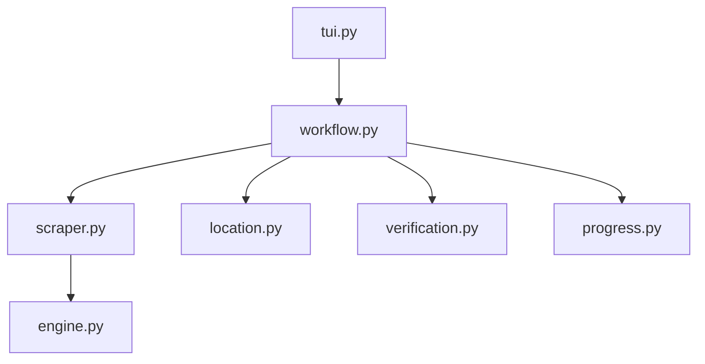

# Anikai Scraper

## Directory Tree
```text
.
├── __init__.py
├── engine.py
├── location.py
├── progress.py
├── scraper.py
├── site_config.json
├── tui.py
├── verification.py
└── workflow.py
```

## Architecture Graph


## Detailed File Explanations

### `__init__.py`
A simple initialization file that marks the `anikai` directory as a Python package, allowing components inside it to be imported as modules by the broader application.

### `engine.py`
This file defines the `AnikaiEngine` class (which inherits from a base `VideoEngine`). It is responsible for the actual stream resolution and downloading logic.
- **`resolve_episode_stream`**: Fetches the video watch page, extracts all embed URLs (from data-video tags), and sorts them based on a server priority algorithm (preferring `vivibebe` and `vidstreaming`). It extracts the `.m3u8` stream URL directly via regex (bypassing headless browser overhead when possible). If regex fails, it gracefully falls back to a Playwright-based extraction.
- **`_fast_hls_download`**: Implements a highly concurrent, custom HLS segment downloader (using 24 threads) for blazing fast speeds. Critically, it strips out obfuscated PNG headers (`\x89PNG...`) that `vivibebe` embeds to thwart standard tools. Finally, it uses `ffmpeg` to stitch the downloaded `.ts` chunks into an `.mp4` file.

### `location.py`
Determines where the downloaded episodes should be saved on the user's local disk.
- **`get_save_path`**: Checks if the process is running in batch mode (in which case it honors a pre-defined `batch_path`) or interactive Vacuum mode. In Vacuum mode, it launches an interactive Anime Import Wizard TUI to prompt the user for the specific category and location inside their Zine library. 

### `progress.py`
Handles UI feedback rendering for the CLI user via the `rich` library.
- **`render_completion_tree`**: Constructs and displays an aesthetically pleasing console tree summarizing the scrape job, including the destination folder, metadata source, total number of discovered videos, the count of pre-existing verified videos, and the presence of series cover art.

### `scraper.py`
Contains the `AnikaiScraper` class, which handles the HTML parsing of the Anikai website.
- **`get_metadata_and_videos`**: Makes requests to the series or episode URL and uses `BeautifulSoup` to parse out key metadata attributes such as Series Title, Cover Image URL, Description, Genres, Studio, and Status. It also grabs a list of all episode URLs associated with a series to build a dictionary list that the orchestrator loop can consume.

### `site_config.json`
A small configuration payload that sets the baseline parameters for the scraper. It maps the internal ID to its main active domain (`anikai.cc`), standardizes its display name, and registers any mirror domains or aliases.

### `tui.py`
The lightweight entry point for terminal user interface integration.
- **`handle_tui`**: Serves as a bridge passing the initialization arguments (like the tracker, location manager, scraper instance, etc.) seamlessly to the heavy-lifting `run_workflow` function.

### `verification.py`
Ensures idempotency in the download workflow so the scraper never fetches duplicate files.
- **`verify_videos`**: Delegates logic to the `tracker` instance to perform a robust two-step verification ensuring an episode is both registered in the internal tracking history and actually exists as a physical file on the user's local disk.

### `workflow.py`
The main orchestrator file that glues the entire Anikai pipeline together.
It performs the following high-level operations:
1. Calls `scraper.py` to pull series metadata and video lists.
2. Checks whether to download a single episode (Quick Grab mode) or an entire series (Vacuum mode). If interactive, prompts the user to select.
3. Consults `location.py` to resolve the final library destination and builds the folder structure.
4. Generates a `.zine/metadata.json` folder structure with all scraped metadata (genres, studios, etc.) and downloads the series cover art.
5. Invokes `verification.py` to calculate existing files.
6. Iterates over the target episodes. For each, it spins up a `rich` Live terminal UI showing real-time pulsing progress bars.
7. Hooks into `engine.py` to fetch HLS streams, parses out any sub-titles (saving them as `.vtt`), and triggers the actual download function. Handles retries and network losses gracefully, and finally logs a summary completion report.
