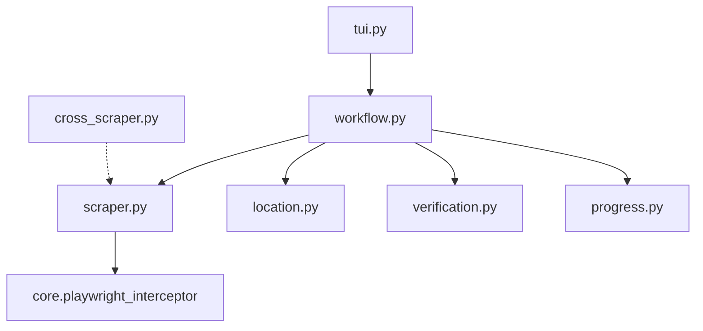

# Anikoto Scraper

## Directory Tree
```text
.
├── __init__.py
├── cross_scraper.py
├── location.py
├── progress.py
├── scraper.py
├── tui.py
├── verification.py
└── workflow.py
```

## Architecture Graph


## Detailed File Explanations

### `__init__.py`
Standard Python package initialization file marking the directory as a module.

### `cross_scraper.py`
A highly sophisticated fallback module. When a primary scraper in the broader Zine ecosystem completely fails to find alive links for a given anime episode, `fallback_cross_scraper` intercepts the error. It uses `difflib.SequenceMatcher` to fuzzy-search Anikoto's catalog for the failed title. If a high-confidence match is found, it dynamically bootstraps the Anikoto scraper and seamlessly hijacks the download thread to grab the video from Anikoto instead—all without breaking the parent batch loop.

### `location.py`
Determines the storage destination.
- **`get_save_path`**: Computes the exact absolute path on the disk for the media. In interactive mode, it invokes the TUI Anime Import Wizard to allow the user to select categorical folders, otherwise defaulting to a predefined batch path.

### `progress.py`
Handles visual terminal UI summaries.
- **`render_completion_tree`**: Uses the `rich` library to draw a structural tree of the metadata (Source, Total Videos, Existing, Cover art status) upon completion of an Anikoto scrape cycle.

### `scraper.py`
Contains the `AnikotoScraper` class, which orchestrates a multi-step API and DOM traversal sequence to extract hidden stream links.
- **`get_metadata_and_videos`**: Fetches the main watch page to rip basic attributes (Title, Genres, Cover, ID). It then reverse-engineers the site's frontend by making an explicit AJAX call to `/ajax/episode/list/{id}` to pull the hidden episode grid and `data-ids`.
- **`resolve_episode_stream`**: Takes the `data-ids`, pings the `/ajax/server/list` endpoint, and dynamically pipes the embed URL into `core.playwright_interceptor`. Playwright acts as a headless browser to spoof a user, intercepting the XHR `getSources` calls from the embedded player to snag the raw `.m3u8` stream.

### `tui.py`
The CLI entry point.
- **`handle_tui`**: A lightweight wrapper that passes context variables (trackers, location managers, etc.) into the main workflow runner.

### `verification.py`
Ensures idempotency in downloads.
- **`verify_videos`**: Cross-references the tracker database and the local disk to calculate which episodes already exist, preventing duplicate bandwidth usage.

### `workflow.py`
The robust execution loop for the Anikoto module. 
It performs the following:
1. Triggers metadata fetching from `scraper.py`.
2. Asks the user if they want to download a single episode or the entire series (handling direct `/ep-` URL routing).
3. Defines the exact save folder via `location.py`.
4. Saves a `cover.jpg` and a highly detailed `.zine/metadata.json` folder payload.
5. Initiates the download loop over all requested episodes.
6. **Mirror Redundancy**: If the primary domain (`anikototv.to`) has dead stream links or is blocked, the workflow automatically iterates through hardcoded alternative mirror domains (`anikoto.cz`, `anikoto.me`, `anikoto.net`, `anikototv.se`), modifying the URL in real-time until a successful resolution is found.
7. Fetches optimal HLS qualities via `_fetch_hls_qualities` and downloads subtitle tracks (`.vtt`) alongside the media.
8. Interfaces with the `rich` terminal library to display pulsing progress bars during the download phase.
