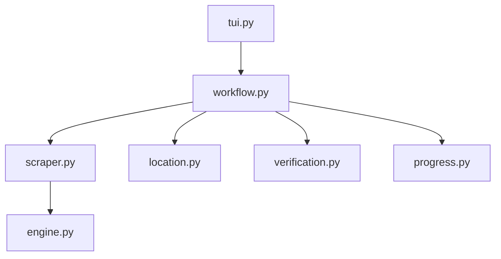

# AniNeko Scraper

## Directory Tree
```text
.
├── __init__.py
├── engine.py
├── location.py
├── progress.py
├── scraper.py
├── site_config.json
├── tui.py
├── verification.py
└── workflow.py
```

## Architecture Graph


## Detailed File Explanations

### `__init__.py`
Standard Python package file marking this directory as the `anineko` module.

### `engine.py`
Defines `AninekoEngine`, which inherits from a shared base `VideoEngine`.
- **`resolve_episode_stream`**: Takes the episode URL, requests the HTML, and parses all `.server-video` embed elements. It sorts available embedded servers by priority (preferring direct CDNs like `vivibebe` and `vidstreaming`). It extracts the m3u8 using regex explicitly for `vivibebe` to skip the headless browser overhead, falling back to a Playwright-based extractor for other obscure video hosts.
- **`_fast_hls_download`**: Replaces the generic yt-dlp downloader with a 24-thread concurrent chunk downloader tailored for AniNeko's streams. Crucially, it identifies and slices off dummy PNG headers (`\x89PNG...`) maliciously prefixed to `.ts` stream segments by video hosts to stop unauthorized scraping. Uses `ffmpeg` to stitch the clean chunks back together.

### `location.py`
Determines local destination folder logic.
- **`get_save_path`**: Decides whether the file falls into a headless `batch_path` target or invokes the interactive `CategoryImportTUI` (Vacuum mode) to let the user select where in their Zine library this anime series should live.

### `progress.py`
Handles terminal visual feedback.
- **`render_completion_tree`**: Uses `rich.tree` to draw a stylized console tree presenting a job's destination folder, original source, total episode count, existing episodes (skipped), and cover art status.

### `scraper.py`
Contains `AninekoScraper`. Unlike Anikai, AniNeko's DOM requires complex multi-page traversal.
- **`get_metadata_and_videos`**: A robust multi-step function. It handles links to either a series overview page or a specific episode's watch page. Since AniNeko overview pages lack server lists, and watch pages lack full metadata, the scraper intelligently fetches both pages in the background if necessary. It parses episodes via `_extract_episodes_from_watch_page` and sidebar properties like MAL Score, Japanese title, and Studio via `_extract_metadata_from_overview`.

### `site_config.json`
Metadata payload specifying the primary domain (`anineko.to`), aliases (e.g. `anineko.com`), and its stylized display name.

### `tui.py`
Simple CLI entry point invoking `handle_tui` which passes core instances into the main workflow.

### `verification.py`
Handles idempotency.
- **`verify_videos`**: Asks the `tracker` instance to perform a dual-check (database history and physical file existence) to prevent re-downloading episodes the user already has on their drive.

### `workflow.py`
The master orchestrator file for the AniNeko pipeline.
1. Retrieves metadata and the full episode list from `scraper.py`.
2. Handles interactive CLI prompts to switch between entire series Vacuum mode or single episode Quick Grab mode (and auto-detects `ep-X` fragments in URLs).
3. Invokes `location.py` to create physical subfolders.
4. Drops a standard `cover.jpg` and `.zine/metadata.json` folder package containing all anime stats (Status, Producers, Aired date, etc).
5. Scans existing files via `verification.py`.
6. Iterates over missing episodes. It spins up a `rich` pulsing progress bar for each, calls the Engine to fetch HLS qualities and subtitles (`.vtt`), and triggers the blazing-fast concurrent download.
7. Ensures clean shutdowns upon receiving a Revolt interrupt signal.
