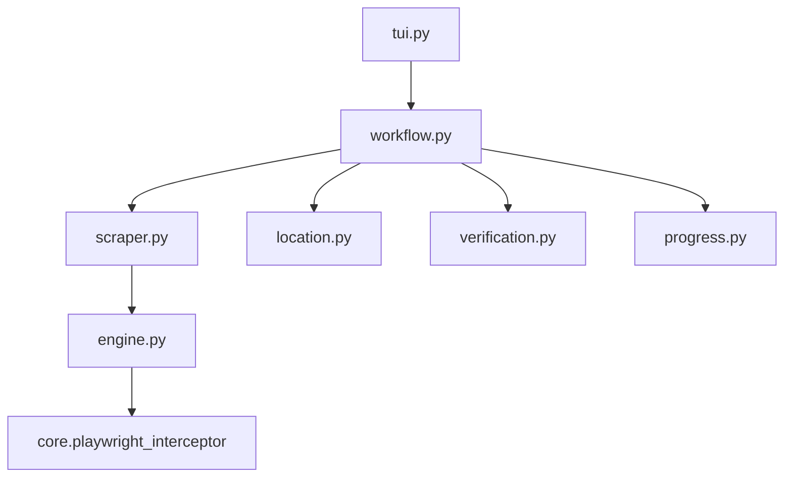

# Anitaku Scraper

## Directory Tree
```text
.
├── __init__.py
├── engine.py
├── location.py
├── progress.py
├── scraper.py
├── site_config.json
├── tui.py
├── verification.py
└── workflow.py
```

## Architecture Graph


## Detailed File Explanations

### `__init__.py`
Standard Python package file marking this directory as the `anitaku` module.

### `engine.py`
The heavy-lifting core for downloading streams from Anitaku (formerly Gogoanime).
- **`resolve_episode_stream`**: Requests the video player page and extracts third-party iframe embed URLs from the `.anime_muti_link ul li a` DOM elements. It sorts them by server priority, placing `vivibebe` / `vidstreaming` at the top because it can extract their `.m3u8` payloads instantly using regex. If it encounters a fallback host (like `mp4upload` or `dood`), it uses a headless browser via `core.playwright_interceptor` to solve JavaScript challenges and extract the video source.
- **`_fast_hls_download`**: Overrides the default yt-dlp downloader with a custom 24-thread segment downloader to pull `.ts` files concurrently. It automatically strips obfuscated `\x89PNG` headers injected by certain CDNs to break standard scrapers. Finally, it uses `ffmpeg` to multiplex the segments into a standard `.mp4` file.

### `location.py`
Determines the physical disk destination.
- **`get_save_path`**: Decides whether the file falls into a headless `batch_path` target or invokes the interactive `CategoryImportTUI` (Vacuum mode) to let the user select where in their Zine library the series should live.

### `progress.py`
Handles terminal visual feedback.
- **`render_completion_tree`**: Uses `rich.tree` to draw a stylized console tree presenting a job's destination folder, original source, total episode count, existing episodes (skipped), and cover art status.

### `scraper.py`
Contains `AnitakuScraper`. Handles extracting series data and building the episode manifest.
- **`get_metadata_and_videos`**: Normalizes input URLs. If given an episode URL (`-episode-`), it first traverses backward to the main category page to grab reliable series metadata. It parses all `.anime_info_body_bg p.type span` tags to scrape Plot Summary, Genres, and Episodes. Finally, it grabs the full episode roster from `#episode_related li a`.

### `site_config.json`
Metadata payload specifying the primary domain (`anitaku.online`), aliases, and its stylized display name.

### `tui.py`
Simple CLI entry point invoking `handle_tui` which passes core instances into the main workflow runner.

### `verification.py`
Handles idempotency.
- **`verify_videos`**: Checks the internal SQLite `tracker` instance and local disk existence to prevent re-downloading episodes the user already possesses.

### `workflow.py`
The master orchestrator file for the Anitaku pipeline.
1. Retrieves metadata and the full episode list from `scraper.py`.
2. Handles interactive CLI prompts to switch between entire series Vacuum mode or single episode Quick Grab mode.
3. Invokes `location.py` to calculate the target directory and resolves path collisions.
4. Generates a standard `cover.jpg` and `.zine/metadata.json` payload for interoperability with external media clients like Jellyfin.
5. Scans existing files via `verification.py` to flag skips.
6. Iterates over missing episodes, instantiating `rich` pulsing progress bars that update across state transitions (Resolving → Downloading → Baking → Done).
7. Fetches HLS streams, parses out `.vtt` subtitle tracks, and delegates the raw bits to `engine.py`.
8. Enforces a clean shutdown if interrupted by a Revolt signal.
