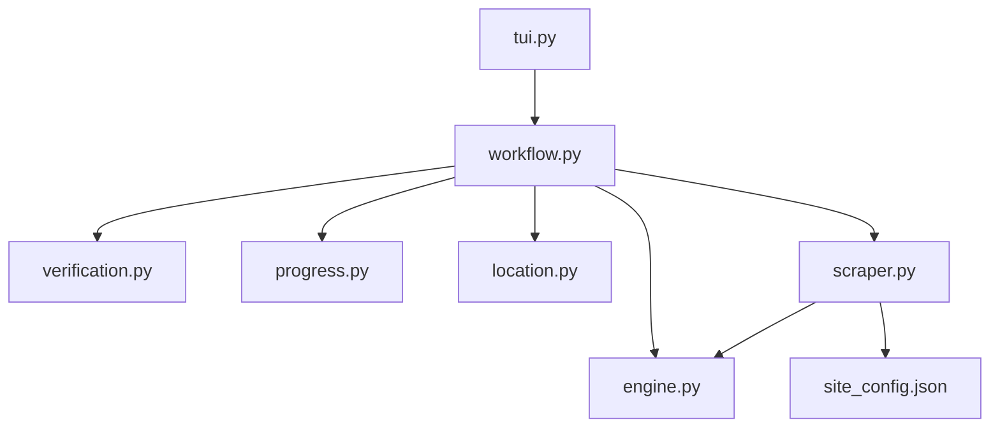

# HiAnime Scraper

```text
hianime
├── README.md
├── __init__.py
├── engine.py
├── location.py
├── progress.py
├── scraper.py
├── site_config.json
├── tui.py
├── verification.py
└── workflow.py
```

## Detailed File Explanations

1. `__init__.py`: The standard initialization file indicating that the `hianime` folder should be treated as a Python module.
2. `engine.py`: Contains the `HianimeEngine` class which is crucial for bypassing standard video hosts. It implements `resolve_episode_stream()` to scrape `data-video` embed links from the DOM. For specific CDNs like vivibebe/vidstreaming, it reads the page's raw JS to extract the `.m3u8` link directly via Regex (bypassing the slow Playwright browser overhead entirely). It also features a custom `_fast_hls_download` method which concurrently downloads video chunks and even strips obfuscated PNG headers baked into chunks as an anti-scraping measure, before using `ffmpeg` to mux them.
3. `location.py`: Because anime requires tighter organizational structure, this file summons the `CategoryImportTUI` (Anime Import Wizard) to interactively prompt the user for the exact Anime Category and Season they want to route the files to (when operating in Vacuum mode).
4. `progress.py`: Exposes a `render_completion_tree` method relying on `rich.tree` to show a beautiful status output of the target location, the total videos in the queue, existing verification hits, and whether the cover artwork was successfully saved.
5. `scraper.py`: Defines the `HianimeScraper`. It handles the complex logic of identifying whether the provided URL is a category overview (`/anime/`) or a specific episode (`/watch/`). It fetches the raw DOM using BeautifulSoup, extracts the comprehensive sidebar metadata (genres, MAL score, studios, aired date), and builds the list of episodes to be fed to the engine.
6. `site_config.json`: Identifies the primary domain `hianime.to` and maps out all its historical or mirror aliases, such as `zoro.to`, `aniwatch.to`, and `zoroxtv.to`.
7. `tui.py`: Acts as a tiny glue layer bridging the core router to the specific `workflow.py` for this scraper. Unlike other scrapers, the complex UI choices are embedded deeper into the workflow script.
8. `verification.py`: Uses the `HistoryLayer` to enact two-step tracking. It confirms whether the video's ID exists in the global `history.json` and if the `.mp4` file is still physically available on disk to prevent duplicates.
9. `workflow.py`: The massive, self-contained orchestrator module exclusively for Anime. It fetches the metadata, conditionally prompts the user for single-episode versus full-series download, launches the Anime Import Wizard, manages the `.zine/metadata.json` saving, and runs the actual concurrent download loop. It includes advanced functionality to download and save subtitle `.vtt`/`.srt` files directly into a `Subtitles/` folder beside the media files to enable seamless playback in standard media players.

## File Call Graph


