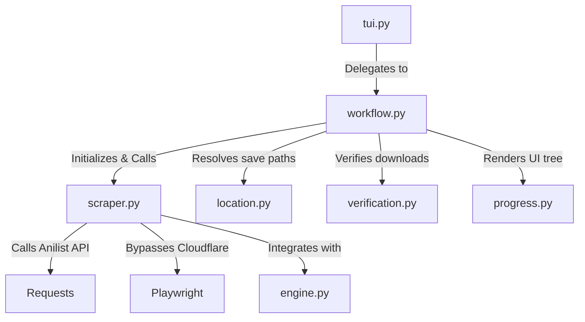

# Miruro Scraper Architecture

## Directory Structure
```
/home/valse-de-anshu/.config/zine scraper/scrapers/miruro
├── __init__.py
├── cover.py
├── engine.py
├── location.py
├── progress.py
├── scraper.py
├── tui.py
├── verification.py
├── workflow.py
└── workflow.py.bak_quickgrab
```

## Module Interactions (Mermaid Graph)


## Detailed File Explanations

### `__init__.py`
Standard Python initialization file establishing the folder as a package.

### `scraper.py`
Unlike toon scrapers, this is an Anime/Video scraper for Miruro (miruro.to, miruro.ru).
**Explicit Execution Path**:
- `get_metadata_and_videos`: It fundamentally bypasses scraping the complex Miruro frontend for metadata. Instead, it parses the Anilist ID straight from the URL (`/watch/12345`), and fires a GraphQL POST query to `https://graphql.anilist.co`. This guarantees perfect metadata (title, total episodes, genres, cover image). It then synthetically generates episode URLs using `?ep=X`.
- `resolve_episode_stream`: Resolves the actual m3u8 stream. It specifically normalizes the URL to `www.miruro.ru` (to mitigate timeout variations across their CDN), then invokes a subprocess utilizing `playwright_extractor.py` out of a dedicated python `venv` to execute browser-side Javascript, bypass Cloudflare, and sniff the raw JSON/m3u8 stream.

### `engine.py`
Handles overarching system integration. While `scraper.py` fetches the stream, `engine.py` likely manages network retries, standard request headers for non-browser queries, and inherits/defines the `VideoEngine` base routines used to pipe m3u8 streams into local video downloading binaries like yt-dlp or ffmpeg.

### `workflow.py`
The master execution controller.
**Explicit Execution Path**:
- Boots up the UI and queries `scraper.py` to map the total episodes via Anilist.
- Defers to `location.py` for picking Anime/Video specific folders.
- Writes metadata and loops through episodes, triggering `resolve_episode_stream`, and feeding the resulting m3u8 URLs into the global Video downloading pipeline, whilst updating terminal UI via `progress.py`.

### `location.py`
The CLI navigator for folder selection.
**Explicit Execution Path**:
- Given the anime metadata, it prompts the user to select the appropriate library category (e.g. Anime -> SFW -> Complete) and constructs the final OS path for the video files.

### `verification.py`
Cross-references downloaded files.
**Explicit Execution Path**:
- Scans target folders for existing video files (`.mp4`, `.mkv`).
- Updates the history tracker, preventing duplicate downloads of heavy anime episodes.

### `cover.py`
A minimalist module designed to download the anime poster. It uses the `Thumbnail` URL provided by the Anilist GraphQL response in `scraper.py`.

### `tui.py`
An entrypoint handler that cleanly passes URL and configuration payloads into `workflow.py`.

### `progress.py`
Leverages the `rich` library to render the console output, displaying episode counts, metadata, and active stream resolution statuses in a visual tree format.

### `workflow.py.bak_quickgrab`
A deprecated backup or legacy script focusing on grabbing a single episode without establishing the full series metadata tracker.
