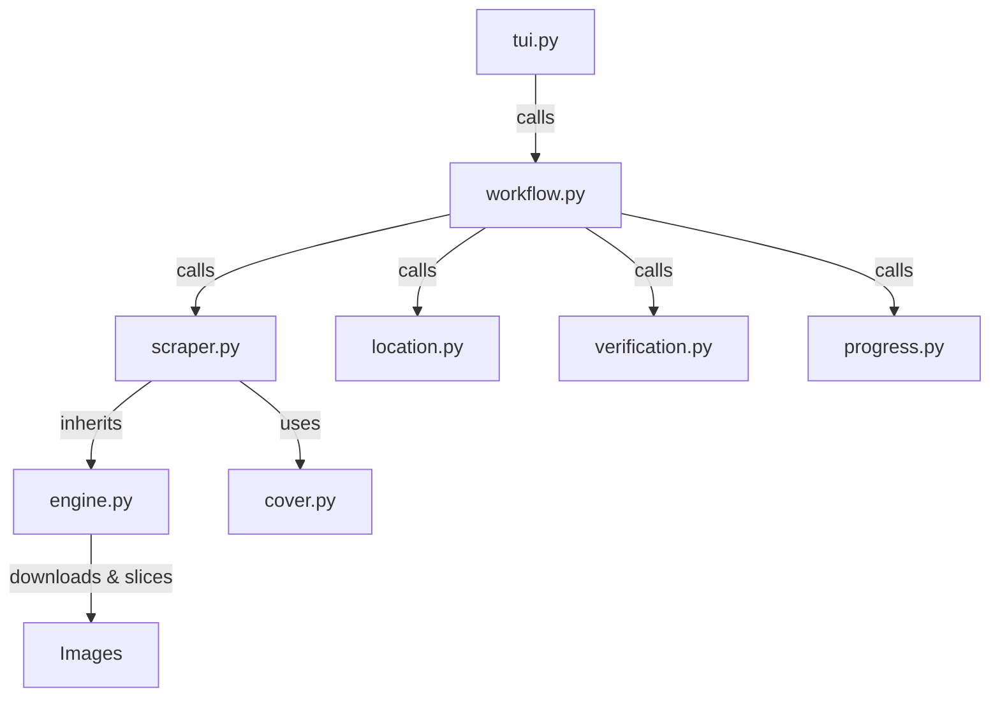

# FanFox Scraper

## Directory Structure
```text
fanfox/
├── README.md
├── __init__.py
├── __pycache__/
├── cover.py
├── engine.py
├── location.py
├── progress.py
├── scraper.py
├── tui.py
├── verification.py
├── workflow.py
└── workflow.py.bak_quickgrab
```

## Architecture Graph


## File Explanations

### `__init__.py`
An empty file that makes the `fanfox` directory a Python module, allowing its scripts to be imported elsewhere.

### `cover.py`
Contains the logic specific to FanFox for extracting the cover image URL from the DOM using BeautifulSoup. It targets `img.detail-cover`, `img.detail-info-cover-img`, or `img.detail-bg-img` to find the main thumbnail, prepending `https:` if the source is protocol-relative. It falls back to a generic extractor (`core.generic_cover`) if not found.

### `engine.py`
The powerhouse of the scraper. It defines a `BaseScraper` class containing heavy-lifting logic for parsing and downloading images.
- Implements robust `requests` session handling (cookies, user-agents, referers, retries).
- Downloads images concurrently using `ThreadPoolExecutor`.
- Provides a `slice_and_save` utility utilizing `Pillow` (PIL) to vertically stitch downloaded images of a chapter into a single continuous canvas, and then slice it back up into standardized 2000px height chunks. This is particularly useful for continuous scrolling webtoons.

### `location.py`
Owns all path/folder prompting and resolves the save location for downloaded content. It displays a TUI (Text User Interface) via the `rich` module to guide the user in selecting the target directory (categorizing into SFW/NSFW, Ongoing/Completed, or custom paths).

### `progress.py`
Handles UI rendering for download summaries. It uses `rich.tree` to draw a stylized completion tree containing metadata like location, source, total chapters, existing verified chapters, and cover status.

### `scraper.py`
Contains the `FanFoxScraper` class which inherits from `BaseScraper`. This file actually defines how to parse the FanFox website.
- **`get_title_and_chapters`**: Scrapes manga title, descriptions, authors, genres, and loops over DOM elements to map out available chapters. Handles "mobile roll view" URLs.
- **`unpack_js`**: A specialized utility to unpack JavaScript obfuscation (`eval(function(p,a,c,k,e,d)...)`) which the FanFox site uses to hide image URLs on their chapter pages.
- **`process_chapter`**: Pulls the chapter HTML, looks for the JS blocks, un-obfuscates the image array, and forwards the URLs to the `process_chapter_multi` method inherited from `engine.py`.

### `tui.py`
A simple entry-point file that delegates execution to `workflow.py`. The primary function `handle_tui` takes in tracker and scraper contexts and hands them off to `run_workflow`.

### `verification.py`
Manages download verifications and history checking. It looks through the target save directory and cross-references it with a `tracker` database. It checks for actual image files on the filesystem (PNGs, JPGs, WebP, AVIF) to ensure chapters are genuinely downloaded, and returns the missing chapters that still need processing. It also handles backwards compatibility for folder naming.

### `workflow.py`
The orchestrator. It brings together all the pieces by calling:
1. `scraper.get_title_and_chapters()` to get chapter metadata.
2. `location.get_save_path()` to ask the user where to save the files.
3. `verification.verify_chapters()` to figure out what's missing.
4. Updates JSON metadata (`meta.json`) inside a hidden `.zine` folder.
5. Initiates a `rich.progress` task and loops through all missing chapters, making calls to `scraper.process_chapter()` in a robust try-catch block to download content while piping live stats to the UI.
6. Handles graceful recovery of the UI output in case of terminal artifacts.

### `workflow.py.bak_quickgrab`
A backup or older iteration of `workflow.py` tailored toward a "quick grab" flow which skips some metadata processing. It remains in the codebase as a historical backup.
