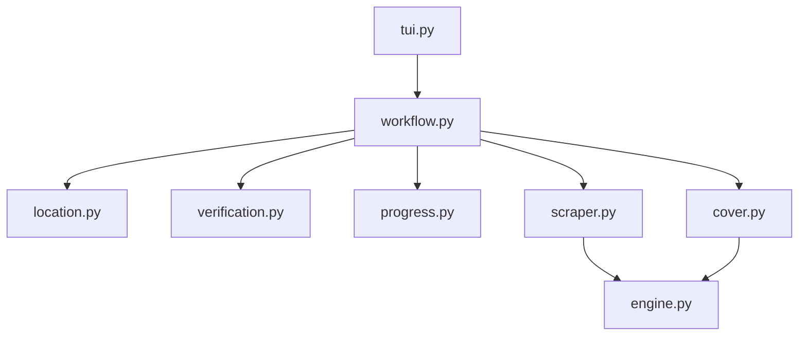

# KunManga Scraper

```text
kunmanga
├── README.md
├── __init__.py
├── cover.py
├── engine.py
├── location.py
├── progress.py
├── scraper.py
├── tui.py
├── verification.py
└── workflow.py
```

## Detailed File Explanations

1. `__init__.py`: Standard initialization file for the `kunmanga` sub-scraper package.
2. `cover.py`: A very simple pass-through script that routes cover image extraction requests directly to `core.generic_cover.extract`, standardizing the approach across multiple toon sites.
3. `engine.py`: Defines the `BaseScraper` parent class specifically tuned for webtoons. Crucially, it manages threaded image chunk downloads (`MAX_WORKERS = 3`) and contains a complex image processing engine (`slice_and_save`). This engine automatically stitches multiple manga pages into one continuous vertical canvas, verifies MIME types dynamically, and re-slices the canvas into perfectly uniform `2000px` height chunks (which is highly optimal for user viewing).
4. `location.py`: The interactive location resolver. Because Manga/Toons require deeper categorization, this script explicitly prompts the user to categorize the series by "Type" (`SFW` vs `NSFW`) and "Status" (`Ongoing` vs `Completed`). It automatically builds the final target filesystem path, falling back to a `Vacuum` mode if necessary.
5. `progress.py`: A `rich.tree` powered UI module. It formats the metadata block prior to the download queue starting, explicitly formatting the ranges of successfully identified existing chapters to prevent visual clutter in the terminal.
6. `scraper.py`: Contains `KunMangaScraper` extending `BaseScraper`. Because KunManga recently moved to a paginated API to combat scraping, this scraper dynamically constructs API queries (`/api/comics/{series_slug}/chapters?page=X`) to exhaustively pull the chapter list, completely bypassing the HTML DOM. It also aggressively sanitizes series metadata (stripping tags like "read online raw free" from the title).
7. `tui.py`: A lightweight bootstrap interface that receives the initial URL drop and immediately routes it to the `workflow.py` orchestration.
8. `verification.py`: Handles chapter verification logic. Not only does it verify `history.json` records against local `.png`/`.jpg` file clusters, but it also features an auto-migration script. If it detects older folders formatted as `ch12`, it automatically safely renames them to `Chapter12` for uniformity without re-downloading.
9. `workflow.py`: The loop orchestrator. It manages fetching the API metadata, invoking the `core.ui.filter_subchapters` menu (allowing users to pick specific chapter ranges), and writes out a unique `.zine/meta.json` tracking file. It hooks deeply into the `process_chapter` ThreadPool callbacks to render a live, byte-accurate progress bar as images are baked and sliced in real-time.

## File Call Graph


