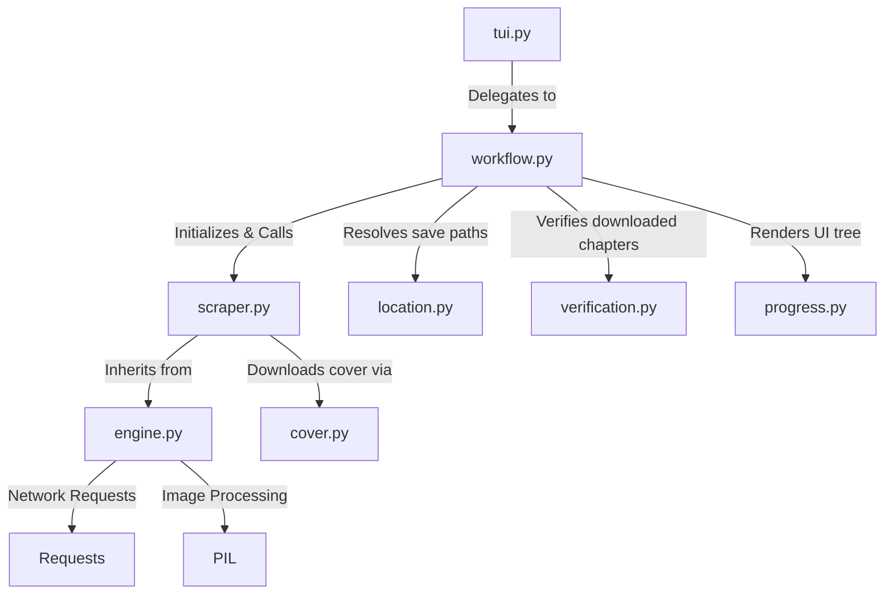

# Mangak Scraper Architecture

## Directory Structure
```
/home/valse-de-anshu/.config/zine scraper/scrapers/mangak
├── __init__.py
├── cover.py
├── engine.py
├── location.py
├── progress.py
├── scraper.py
├── tui.py
├── verification.py
├── workflow.py
└── workflow.py.bak_quickgrab
```

## Module Interactions (Mermaid Graph)


## Detailed File Explanations

### `__init__.py`
This is a standard Python initialization file that allows the `mangak` directory to be treated as a modular package. It is empty but crucial for import resolution across the zine scraper architecture.

### `engine.py`
This file contains the core `BaseScraper` class, which serves as the foundational scraping engine. 
**Explicit Execution Path**:
- Defines strict HTTP headers, mocking a real Chrome browser.
- Implements robust error handling and retries (up to 5 times) for network requests via BeautifulSoup.
- `download_image`: A robust downloader that tries multiple referer headers (root domain, chapter url, no referer) to bypass hotlink protections. Preserves native image mimes.
- `process_chapter_multi`: Uses a `ThreadPoolExecutor` to download chapter pages concurrently for high throughput.
- `slice_and_save`: An image processing pipeline using `PIL`. It aggregates all the raw downloaded images vertically into a massive RGBA/RGB canvas, then systematically slices them into consistent 2000px height chunks. This is critical for seamless vertical scrolling (baking).

### `scraper.py`
Contains the `MangaKScraper` class which inherits directly from `BaseScraper` (in `engine.py`).
**Explicit Execution Path**:
- `get_title_and_chapters`: Parses the target URL. It attempts to rip out the main manga metadata (title, author, genres, description). It cleverly falls back to reading `__NEXT_DATA__` JSON scripts embedded in the MangaK Next.js frontend if standard DOM scraping fails. Furthermore, it paginates through `api.mangak.io` to collect all available chapters, filtering out decimal-numbered variants.
- `process_chapter`: Given a chapter URL, it sniffs out the raw JSON payload in the DOM, runs a regex to extract all valid image CDNs (specifically `rx.qvzr` or `resmk.org`), deduplicates the URLs, and then passes them to `process_chapter_multi` in the engine.

### `workflow.py`
The orchestrator script tying the entire scraping pipeline together.
**Explicit Execution Path**:
- It clears the terminal and queries `scraper.py` for metadata.
- Pushes the metadata to `location.py` to determine where the manga should be saved.
- Instantiates `.zine/meta.json` within the output directory for persistent metadata tracking.
- Initiates `verification.py` to determine which chapters need to be downloaded versus skipped.
- Loops through remaining chapters, instantiating Rich Live TUIs for progress bars, and invokes `scraper.process_chapter`. Provides an intricate fallback mechanism to redraw the TUI upon connection interruptions.

### `location.py`
Responsible for the user-facing TUI path selection prompt and directory management.
**Explicit Execution Path**:
- Evaluates whether the user is in an automated batch mode. If not, it generates an interactive menu using the `Selector` class.
- Asks the user if the manga is SFW or NSFW, and Ongoing or Completed.
- Asks whether to use a default structured path or a custom location, handling standard input safely.
- Resolves the target directory using the `store_layer` abstraction.

### `verification.py`
A crucial deduplication and integrity check module.
**Explicit Execution Path**:
- Iterates over the list of parsed chapters and cross-references them against a persistent `tracker` (usually an SQLite database) and the local filesystem.
- Inspects directories for actual images (`*.png`, `*.jpg`, `*.webp`, etc.). If a directory exists but is empty/corrupt, it deletes temporary files and flags the chapter for re-download.
- Renames legacy folder formats (e.g., `ch1` to `Chapter1`).

### `tui.py`
The entrypoint interface layer for the UI.
**Explicit Execution Path**:
- Receives the core context (tracker, location_manager, scraper).
- Immediately delegates control to `run_workflow` within `workflow.py`. It is a structural adapter.

### `progress.py`
Renders the high-level tree structure of the manga download progress.
**Explicit Execution Path**:
- Utilizes `rich.tree.Tree` to visualize metadata, save location, total chapters, existing verified chapters, and cover download status in an aesthetic CLI tree.

### `cover.py`
A minimalist bridge script for fetching manga cover art.
**Explicit Execution Path**:
- It simply calls a shared `generic_extract` function from `core.generic_cover`, offloading the logic of finding `og:image` or primary cover thumbnails from the DOM.

### `workflow.py.bak_quickgrab`
A deprecated or backup version of `workflow.py` originally designed to focus purely on "quick grab" downloads without comprehensive metadata cataloging.
