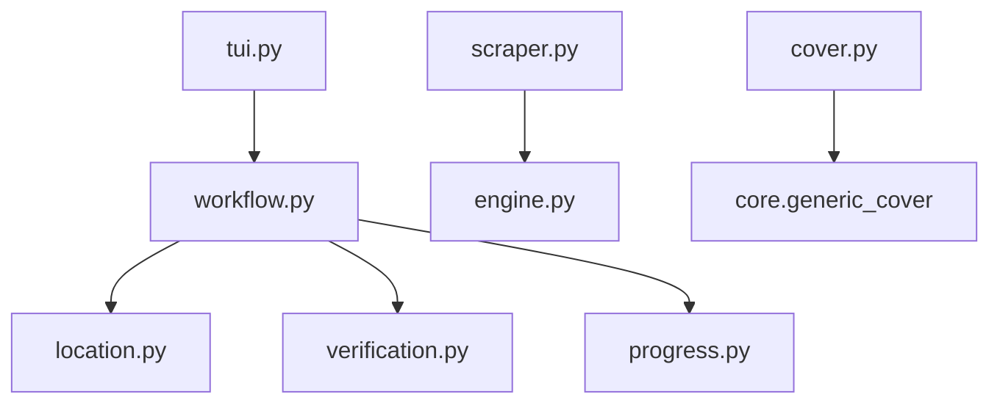

# WeebCentral Scraper

```text
.
├── __init__.py
├── __pycache__/
├── cover.py
├── engine.py
├── location.py
├── progress.py
├── scraper.py
├── tui.py
├── verification.py
└── workflow.py
```

## Architecture and Dependencies



## Detailed File Explanations

### `tui.py`
**What it does:** The text UI entry point for the WeebCentral scraper.
**Explicit Details:** 
- Acts as a thin delegator, instantly passing URL, tracker, location manager, and scraper instances to `run_workflow()` inside `workflow.py` without requiring extra upfront user menus.

### `scraper.py`
**What it does:** The DOM and API parser specific to WeebCentral's layout and data delivery mechanisms.
**Explicit Details:** 
- Inherits from `BaseScraper` defined in `engine.py`.
- **`get_title_and_chapters`**: Contains extensive fallback logic to parse the description, authors, tags, and genres from WeebCentral's series pages. It automatically detects if a user inputs a single chapter link (`/chapters/`) and traces it backward through the DOM to find the main `/series/` URL. It then fetches the full chapter list from a dedicated backend URL (`/full-chapter-list`) to bypass JavaScript-rendered pagination.
- **`process_chapter`**: Orchestrates downloading a specific chapter. Because WeebCentral lazy-loads images via AJAX, this function extracts the unique chapter ID and sends a direct `GET` request to `https://weebcentral.com/chapters/{ch_id}/images?is_prev=False&current_page=1&reading_style=long_strip` to scrape the raw image URLs before handing them off to the engine's batch downloader.

### `engine.py`
**What it does:** Core engine providing asynchronous downloading and heavy image manipulation functionality specifically tailored for reading comics/mangas locally.
**Explicit Details:** 
- Defines `BaseScraper` with a custom `requests.Session` maintaining mocked browser headers (`Sec-Ch-Ua`, `Sec-Fetch-Site`) to prevent CDN blocks.
- **`download_image`**: Robust multi-attempt downloader that validates the `Content-Type` header (checking against a `VALID_IMAGE_MIMES` set) to strictly reject ad-tracking pixels or HTML error pages. It automatically rewrites file extensions on the fly (e.g. saving as `.avif` if the CDN actually delivered AVIF).
- **`process_chapter_multi`**: Silently manages the concurrent downloading of all pages in a chapter using a `ThreadPoolExecutor` (max 3 workers). Pages are piped into a hidden `_temp_{ch_num}` folder.
- **`slice_and_save`**: Crucial feature that merges all downloaded images in a chapter into one extremely tall `PIL` (Pillow) canvas in memory. It then intelligently slices that canvas into 2000px height chunks. This effectively converts standard paginated manga into a continuous "webtoon" strip format optimized for vertical scrolling while keeping file sizes manageable for standard image viewers.

### `workflow.py`
**What it does:** Manages the primary execution loop, UI state management, and file system interactions.
**Explicit Details:** 
- Calls the scraper to extract metadata. Detects whether the link is a full series or a single chapter.
- Prompts `location.py` to get the final download destination and creates the `.zine/meta.json` file inside the target directory, saving all extracted metadata (author, tags, genres, description).
- Downloads the series cover art.
- Triggers `verify_chapters` to purge already-downloaded chapters from the current queue.
- Executes the main download loop, constructing deep `Rich` Live UI Trees showing real-time concurrent page download progress, missing pages, retry counts, and "baking" (image merging/slicing) status.
- Registers a `tui_reconstruct` callback with the system's `whistleblower` so the terminal UI perfectly rebuilds itself if the app loses internet connection and reconnects.

### `location.py`
**What it does:** Handles standard and custom directory path selection.
**Explicit Details:** 
- Interactively asks the user to categorize the comic as SFW vs NSFW, and Ongoing vs Completed.
- Constructs the target path based on those choices (e.g., `Zine/Toon/SFW/OnGoing/weebcentral/`).
- Allows the user to select a totally custom absolute path instead, validating the directory via the storage layer.

### `progress.py`
**What it does:** Renders a summary visual tree before the actual download phase begins.
**Explicit Details:** 
- Defines `render_completion_tree()` which uses the `rich` library to print a clean summary block containing the destination folder, total chapters discovered, successfully fetched cover status, and a summarized string of currently existing chapters on disk (e.g. "1-20, 22-25").

### `verification.py`
**What it does:** Guarantees idempotency and cleans up aborted download fragments.
**Explicit Details:** 
- Examines `Tracker` history against the physical file system.
- Standardizes chapter numbering formats (e.g., renaming `ch1` to `Chapter1`).
- Sweeps the directory for anomalous leftover `_temp_{num}` directories from prior failed downloads and deletes them.
- Synchronizes the local database; if a chapter is marked downloaded but physically missing, it resets the history flag to force a re-download.

### `cover.py`
**What it does:** Wrapper for generic cover extraction.
**Explicit Details:** 
- Simply imports and returns `generic_extract(soup, url)` from `core.generic_cover`.
