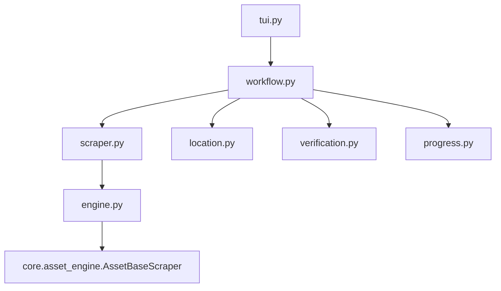

# Internet Archive Scraper

## Directory Tree
```text
.
├── __init__.py
├── engine.py
├── location.py
├── progress.py
├── scraper.py
├── tui.py
├── verification.py
└── workflow.py
```

## Architecture Graph


## Detailed File Explanations

### `__init__.py`
Standard Python package file marking this directory as the `archive` module.

### `engine.py`
A minimalist module containing `BaseScraper` which inherits directly from `core.asset_engine.AssetBaseScraper`. Because the Internet Archive exposes raw static files rather than obfuscated streaming video, there is no need for a complex engine to intercept HLS segments or strip dummy PNG headers.

### `location.py`
Determines the storage destination with an asset-centric focus.
- **`get_save_path`**: Computes the path and presents a generic `Selector` UI. It allows the user to either accept a generated default folder or type in a specific absolute path, complete with validation checks.

### `progress.py`
Handles terminal visual feedback.
- **`render_completion_tree`**: Uses `rich.tree` to draw a stylized console tree. Since IA items can be anything (books, software, audio), it dynamically iterates over the metadata dictionary to render whatever fields were successfully pulled.

### `scraper.py`
Contains `ArchiveScraper`, the core logic for querying the Internet Archive.
- **`get_metadata_and_assets`**: Parses the IA identifier from the provided URL (e.g. `/details/{id}`). Instead of fragile HTML scraping, it hits the official `https://archive.org/metadata/{identifier}` JSON API. 
- **Filtering Logic**: It implements sophisticated filtering rules to discard IA system spam (like `_files.xml`, `_meta.sqlite`, and `_archive.torrent`). It also skips auto-generated derivative files (such as `Abbyy GZ` or `Djvu XML` OCR data) to ensure the user only downloads the primary source files. It sorts the remaining assets descending by size.

### `tui.py`
Simple CLI entry point invoking `handle_tui` which delegates directly to the main workflow runner.

### `verification.py`
Handles idempotency for raw assets.
- **`verify_assets`**: Scans the tracker database and cross-references it with local files. If a file was marked as downloaded but is physically missing, it repairs the database by unmarking it.

### `workflow.py`
The master orchestrator file for the Internet Archive pipeline.
1. Retrieves metadata and the asset payload from `scraper.py`.
2. Invokes `location.py` to establish the target folder structure.
3. Renders the interactive metadata summary tree.
4. If running in interactive mode, it displays a `MultiSelector` menu, giving the user granular checklist control over exactly which files they wish to pull from the archive item.
5. Iterates through the selected files. It spins up a standard HTTP `rich` progress bar layout (including Time Remaining and Mbps widgets) and delegates the chunk downloading to the engine.
