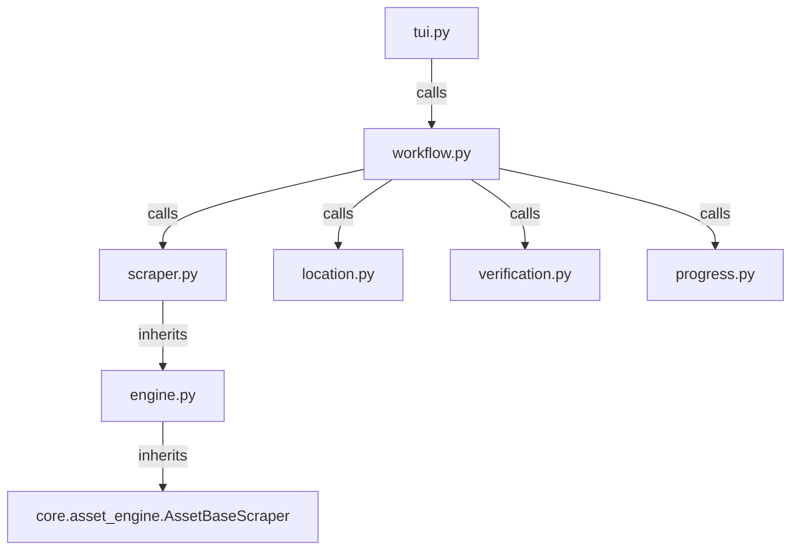

# Gutenberg Scraper

## Directory Structure
```text
gutenberg/
├── README.md
├── __init__.py
├── __pycache__/
├── engine.py
├── location.py
├── progress.py
├── scraper.py
├── tui.py
├── verification.py
└── workflow.py
```

## Architecture Graph


## File Explanations

### `__init__.py`
Empty file to mark the directory as a Python module for relative imports.

### `engine.py`
A minimalist bridge file. It imports `AssetBaseScraper` from `core.asset_engine` and creates a `BaseScraper` class that simply inherits from it. It relies on the core application's file downloading mechanics rather than implementing its own chunking logic (unlike image-based scrapers).

### `location.py`
Handles directory resolution for downloaded ebook files. It presents a TUI to the user displaying extracted ebook metadata (Title, Author, Language, Ebook ID, Subjects) and asks whether to save it to the default categorization path or a user-provided custom location.

### `progress.py`
Provides the terminal UI logic using the `rich` library to draw a tree view. It displays the book's metadata, save location, cover download status, and how many files have already been downloaded.

### `scraper.py`
Contains the `GutenbergScraper` which parses the official `gutenberg.org` website. 
- It uses BeautifulSoup to parse the bibliographic table (`table.bibrec`) to extract authors, languages, and subjects.
- Parses the cover image from `img.cover-art`.
- Finds the available ebook formats (EPUB, TXT, HTML, Kindle, etc.) by looking at `div.featured-format-row` and `div.other-format-row`.
- Computes file sizes and cleans up broken file extensions that Gutenberg sometimes provides (e.g. converting `.epub.images` to standard `.epub`).

### `tui.py`
A simple entry-point function (`handle_tui`) that passes the URL, tracker, location manager, and scraper contexts to the main `run_workflow` function.

### `verification.py`
Cross-references the remote asset metadata list against the local filesystem and the history tracker. It checks if files (like `.epub` or `.txt`) already exist in the target folder so the downloader doesn't re-download them.

### `workflow.py`
The overarching coordinator script for Gutenberg:
1. Calls the scraper to get all available formats and metadata.
2. Uses `location.py` to prompt for the target directory.
3. Automatically downloads the book's cover image.
4. If running interactively, pops up a `MultiSelector` UI prompting the user to choose which specific file formats they want to download (e.g. they can select EPUB but ignore TXT).
5. Loops over the selected files and invokes the base scraper's `download_file` with a robust `rich` download progress bar.
