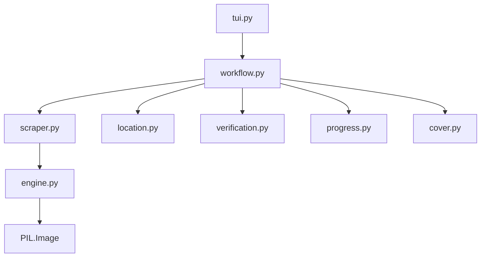

# AsuraScans Scraper

## Directory Tree
```text
.
├── __init__.py
├── cover.py
├── engine.py
├── location.py
├── progress.py
├── scraper.py
├── tui.py
├── verification.py
└── workflow.py
```

## Architecture Graph


## Detailed File Explanations

> [!NOTE]
> The `asurascans` module shares an almost identical architecture and codebase with the `asmhentai` scraper. Its `engine.py`, `workflow.py`, `location.py`, and `verification.py` modules are exactly the same, implementing the core Toon/Manga downloader logic. The primary difference lies in `scraper.py`.

### `__init__.py`
Standard Python package file marking this directory as the `asurascans` module.

### `cover.py`
A lightweight wrapper that delegates cover extraction logic to the shared `core.generic_cover.extract` function.

### `engine.py`
The shared image scraping engine.
- **`download_image`**: Robustly handles HTTP requests by forging `Referer` headers. It strictly validates response MIME types to prevent downloading ads or tracker pixels, and automatically corrects false file extensions (e.g. converting a `.jpg` payload to `.webp` locally).
- **`slice_and_save`**: The core image baker. It uses `Pillow` (PIL) to stitch all downloaded pages of a chapter into a single gigantic vertical canvas, then automatically slices the canvas into perfectly standardized 2000px-height chunks, optimizing the comic for infinite-scrolling reader applications.

### `location.py`
Calculates the absolute path for storing the comic on disk. Operates an interactive UI flow prompting the user to classify the gallery as `SFW` or `NSFW`, and `Ongoing` or `Complete`.

### `progress.py`
Handles terminal visual feedback. Draws a `rich.tree` console summary displaying the destination folder, chapter count, and skipped/verified pages.

### `scraper.py`
Contains `AsuraScansScraper`, the site-specific extraction logic.
- **`get_title_and_chapters`**: Parses the `asurascans.com` series page. Extracts titles from `h1.entry-title`, parses various potential description blocks (`#syn-target`, `div.manga-excerpt`), and hunts for author metadata and tags while rejecting sidebar junk. It extracts chapter lists by regex matching links formatted like `/chapter/[\d.]+`.
- **`process_chapter`**: Designed to defeat AsuraScans's shifting frontend frameworks. It first searches for standard `img` tags containing `asura-images/chapters`. If the site is rendered via a framework (like Astro) that obscures DOM nodes, it deploys a Regex fallback that scans the raw page source for HTML-encoded JSON payloads (e.g. `&quot;url&quot;:\[\d+,&quot;(https?://[^&]+)&quot;\]`), extracting the raw CDN image links directly from the data layer.

### `tui.py`
Simple CLI entry point invoking `handle_tui` which passes core instances into the main workflow runner.

### `verification.py`
Checks local disk to ensure downloaded chapters actually contain valid images. Cleans up broken `_temp_` directories and synchronizes its findings with the SQLite `tracker`.

### `workflow.py`
The master orchestrator file for the pipeline.
1. Calls `scraper.py` for metadata and page resolution.
2. Creates the library taxonomy folder and writes a rich `.zine/meta.json` payload.
3. Downloads the cover art.
4. Invokes the engine's download and slice-baking loop. It maintains a `rich.live` progress bar that cycles through states (Downloading pages → Baking slices).
5. Registers a UI reconstruction callback with the `whistleblower` module to gracefully restore the terminal output if the internet connection drops mid-download.
