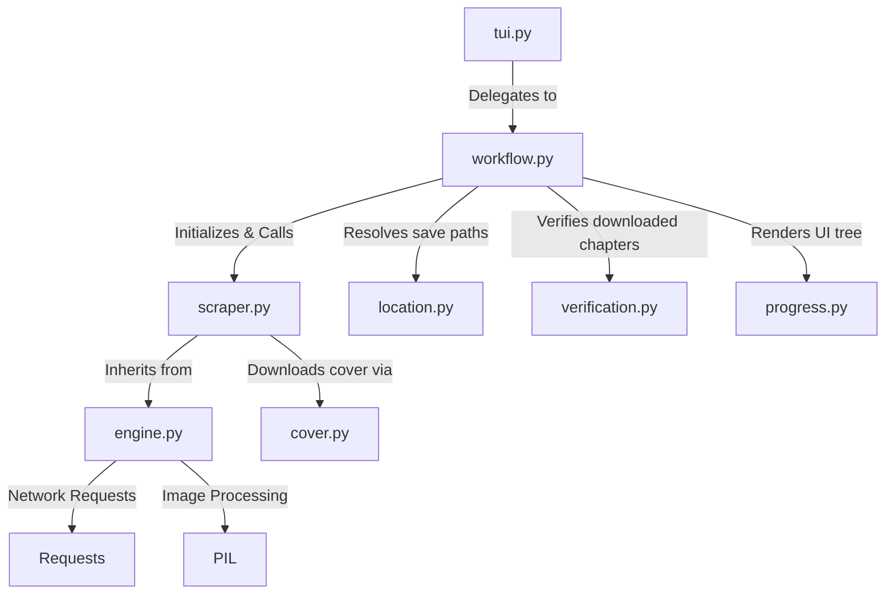

# ManhuaPlus Scraper Architecture

## Directory Structure
```
/home/valse-de-anshu/.config/zine scraper/scrapers/manhuaplus
├── __init__.py
├── cover.py
├── engine.py
├── location.py
├── progress.py
├── scraper.py
├── tui.py
├── verification.py
├── workflow.py
└── workflow.py.bak_quickgrab
```

## Module Interactions (Mermaid Graph)


## Detailed File Explanations

### `__init__.py`
This is an empty Python initialization file. It formally defines the `manhuaplus` directory as a package for import resolution across the broader app.

### `engine.py`
This file contains the foundational `BaseScraper` class, which handles networking and file I/O operations.
**Explicit Execution Path**:
- Applies specific request headers mimicking a desktop browser to dodge blocks.
- Contains the `download_image` routine. This is explicitly designed to brute force its way past Cloudflare or standard hotlink protection using varying Referer headers.
- Handles the actual `ThreadPoolExecutor` async queueing of image payloads via `process_chapter_multi`.
- Converts, restructures, and vertically splices images (often combining mixed formats like JPEG/WEBP into a uniform standard, sliced every 2000px height) via `slice_and_save`.

### `scraper.py`
Contains the `ManhuaPlusScraper` which overrides methods to specifically handle ManhuaPlus DOM structures.
**Explicit Execution Path**:
- `get_title_and_chapters`: Navigates to the ManhuaPlus manga page. It explicitly targets elements like `#syn-target` and `.manga-excerpt` for metadata. It uses regex `chapter-([\d\.]+)` to rip chapter links from standard anchor tags since manhuaplus chapters are typically in `.row-content-chapter` or similar standard WordPress Manga plugin containers.
- `process_chapter`: The extraction logic explicitly hunts for `const CHAPTER_ID = (...)` in the source code. Once found, it fires a highly specific AJAX POST request to `https://manhuaplus.org/ajax/image/list/chap/{ch_id}` with `X-Requested-With: XMLHttpRequest`. This directly bypasses standard bot protections to fetch the clean list of chapter images.

### `workflow.py`
The orchestrator. It acts as the backbone script gluing TUI elements and scraper logic together.
**Explicit Execution Path**:
- Retrieves metadata and chapters from the scraper.
- Pings `location.py` for target folders.
- Writes a `.zine/meta.json` file inside the local manga folder.
- Passes chapter lists through `verification.py` to identify missing or failed chapters.
- Initiates the `rich.live` interface rendering progress bars as the engine performs multithreaded downloads.

### `location.py`
Controls the directory save path prompts.
**Explicit Execution Path**:
- Prompts users (via TUI menus) whether the item should go to `SFW` or `NSFW`, and whether it is `OnGoing` or `Completed`.
- Generates the hierarchical target path utilizing the core `store_layer` APIs.

### `verification.py`
Data integrity enforcer.
**Explicit Execution Path**:
- Analyzes existing downloaded folders on disk (e.g. `Chapter1`).
- Cross-references them with an internal SQLite tracker to verify completion state.
- Deletes any leftover `_temp_X` directories from failed/aborted runs.

### `tui.py`
A minimal interface file that purely exists to capture terminal events and forward them into the `workflow.py`.

### `progress.py`
Handles `rich.tree` construction. It dynamically outputs a CLI representation of total chapters vs existing chapters and cover download statuses.

### `cover.py`
A utility script bridging `core.generic_cover` to download the `og:image` from the manga's main page.

### `workflow.py.bak_quickgrab`
A backup version of a legacy fast-grabbing workflow logic meant to bypass structured saving.
