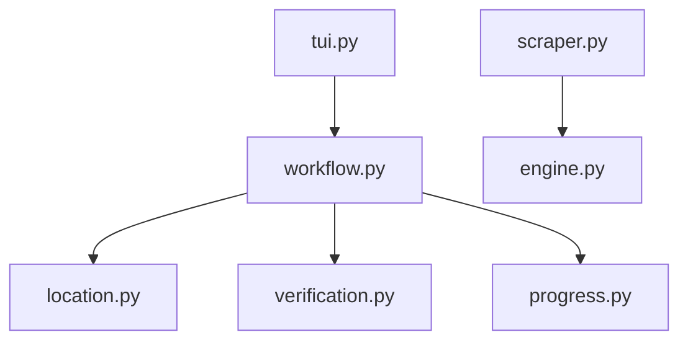

# ProjectSuki Scraper

```text
.
├── __init__.py
├── __pycache__/
├── engine.py
├── location.py
├── progress.py
├── scraper.py
├── tui.py
├── verification.py
└── workflow.py
```

## Architecture and Dependencies



## Detailed File Explanations

### `tui.py`
**What it does:** The simplistic text UI entry point for the ProjectSuki scraper.
**Explicit Details:** 
- It acts merely as a delegator in this module, immediately passing off URL, tracker, location manager, and scraper instances to `run_workflow()` inside `workflow.py`.

### `scraper.py`
**What it does:** The parser specific to ProjectSuki's DOM and API structure, handling both index pages and individual chapter reads.
**Explicit Details:** 
- Inherits from `BaseScraper` defined in `engine.py`.
- **`get_title_and_chapters`**: Parses the main manga/comic index page. It pulls titles from OpenGraph meta tags, cleans up the description, extracts genres/authors via link href matching (`/genre/`, `/authors/`), and locates the main chapter table. It extracts chapter numbers and links explicitly for English translations.
- **`process_chapter`**: Orchestrates downloading a specific chapter. ProjectSuki uses a dynamically loaded image system. This method manually fetches the first page from the static HTML (`.strip-reader img`), and then fires a direct AJAX `POST` request to `https://projectsuki.com/callpage` using the `bookid` and `chapterid` (parsed from the URL) to retrieve the rest of the image URLs in JSON format. It then triggers the engine's batch downloader.

### `engine.py`
**What it does:** Provides the core web-scraping utilities, asynchronous downloading mechanisms, and image-processing features necessary for scraping comics/mangas.
**Explicit Details:** 
- Contains `BaseScraper`. Manages a custom `requests.Session` with robust spoofed headers to bypass anti-bot mechanisms.
- **`download_image`**: Safely downloads an individual image, verifying MIME types against an allowed list (`image/jpeg`, `image/webp`, etc.) to reject ads and trackers. Automatically enforces correct file extensions based on the actual `Content-Type` header payload rather than trusting the URL suffix.
- **`process_chapter_multi`**: Executes concurrent image downloading using `ThreadPoolExecutor` (max 3 workers). Pages are saved initially as `.bin` files inside a temporary folder. 
- **`slice_and_save`**: Crucial function for continuous scroll "webtoons." It uses `Pillow` (PIL) to stitch all downloaded images of a chapter into one massive vertical canvas, normalizes the color modes (RGB vs RGBA), and seamlessly slices them back into uniformly sized chunks (e.g., 2000px height limit). This prevents massive image files from crashing image viewers.

### `workflow.py`
**What it does:** Handles the primary execution loop, metadata creation, and Rich UI updates.
**Explicit Details:** 
- Retrieves metadata via the scraper. If the URL points directly to a chapter, it falls back to parsing the chapter number from the URL string.
- Uses `filter_subchapters` (from core) to allow users to select a range of chapters.
- Determines the output path using `location.py` and creates the `.zine/meta.json` file, flushing all parsed metadata (author, genre, description).
- Orchestrates the downloading of the cover art.
- Triggers `verify_chapters` to drop already-downloaded chapters from the current queue.
- Initiates the main download loop. Constructs highly detailed, deeply nested `Rich` Live UI Trees showing concurrent page download progress, baking (image stitching/slicing) status, missing pages, and retries.
- Features a robust TUI reconstructor callback (`tui_reconstruct`) hooked into the `whistleblower` to flawlessly revive the UI if the system loses internet connectivity.

### `location.py`
**What it does:** Manages standard and custom directory path formulation via interactive UI prompts.
**Explicit Details:** 
- Prompts the user to classify the comic (SFW vs NSFW) and its status (Ongoing vs Completed).
- Formulates the exact path structure (e.g., `Zine/Toon/SFW/Ongoing/projectsuki/`).
- Allows the user to bypass this and input a custom absolute path manually, validating it through the storage layer before allowing the script to proceed.

### `progress.py`
**What it does:** Generates the terminal UI tree for pre-download summaries.
**Explicit Details:** 
- Provides `render_completion_tree()`, drawing a compact summary of the output directory, total chapters discovered, currently verified (existing) chapters formatting them cleanly (e.g., "1-10, 12, 14-20"), and whether a cover image was successfully fetched.

### `verification.py`
**What it does:** Checks local disk history to guarantee idempotency and avoid re-downloading chapters.
**Explicit Details:** 
- Evaluates `Tracker` history against the physical existence of files within the expected chapter folder.
- Cleverly normalizes chapter numbers (e.g., dropping `.0` from whole numbers, preserving `.5` for side chapters).
- Cleans up anomalous leftover `_temp_` directories from previously aborted download attempts or system crashes.
- Synchronizes the tracker database; if a chapter is marked downloaded but the folder is empty, it unmarks it. If files exist but aren't logged, it marks them downloaded.

### `__init__.py`
**What it does:** Marks the directory as a Python package.
