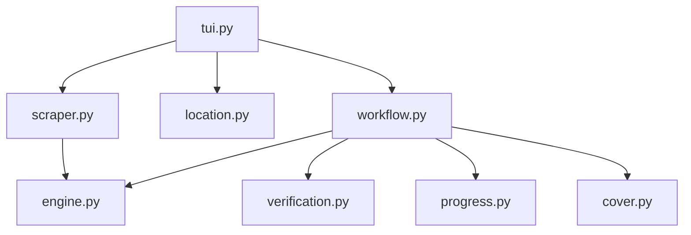

# Idagio Scraper

```text
idagio
├── README.md
├── __init__.py
├── cover.py
├── engine.py
├── location.py
├── progress.py
├── scraper.py
├── tui.py
├── verification.py
└── workflow.py
```

## Detailed File Explanations

1. `__init__.py`: Empty initialization file for the `idagio` Python sub-module.
2. `cover.py`: A specialized standalone script dedicated to extracting the highest possible resolution album art from Idagio. It attempts three aggressive approaches: reading Open Graph (`og:image`) meta tags, scraping the DOM structure for `idagio-images.global.ssl.fastly.net` regex patterns, and ultimately parsing embedded `application/ld+json` script tags representing Google structured data nodes.
3. `engine.py`: An extremely lightweight wrapper housing `IdagioEngine`, bridging `VideoEngine` to the broader application.
4. `location.py`: Resolves the save path for music specifically. If the scrape is a single track (not an album/playlist), it checks the `ConfigLayer` to see if a dedicated `music_quick_grab_path` has been explicitly set in user preferences, prioritizing it over the generic download root.
5. `progress.py`: A `rich.tree` powered UI module that crafts the visual confirmation block before initiating downloading. Notably, it formats output metrics to reflect "Total Song" rather than video equivalents.
6. `scraper.py`: The `IdagioScraper` module, deeply integrated with the `IdagioEngine` API. Crucially, it eschews "flat" yt-dlp extraction (`extract_flat: True`) on playlists in favor of a full deep-extraction because Idagio's flat metadata masks the underlying track titles. To mesh smoothly with the orchestrator, it ingeniously maps the music `artist` string into the `upload_date` field.
7. `tui.py`: Bootstraps the terminal interface for Idagio, retrieving metadata, resolving target location paths via `core.paths.get_container_root`, displaying the URL and category, and subsequently invoking the `workflow.py` execution thread.
8. `verification.py`: Uses the `HistoryLayer` to enact robust verification. It evaluates if `is_music` is flagged to search inside a `/music/` directory rather than `/videos/`, dynamically adapting the search scope. It cross-references `[vid_id]` signatures within the `.flac` filenames against local `history.json` registers to skip downloading preexisting audio tracks.
9. `workflow.py`: The overarching loop manager. It leverages `is_music` flags from the scraper to configure yt-dlp to output `.flac` extensions and embed the album art (from `cover.py`) seamlessly into the audio container metadata. It prints aesthetic real-time pulse bars and handles API edge cases without dropping the multithreaded queue.

## File Call Graph


