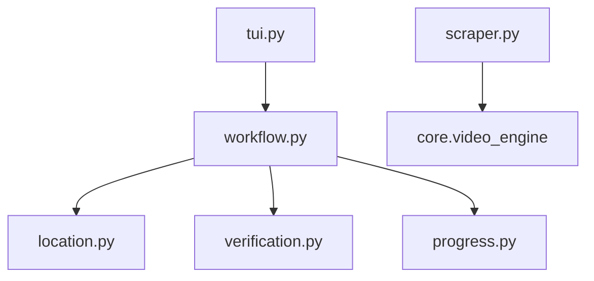

# SoundCloud Scraper

```text
.
├── __init__.py
├── __pycache__/
├── location.py
├── progress.py
├── scraper.py
├── tui.py
├── verification.py
└── workflow.py
```

## Architecture and Dependencies



## Detailed File Explanations

### `tui.py`
**What it does:** The text-based user interface specifically tailored for SoundCloud tracks.
**Explicit Details:** 
- Immediately rejects SoundCloud playlists (`/sets/`) due to massive downstream limitations in extracting accurate metadata for playlists, surfacing a highly stylized error panel to the user informing them to provide single tracks instead.
- For single tracks, it prompts the user to select their cover art preference: they can either use the default SoundCloud track artwork or provide a custom image file path from their local system to embed into the downloaded audio file.
- Delegates execution to `workflow.py` along with the cover art preference.

### `scraper.py`
**What it does:** The metadata extractor for SoundCloud links.
**Explicit Details:** 
- Strips the `?in=` context parameter from track URLs to prevent playlist context pollution during single-track downloads.
- Flags URLs containing `/sets/` as banned playlists to be caught by the TUI.
- Instantiates the `VideoEngine` (from `core.video_engine`) to power the actual extraction rather than implementing a custom engine.
- Formats the raw `yt-dlp` output into standard Zine metadata structures, extracting channel name, track ID, and finding the highest resolution thumbnail available in the `thumbnails` list.
- Explicitly catches and throws a `RuntimeError` if metadata extraction fails, usually indicating that the track is a SoundCloud GO+ DRM-protected premium track.

### `workflow.py`
**What it does:** Orchestrates the actual downloading, metadata embedding, and UI updating for audio tracks.
**Explicit Details:** 
- Uses `active_status` to show a spinner during metadata extraction. If a DRM track is encountered, it halts the workflow and displays a styled error panel explaining why SoundCloud GO+ tracks cannot be downloaded.
- Uses `core.paths` to determine the save destination and resolve any potential folder name collisions.
- Integrates `butler/part_cleaner.py` to clean up aborted `.part` files.
- Identifies if a generic track title like "Track 1" was given. If so, it attempts a manual lazy-load via `requests` and `BeautifulSoup` to scrape the OpenGraph tags (`og:title`, `og:image`) directly from the URL to get the real track title and cover art.
- Downloads the custom thumbnail (if provided by the user) or fetches the SoundCloud artwork to a temporary `.jpg` file.
- Wraps the `VideoEngine` downloader inside a robust `Rich` Live Tree UI, displaying download progress, speed, and a "baking" state indicating that `ffmpeg` is actively embedding the cover art and ID3 tags into the final `.flac` file.

### `location.py`
**What it does:** Determines the local file path for saving the downloaded music files.
**Explicit Details:** 
- Utilizes the `ConfigLayer` and `PathAuthority`. If the user has a "quick grab" default directory set for music in their config, it automatically bypasses all interactive UI prompts and returns that path.
- Otherwise, it displays a standard menu allowing the user to select the default categorical folder or define a custom filesystem path, complete with validation against the storage layer.

### `progress.py`
**What it does:** Renders a visual summary before the track download starts.
**Explicit Details:** 
- Exposes `render_completion_tree()` which builds a `Tree` layout showing the exact destination folder, track source, and any existing tracks (if running against an artist's page or if the track was already downloaded).

### `verification.py`
**What it does:** Ensures that duplicate files are not downloaded.
**Explicit Details:** 
- A simple passthrough module that hooks into `HistoryLayer.sync_local_history()`. It ensures that the specific track ID exists both in the `.zine/history.json` and physically on the disk as a `.flac` file before returning it in the `verified_ids` list.

### `__init__.py`
**What it does:** Standard Python module initializer.
