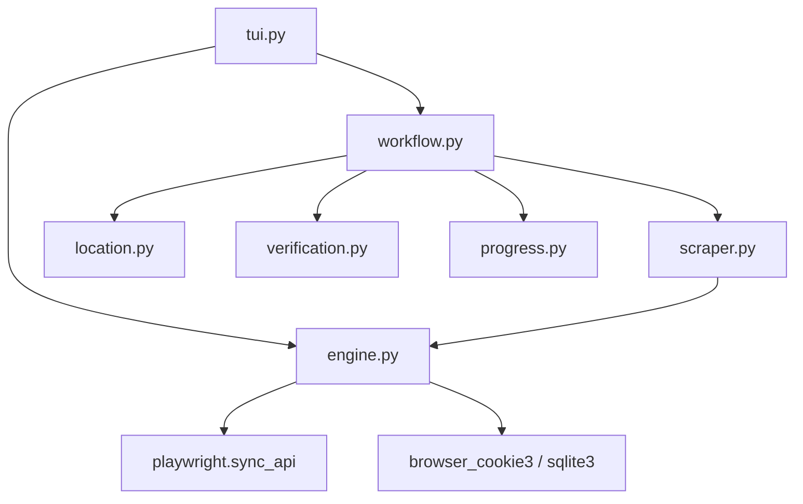

# Facebook Scraper

## Directory Tree
```text
.
├── __init__.py
├── engine.py
├── location.py
├── progress.py
├── scraper.py
├── site_config.json
├── tui.py
├── verification.py
└── workflow.py
```

## Architecture Graph


## Detailed File Explanations

### `__init__.py`
Standard Python package file marking this directory as the `facebook` module.

### `engine.py`
The highly advanced backend engine for interacting with Facebook's React architecture.
- **Cookie Extraction**: Bypasses Facebook's aggressive login walls by automatically importing session cookies. It uses `browser_cookie3` for standard browsers, and includes custom SQLite extraction logic to dynamically copy and read `cookies.sqlite` from Zen Browser/Firefox profiles.
- **Profile Scouting**: Deploys a headless `Playwright` browser to resolve the target's real human name. It uses 4 fallback strategies, including parsing `aria-label` attributes on the "Add Friend" button, investigating the Cover Photo links, and safely filtering `h1` DOM elements.
- **Media Extraction**: Supports scraping standard Photos and Video Reels. It navigates to the respective subpages (`?sk=photos` or `/reels`) and executes JavaScript viewport auto-scrolling to trigger lazy loading. It modifies thumbnail image URLs (e.g. stripping `p200x200` constraints) to force the CDN to serve the maximum resolution versions.

### `location.py`
Determines the storage destination. Similar to the engine, it performs a preliminary Playwright scout to acquire the profile's real name to generate a clean, human-readable directory name before presenting the standard interactive `Selector` prompt to the user.

### `progress.py`
Handles terminal visual feedback.
- **`render_progress_tree`**: Uses `rich.tree` to draw a console tree displaying the target board (e.g. "Photos"), total items found, and an active progress spinner indicating whether the scraper is currently resolving metadata or actively downloading bytes.

### `scraper.py`
Contains `FacebookScraper`, inheriting from `AssetBaseScraper`.
- **`download_asset`**: Intelligently splits downloading logic. For Reels and videos, it delegates to `yt-dlp` by passing along the forged Facebook referer headers. For photos, it performs direct HTTP downloads.
- **`_validate_and_fix_image`**: An aggressive post-processing validator. Facebook's CDNs often lie about file extensions or serve HTML login walls disguised as `.jpg` images. This function sniffs the first 32 magic bytes of the downloaded file. It immediately deletes HTML payloads (`<!DOCTYPE`), and corrects file extensions by identifying binary signatures for JPEG (`\xff\xd8\xff`), WEBP (`RIFF...WEBP`), PNG, GIF, AVIF, and MP4.

### `site_config.json`
Metadata payload specifying the primary domain (`facebook.com`).

### `tui.py`
A highly customized CLI entry point for Facebook.
- **`_normalize_fb_url`**: Allows users to paste raw usernames (e.g., `markzuckerberg`) instead of full URLs, automatically formatting them into canonical `https://www.facebook.com/...` structures.
- **Execution Flow**: Spawns the initial Playwright scouting phase to determine available media categories (Boards). Sends an OS-level notification via `butler.notify` when scouting finishes, and renders a `MultiSelector` so the user can selectively download "Photos" or "Video Reels".

### `verification.py`
Handles idempotency.
- **`verify_pins`**: Checks local disk to ensure downloaded media assets exist, synchronizing its findings with the SQLite `tracker` to gracefully skip duplicates.

### `workflow.py`
The master orchestrator file for the Facebook pipeline.
1. Iterates through the media boards selected in the TUI.
2. Creates the taxonomy folders (`{target_root}/{profile_name}/{board_name}`).
3. Triggers the engine to extract media URLs for the active board.
4. Executes the download loop via `scraper.py`, rendering the `rich.live` progress bar.
5. Emits a final OS-level success notification via `butler.notify` once all media is archived.
