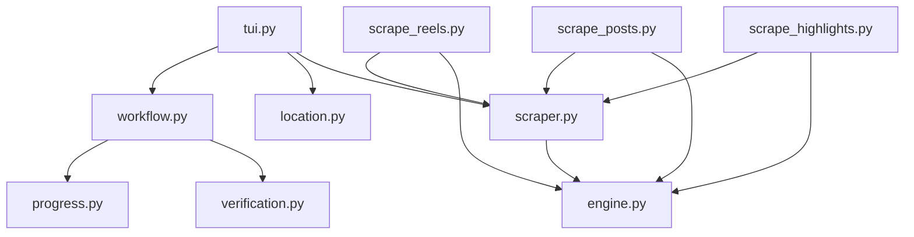

# Instagram Scraper

```text
instagram
├── README.md
├── __init__.py
├── cover.py
├── engine.py
├── location.py
├── progress.py
├── scrape_highlights.py
├── scrape_posts.py
├── scrape_reels.py
├── scraper.py
├── tui.py
├── verification.py
└── workflow.py
```

## Detailed File Explanations

1. `__init__.py`: Standard empty initialization file for the `instagram` scraper package.
2. `cover.py`: Designed to extract profile pictures or Open Graph images. *(Note: The internal implementation currently contains legacy regex targeting `i.pinimg.com`, indicating it was likely duplicated from the Pinterest scraper and relies on the Open Graph fallback for Instagram)*.
3. `engine.py`: The crown jewel of this scraper. `InstagramEngine` implements a sophisticated "One Browser, One Pass, One Cache" architecture using Playwright. To bypass Instagram's aggressive anti-scraping measures, it injects cookies from the user's local browsers (including the Zen browser) and intercepts raw GraphQL/REST API network responses. It automatically filters out unrelated content and caches the entire `Feed` and `Reels` tab in memory to ensure lightning-fast UI responsiveness without re-triggering browser automation.
4. `location.py`: Manages the interactive prompt for the save directory. It allows users to fallback to default paths or specify a custom output directory for the scraped profile.
5. `progress.py`: UI rendering module using `rich.tree`. It displays a minimalist live progress tree tracking total "pins" (posts/reels) found, existing files, and download completion status.
6. `scrape_highlights.py`: A standalone, executable CLI script specifically tailored to extract and download all Instagram Story Highlights from a target profile into organized sub-folders.
7. `scrape_posts.py`: A standalone CLI script focused exclusively on extracting standard image posts from a profile's main feed.
8. `scrape_reels.py`: A standalone CLI script engineered to download all short-form video content specifically from a profile's dedicated Reels tab.
9. `scraper.py`: `InstagramScraper` extends `AssetBaseScraper`. It maps URL structures (boards vs pins vs profile) and uniquely features a `_export_cookie_file()` method. This method translates intercepted Playwright session cookies into a Netscape-formatted `cookies.txt` file, which is then securely passed to `yt-dlp` to download DASH/HLS fragmented video reels cleanly.
10. `tui.py`: The interactive terminal interface. It accepts URL/Username inputs, normalizes them, and presents a multi-select menu allowing the user to simultaneously queue up downloads for the "Profile Picture Only", "Main Feed (Posts)", and "Reels Tab".
11. `verification.py`: Connects with `HistoryLayer` to perform local checks, syncing `.jpg`/`.mp4` filenames with the history registry to avert duplicate downloads.
12. `workflow.py`: The high-level orchestrator. It manages folder creation logic (segregating "Reels Tab" and "Main Feed" visually on the filesystem), routes story highlight groups into their respective named subdirectories, and invokes the robust threaded download queue for assets.

## File Call Graph


