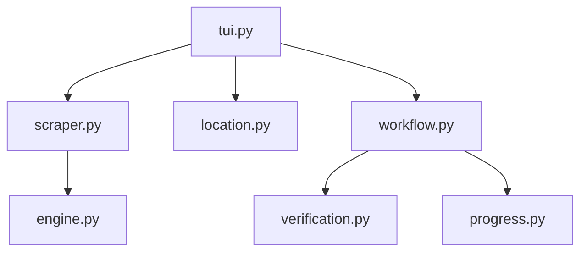

# Pinterest Scraper

```text
.
├── __init__.py
├── __pycache__/
├── cover.py
├── engine.py
├── location.py
├── progress.py
├── scraper.py
├── tui.py
├── verification.py
└── workflow.py
```

## Architecture and Dependencies



## Detailed File Explanations

### `tui.py`
**What it does:** This file acts as the primary user interface and entry point for the Pinterest scraper module. It is responsible for orchestrating the initial interactions when a user inputs a Pinterest URL.
**Explicit Details:** 
- It identifies if the URL points to a user profile, a board, or a single pin using the scraper's methods.
- If a profile URL is provided, it invokes the engine to fetch all the boards available under that profile, parses them, and presents a multi-selection menu via the console UI to the user. It warns the user with a disclaimer regarding Pinterest's inaccurate pin counts.
- After the user selects the target boards (or if it's a direct pin/board link), it calculates the target destination root path via `location.py`.
- It eventually delegates the actual batch/bulk downloading process by passing the selected boards and configurations to `run_workflow` located in `workflow.py`.

### `scraper.py`
**What it does:** This file wraps the underlying `PinterestEngine` into a standard scraper interface compatible with the system's `AssetBaseScraper`.
**Explicit Details:** 
- It determines the "link type" (profile, board, or pin) via `get_link_type()` by analyzing the URL's path components.
- The `get_metadata_and_assets()` method retrieves all relevant pins by calling corresponding engine methods (`get_profile_pins`, `get_board_pins`, or `get_pin_info`). It then normalizes the data into standard asset dictionaries containing clean filenames, IDs, and direct media URLs (for either images or videos).
- The `download_asset()` method handles the specific download logic. For videos, it explicitly forks a `yt-dlp` subprocess (using the pin's page URL) because direct m3u8 downloads can be unreliable. For static images, it falls back to a standard HTTP direct download approach via the parent class.

### `engine.py`
**What it does:** The heavy lifter for web scraping and API interaction with Pinterest. It handles raw network requests, state interception, and data parsing.
**Explicit Details:** 
- **`get_profile_boards`**: Fetches HTML from a Pinterest profile and aggressively searches for `<script type="application/json">` blocks containing internal Redux state data. It recursively extracts board names, URLs, IDs, and pin counts, falling back to regex matching if standard parsing fails.
- **`get_board_pins`**: Orchestrates the extraction of pins from a specific board using a headless Playwright Chromium instance. It intercepts network responses matching `/resource/` to harvest pins silently while simulating user scrolling via key presses.
- **`_batch_enrich_pins`**: Uses asynchronous HTTP requests (`aiohttp`) to hit Pinterest's unauthenticated API (`unauth_react_main_pin`) to enrich basic pin data, ensuring high-res videos and story pin configurations are detected.
- **`_extract_pin_data`**: A deeply robust JSON parsing utility that navigates the nested and often unpredictable Pinterest API responses to find the highest quality direct image URLs or video streams (checking `video_list`, `v_hlsv4_video_list`, and `story_pin_data`).

### `workflow.py`
**What it does:** Manages the active download loop, UI state refreshing, and local storage interactions for all selected Pinterest boards.
**Explicit Details:** 
- Iterates over the selected boards and creates necessary directories for each using the `StorageLayer`.
- For each board, it manages a `Live` Rich UI tree, updating the visual progress in a background daemon thread while it fetches pin metadata.
- After securing the pin list, it verifies which pins have already been downloaded via `verification.py` to prevent redundant downloads.
- Loops through all pending pins, formats their local filenames safely, and calls the scraper's `download_asset()` method. It tracks download speed, ETA, and size, seamlessly updating the live visual progress tree.
- Manages the saving of `.zine` metadata files and the profile picture if available.

### `location.py`
**What it does:** Handles determining and confirming the local filesystem destination where scraped files should be saved.
**Explicit Details:** 
- Prompts the user with a UI menu to either accept the default download directory or input a custom path manually.
- Validates the user's custom path using the `StorageLayer`.
- Bypasses the UI prompts entirely if the scraper is running in automated batch mode, enforcing the pre-determined path.

### `progress.py`
**What it does:** Generates the Rich Tree UI component used to display live progress during the scraping and downloading phases.
**Explicit Details:** 
- Defines `render_progress_tree(state)` which translates the current state dictionary of the workflow into a structured visual format.
- Adds animated visual feedback, such as blinking terminal symbols based on time to indicate that background scrolling/extracting or downloading is actively taking place.

### `verification.py`
**What it does:** Checks local download history and filesystem state before initiating new downloads.
**Explicit Details:** 
- Exposes `verify_pins()`, which calls the `Tracker` (history layer) to synchronize the provided list of extracted pins with the local database/filesystem to identify items that have already been saved. This ensures idempotency across scraping sessions.

### `cover.py`
**What it does:** Provides a fallback utility for extracting an entity's cover image.
**Explicit Details:** 
- Defines `extract(soup, url)` which takes a BeautifulSoup object of a Pinterest page and tries to locate the best available cover image. It sequentially checks for Open Graph metadata (`og:image`), then large original images (`i.pinimg.com/originals/`), and finally scaled down (`736x`) images.

### `__init__.py`
**What it does:** Marks the directory as a Python package, allowing other modules to import from it.
