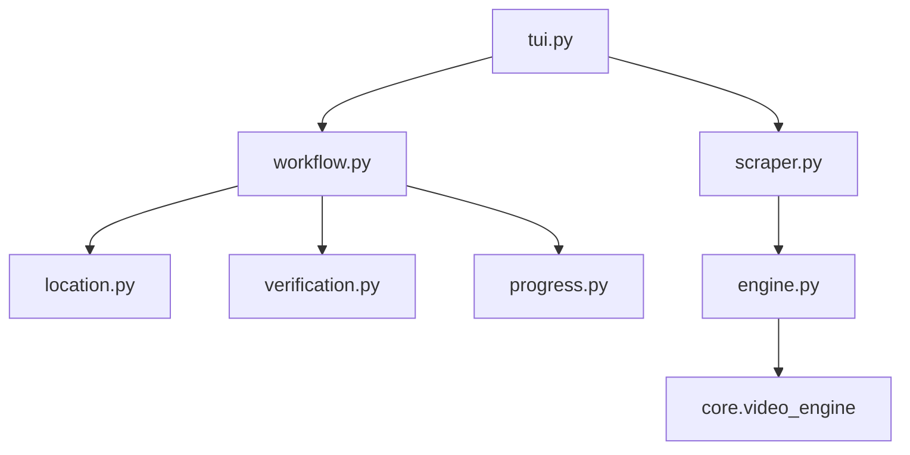

# YouTube Scraper

```text
.
├── __init__.py
├── __pycache__/
├── engine.py
├── location.py
├── progress.py
├── scraper.py
├── tui.py
├── verification.py
├── workflow.py
└── yt_music/
    ├── __init__.py
    ├── engine.py
    ├── location.py
    ├── progress.py
    ├── scraper.py
    ├── tui.py
    ├── verification.py
    ├── workflow.py
    └── README.md
```

## Subpackages
- **`yt_music/`**: Standalone, fully isolated scraper for **YouTube Music** (`music.youtube.com`). Provides high-fidelity lossless `.flac` audio extraction, Mutagen Vorbis tag embedding, high-res album cover art injection, and background synced `.lrc` lyrics fetching. Supports single tracks, albums, playlists, and artist discographies.

## Architecture and Dependencies



## Detailed File Explanations

### `tui.py`
**What it does:** The massive, highly interactive Text-Based User Interface layer explicitly built for YouTube's vast array of link types (Channels, Playlists, Shorts, and standard Videos).
**Explicit Details:** 
- It aggressively uses the `CacheLayer` to save metadata immediately. Since YouTube blocks IPs frequently (HTTP 403 / 429), the scraper falls back to `cached_data` on disk seamlessly if a rate-limit is encountered mid-menu.
- Features explicit logic to cap playlist/channel scans to 200 items initially (so the UI doesn't hang for 5 minutes scraping a 10,000 video channel). Prompts the user: if they type `"all"`, it orchestrates a chunked, paginated scraping loop updating the cache every 200 videos.
- Displays dynamic menu options based on the target (e.g. Video vs Song formats, custom cover art injection).
- Offers extreme control over formats: `FLAC`, `OPUS`, `MP3`, `M4A`, `AAC` for music, and explicit resolution bounds (`144p` up to `2K`) for videos.

### `scraper.py`
**What it does:** Classifies YouTube links, parses metadata, and structures video objects.
**Explicit Details:** 
- Detects the URL pattern (`/@`, `/c/`, `list=`) to classify it as a "channel", "playlist", or "single" video.
- **`_scrape_single_video_metadata`**: A lightning-fast, regex-based streaming HTML scraper. Instead of spinning up the slow `yt-dlp` executable just to get the title of a video, it streams the raw YouTube page via `requests` in 8KB chunks, looking for `<meta>` and `itemprop` tags. Once it finds the title, author, thumbnail, and date, it immediately aborts the stream to save time and memory.
- Uses `yt-dlp` via the engine only for massive playlist pagination where raw HTML parsing is impossible.
- Re-formats raw `yt-dlp` output to Zine's `metadata`, `videos`, `info` format.

### `engine.py`
**What it does:** A heavy extension of `core.video_engine` integrating deep `ffmpeg` subsystem calls.
**Explicit Details:** 
- Overrides the `download_video` function to build precise, heavily constrained `yt-dlp` command-line arrays based on user quality choices.
- Forces Android/Web client impersonation via `--extractor-args "youtube:player-client=android,web,default"` to bypass YouTube's recent anti-bot mechanisms.
- **`_apply_custom_thumbnail`**: If the user chose to inject their own cover art, it uses `ffmpeg` directly (via `subprocess.run`) with complex stream-mapping arguments (`-map_metadata`, `-disposition:v:0 attached_pic`) to surgically bake the `.jpg` into the media container file (`.mp4` or `.flac`) without re-encoding the actual video/audio stream.
- Re-routes standard thumbnail extraction to fetch the highest quality square channel avatar instead of landscape banners.

### `workflow.py`
**What it does:** The mammoth orchestrator that controls folder hierarchies, parallel metadata fetching, download queuing, and error recovery.
**Explicit Details:** 
- Highly complex sub-folder routing: it intelligently routes downloads into distinct folders (e.g. `[Channel Name]/short/` for YouTube Shorts, `[Channel Name]/playlist/[Playlist Name]/` for playlists, or `[Channel Name]/video/` for standard uploads).
- Uses `ThreadPoolExecutor` to perform concurrent, parallel HTML scrapes to fetch `upload_date` for every single video in a playlist simultaneously, dramatically speeding up timeline sorting.
- Implements a resilient "Baking Recovery" mechanism. If the script was interrupted while `ffmpeg` was merging video/audio (`.tmp.mp4`), the workflow detects this orphaned file on the next run, prompts the user, and resumes the exact `ffmpeg` metadata/cover injection command without re-downloading the entire video.
- Controls the `Rich` UI rendering with multi-bar progress displays, showing speed (`MbpsColumn`), estimated time, and retry counts, while seamlessly handling `Revolt` shutdown signals.

### `location.py`
**What it does:** Custom directory resolution for YouTube.
**Explicit Details:** 
- Works almost exactly like the location managers in other scrapers, asking the user for a custom vs default path.
- Injects an extra `/youtube/` subfolder automatically if a custom root directory is provided for channel/playlist downloads.

### `progress.py`
**What it does:** Renders a summary visual tree before the download phase.
**Explicit Details:** 
- Renders the target path, source, total videos, and visual indicators on whether a custom thumbnail or standard channel avatar is ready to be applied.

### `verification.py`
**What it does:** Prevents duplicate downloads.
**Explicit Details:** 
- Acts as a thin wrapper sending the video list to `tracker.sync_local_history()`, synchronizing local `.flac` or `.mp4` file existence with the internal Zine JSON database.
