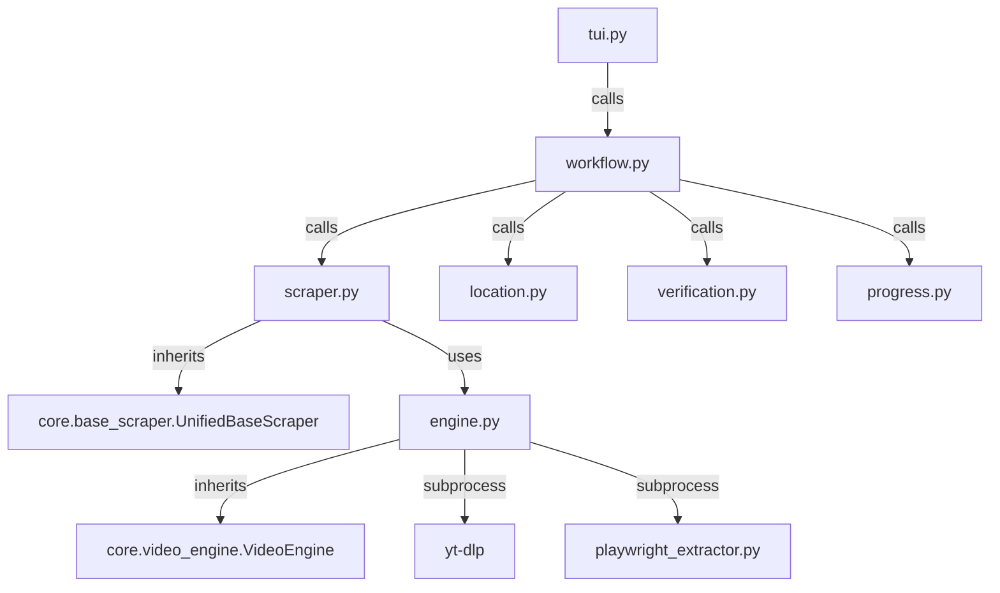

# Hanime Scraper

## Directory Structure
```text
hanime/
├── README.md
├── __init__.py
├── __pycache__/
├── engine.py
├── location.py
├── progress.py
├── scraper.py
├── site_config.json
├── tui.py
├── verification.py
└── workflow.py
```

## Architecture Graph


## File Explanations

### `__init__.py`
Standard empty Python module initializer.

### `engine.py`
The `HanimeEngine` which extends the core `VideoEngine`. 
- Handles the actual video downloading process by wrapping `yt-dlp` in a subprocess, configured with headers and a preference for `.mp4` format up to a specified resolution (default 1080p). 
- If standard extraction fails, it spawns a headless browser via `playwright_extractor.py` to bypass Cloudflare Turnstile protection. 
- It detects Geo-blocks and outputs a user-friendly error string.
- Responsible for writing `metadata.json` which it formats with HTML-unescaped clean strings and sorts videos into `most_viewed`, `top_rated`, `latest`, and `longest`.
- Downloads the franchise cover image.

### `location.py`
Provides the `rich` text user interface prompt allowing the user to select between "Default" and "Custom" target save locations for downloaded files.

### `progress.py`
Draws the `rich.tree` UI component summarizing what is about to be downloaded: title, file path, number of videos, already existing videos, and cover image presence.

### `scraper.py`
Defines `HanimeScraper`. It visits the requested Hanime video page using `requests` and parses the HTML using `BeautifulSoup`. It extracts title, cover, description, tags, and studio. Crucially, it finds "More from" sections in the DOM to identify other episodes within the same franchise (playlist mapping). 

### `site_config.json`
A small configuration file holding the primary domain (`hanime.tv`), base APIs, and regex patterns to extract video slugs from URLs.

### `tui.py`
The primary routing logic. It handles the initial metadata fetch, and then prompts the user via a terminal menu:
- Single Episode (Quick Grab: video only, no metadata)
- Whole Franchise (Vacuum: Flat Folder)
- Whole Franchise (Vacuum: Nested Subfolders)
Passes the chosen configuration down to `workflow.py`.

### `verification.py`
Ensures idempotency by checking if a file is already downloaded. It requires a two-step validation: 1) the video ID exists in `.zine/history.json`, and 2) the `.mp4` file physically exists on the disk.

### `workflow.py`
The overarching orchestration file:
1. Calls `resolve_folder_collision` to create a safe subfolder.
2. Invokes the `butler.part_cleaner` to wipe out any broken `.part` or format-chunk files from previous failed downloads.
3. Calls the engine to save `metadata.json` and download `cover.png`.
4. Loops over every episode, invokes `verify_videos`, and orchestrates the download progress UI.
5. Provides a `tui_reconstruct` callback to seamlessly restore the terminal UI state in the event of an internet disconnect and reconnect.
