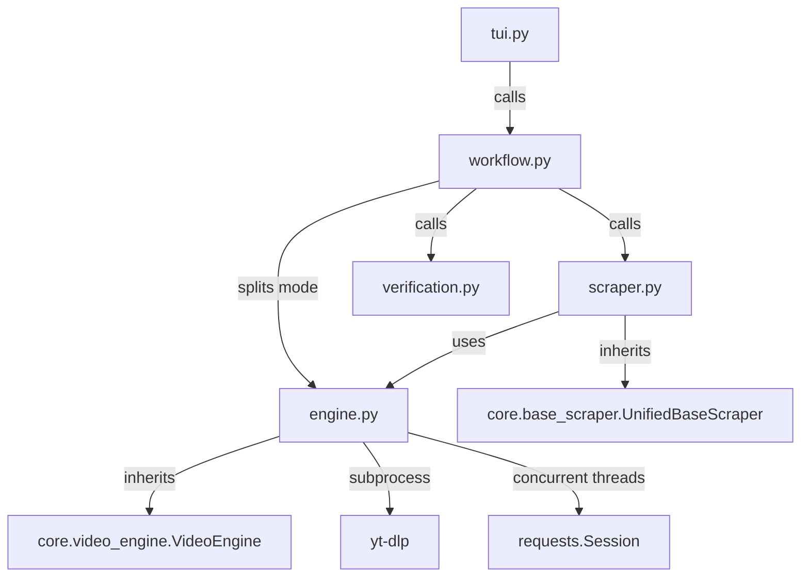

# Hentaicity Scraper

## Directory Structure
```text
hentaicity/
├── README.md
├── __init__.py
├── __pycache__/
├── engine.py
├── scraper.py
├── site_config.json
├── tui.py
├── verification.py
└── workflow.py
```

## Architecture Graph


## File Explanations

### `__init__.py`
Standard empty Python module initializer.

### `engine.py`
Defines `HentaicityEngine`, which inherits from `VideoEngine`. This is a dual-mode engine capable of processing video and gallery streams.
- **Video Mode**: Implements custom logic to parse `.m3u8` HLS master playlists. It evaluates bandwidth variants to select the highest quality stream (usually 1080p). If unavailable, it falls back to parsing a direct mobile `.mp4`. Downloads are executed via `yt-dlp`.
- **Gallery Mode**: Defines `download_gallery_images` utilizing a `ThreadPoolExecutor` (scaled up to 16 threads for efficiency) to rapidly download raw `.jpg` assets.
- Provides `save_metadata` to construct `metadata.json` and fetches the profile cover image.

### `scraper.py`
Defines `HentaicityScraper`, handling the dual-format architecture of HentaiCity.
- **Content Type Detection**: Differentiates between `/video/` endpoints and `/gallery/` endpoints on initialization.
- **Video Strategy**: Employs BeautifulSoup to parse `application/ld+json`, `og:tags`, and sidebar elements. Crucially, it finds sidebar links matching "Episode N" to map out an entire franchise playlist.
- **Gallery Strategy**: Scrapes all CDN `img` sources in the gallery container. By removing the `-t.jpg` suffix from the thumbnail sources, it derives the direct paths to the full-resolution images. Formats these images as pseudo-"videos" to be iterated over by the unified UI layer.

### `site_config.json`
Configuration file holding the primary domain (`hentaicity.com`).

### `tui.py`
The frontend route handler. It dynamically adjusts the terminal UI based on the `Content Type` flagged by the scraper (changing terminology between "Videos" and "Images"). Routes the user to choose between a Single Episode grab or a Full Franchise Vacuum.

### `verification.py`
A simple pass-through to the core `HistoryLayer.sync_local_history`. Ensures robust 2-step verification (checking `.zine/history.json` and verifying physical `.mp4` or `.jpg` existence) to guarantee idempotent downloads.

### `workflow.py`
The core orchestration file, branching execution based on content type:
- Initiates metadata extraction, path collision resolution, and history verification.
- **Video Path**: Loops sequentially through video objects, invoking the yt-dlp engine wrapper while rendering a reactive `rich.tree` progress UI.
- **Gallery Path**: Calls the specialized `_run_gallery_workflow` function, engaging a concurrent thread lock pipeline that rapidly downloads image assets while updating a specialized blinking-circle TUI reflecting `X/Total` image status.
