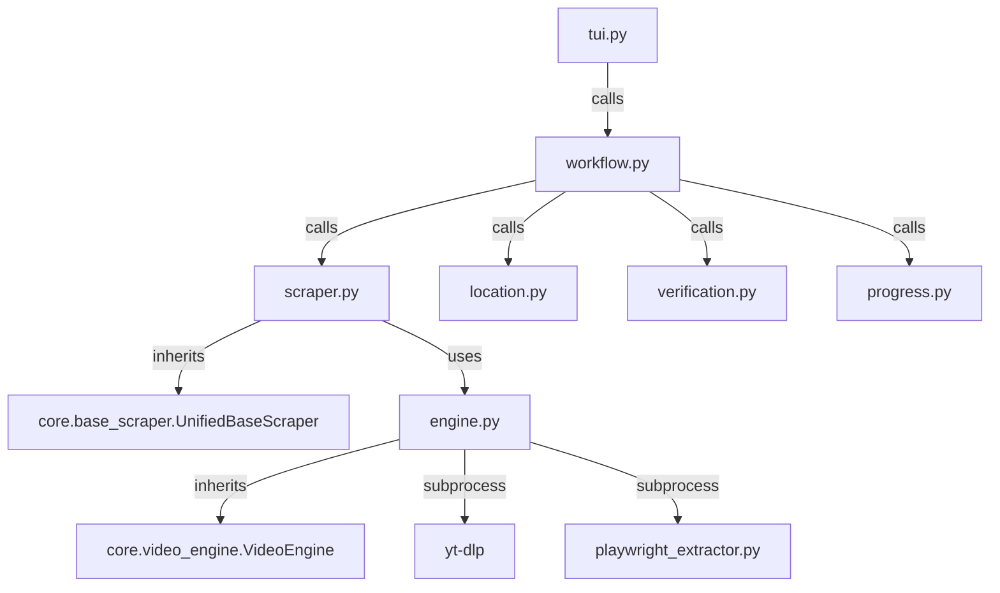

# HentaiHaven Scraper

## Directory Structure
```text
hentaihaven/
├── README.md
├── __init__.py
├── __pycache__/
├── engine.py
├── location.py
├── progress.py
├── scraper.py
├── site_config.json
├── tui.py
├── verification.py
└── workflow.py
```

## Architecture Graph


## File Explanations

### `__init__.py`
Standard empty Python module initializer.

### `engine.py`
Defines `HentaiHavenEngine`, which inherits from `VideoEngine`.
- **Cloudflare Bypass**: Because HentaiHaven makes heavy use of Cloudflare and client-side JavaScript streaming protection, this engine does *not* natively attempt to extract the video URL. Instead, it delegates URL extraction to the external `playwright_extractor.py` (a headless browser scraper).
- Once the direct stream URL is retrieved, it is passed into `yt-dlp` using a subprocess for the actual download loop.
- It also manages downloading the profile avatar/cover and creating the `metadata.json`. It formats date strings and unescapes all HTML strings prior to writing to the metadata file.

### `location.py`
Provides the `rich` text user interface prompt to select between "Default" and "Custom" target save locations. Ensures any custom folder chosen ends up nested inside a `/hentaihaven` subfolder.

### `progress.py`
Renders the `rich.tree` UI component that visually summarizes the intended download state before beginning: Title, Location, Source, Total videos, Existing videos, and Cover image presence.

### `scraper.py`
Defines `HentaiHavenScraper(UnifiedBaseScraper)`.
- It fetches the HTML using `curl_cffi` (impersonating `chrome124`) to navigate basic bot protections.
- Parses the DOM using BeautifulSoup.
- It determines series structures by locating `li.wp-manga-chapter a` tags. If it's on a single episode page and can't find the chapter list, it dynamically searches for a parent `/watch/` URL, scrapes the parent, and maps the entire franchise recursively.

### `site_config.json`
Configuration file holding the primary domain (`hentaihaven.xxx`) and numerous backup alias domains. Contains CSS selectors for titles, descriptions, episode lists, and cover URLs.

### `tui.py`
The primary UI logic. Handles fetching the metadata and presents a terminal menu asking the user to choose their target workflow (Quick Grab Single Episode vs Franchise Vacuum to flat folder/nested subfolders).

### `verification.py`
Uses `HistoryLayer` to perform 2-step verification (`history.json` tracking and physical `.mp4` disk tracking) to prevent downloading the same episodes multiple times.

### `workflow.py`
The central orchestrator for the HentaiHaven download process:
1. Calculates safe folder names to avoid system collisions.
2. Utilizes `butler.part_cleaner` to wipe out any broken `.part` chunk files.
3. Invokes the engine to save metadata and download the cover.
4. Executes the main download loop, updating the live `rich.progress` bar and tree interface.
5. Injects a callback (`tui_reconstruct`) to ensure the UI doesn't visually break during internet disconnects/reconnects.
