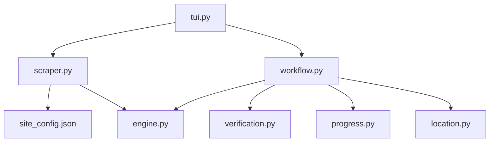

# HentaiHaven.co Scraper

```text
hentaihaven_co
├── README.md
├── __init__.py
├── engine.py
├── location.py
├── progress.py
├── scraper.py
├── site_config.json
├── tui.py
├── verification.py
└── workflow.py
```

## Detailed File Explanations

1. `__init__.py`: This file initializes the Python package for the `hentaihaven_co` directory, allowing other parts of the application to import modules from this scraper.
2. `engine.py`: This contains the `HentaiHavenCoEngine` class which inherits from `VideoEngine`. It is responsible for the heavy lifting of the video extraction and downloading. It parses M3U8 video streams by spinning up a playwright instance to bypass Cloudflare/bot protections on `nhplayer.com`. It also writes out a detailed `metadata.json` for downloaded series alongside downloading cover images, handling subtitles explicitly.
3. `location.py`: Handles determining the save directory for the downloaded content. It displays a prompt for the user to pick either a Default Location or a Custom Location. It strictly ensures there are no directory naming collisions for the same creator, creating a custom subfolder under `hentaihaven` when in franchise/vacuum mode.
4. `progress.py`: Utilizing the `rich.tree` library, this provides an aesthetic, Tokyo-Night styled visual UI output summarizing the metadata. It showcases the directory paths, number of total videos, existing videos on disk, and the status of the downloaded cover image.
5. `scraper.py`: Implements `HentaiHavenCoScraper` to retrieve web data. It parses the series slug from the URL and then fetches search pages and episode listings using BeautifulSoup. It gathers metadata like tags, series thumbnails, video counts, and individual video URLs. The scraper structure prepares nodes that the engine will later traverse.
6. `site_config.json`: A tiny configuration file containing the primary domain name (`hentaihaven.co`) and its base URL to establish domain boundaries and name matching logic.
7. `tui.py`: Manages the Terminal User Interface workflow specifically for this site. It fetches the metadata via the scraper first, then renders a visual banner showing series info. Crucially, it asks the user whether they want to download a 'Single Episode', 'Whole Franchise (Flat)', or 'Whole Franchise (Nested)'. The user's choice resolves the target download path natively, skipping a manual location prompt.
8. `verification.py`: Connects with the `HistoryLayer` to perform a robust two-step verification. It checks both the `.zine/history.json` and the physical filesystem (the `.mp4` files) to ensure a video has not already been downloaded. This effectively eliminates redundant bandwidth usage and ghost entries.
9. `workflow.py`: The master orchestrator script called by `tui.py`. It initiates `resolve_folder_collision` to get the clean output path. It writes the metadata JSON, cleans up any leftover `.part` files from interrupted downloads, validates existing files using `verification.py`, prints the UI tree from `progress.py`, sets up a TUI reconstructor in case of internet loss, and runs a comprehensive `yt-dlp` hooked download loop with retry mechanisms and beautiful visual loading bars.

## File Call Graph


