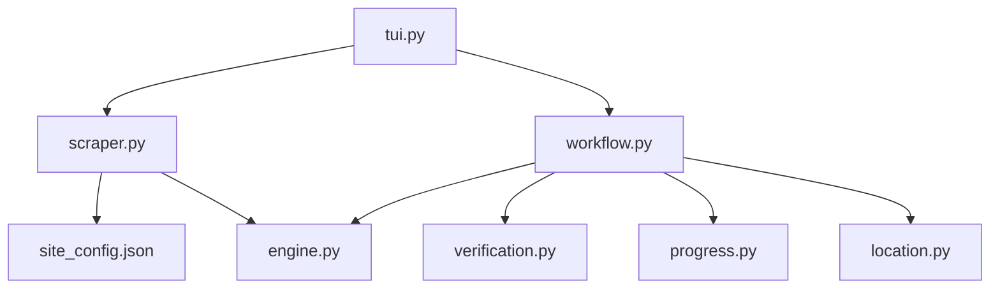

# HentaiMama Scraper

```text
hentaimama
├── README.md
├── __init__.py
├── engine.py
├── location.py
├── progress.py
├── scraper.py
├── site_config.json
├── tui.py
├── verification.py
└── workflow.py
```

## Detailed File Explanations

1. `__init__.py`: Initialization file for the `hentaimama` scraper module, allowing it to be imported as a python package within the larger codebase.
2. `engine.py`: Contains the `HentaimamaEngine` which extends the core `VideoEngine`. This component sets specific headers for impersonation against cloud protections. It dictates how metadata JSON is assembled and written to the `.zine` hidden folder alongside how the cover thumbnail is fetched from the server. Finally, it interfaces with yt-dlp to download the Hentaimama videos securely.
3. `location.py`: A user interface component that queries the user to either pick the default download location or input a custom path. It uses `StorageLayer` validation to ensure that custom paths are syntactically sound and have the correct permissions, ensuring no duplicate directories are accidentally made for the same scraper target.
4. `progress.py`: Generates the visually pleasing terminal UI summarizing the download context. It leverages `rich.tree` to build a metadata tree that outlines the target folder, the scraper source name, how many videos were found in the playlist/series, and exactly how many are already on disk.
5. `scraper.py`: The logic behind extracting video lists and metadata from `hentaimama.io`. The `HentaimamaScraper` utilizes BeautifulSoup to parse URLs. It intelligently detects if a given link is a single episode or a full series page, extracting episode links, series tags, studio, and cover images from the DOM to structure into uniform nodes.
6. `site_config.json`: Basic configuration mapping identifying the module's name as 'Hentaimama' and setting its category to 'Hentai' for routing within the main CLI pipeline.
7. `tui.py`: The entry point for the Hentaimama interactive flow. It first invokes `scraper.py` to retrieve metadata, prints an interactive `Menu` showing the series and episodes, and provides a Single vs Franchise selector. Depending on the choice (quick grab vs vacuum), it dynamically calculates the base download location.
8. `verification.py`: Handles integrity checks to prevent re-downloading media. By querying the `HistoryLayer`, it cross-references the video IDs embedded in local history against the physical MP4 files present in the `sub_folder`. If both checks pass, it instructs the workflow to skip the download.
9. `workflow.py`: The central orchestrator that glues the components together. Called by `tui.py`, it executes collision-free folder creation logic, delegates metadata saving, triggers the cleaning of interrupted `.part` files, hooks up the `progress.py` visual tree, and manages a multithreaded download loop utilizing rich progress bars. It also implements an automatic UI reconstructor in case the internet connection drops mid-download.

## File Call Graph


