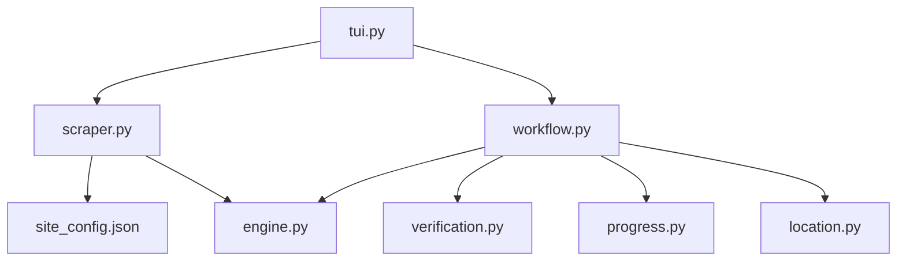

# Hstream Scraper

```text
hstream
├── README.md
├── __init__.py
├── engine.py
├── location.py
├── progress.py
├── scraper.py
├── site_config.json
├── tui.py
├── verification.py
└── workflow.py
```

## Detailed File Explanations

1. `__init__.py`: Package initialization file for the `hstream` sub-scraper module.
2. `engine.py`: Defines `HstreamEngine` expanding upon the `VideoEngine`. Sets necessary Request headers (`hstream.moe` referer). Features avatar/cover download functionality. It constructs the metadata mapping structure and writes it to `.zine/metadata.json`. Finally, since Hstream's streams are natively supported by `yt-dlp`, it passes URLs smoothly to the underlying process without requiring Playwright intervention.
3. `location.py`: TUI module specifically determining the folder location for Hstream downloads. It prompts the user with choices (`DEFAULT` or `CUSTOM`). Upon selecting a custom directory, it rigorously validates that directory string through `StorageLayer` checks and seamlessly integrates subfolders based on whether the scrape is a Vacuum job or a single file download.
4. `progress.py`: A `rich.tree` powered script designed to output an aesthetically pleasing console UI block before downloads execute. It explicitly formats the target folder, source information, how many videos were successfully scraped from the web, and if local matches (already downloaded files) were found.
5. `scraper.py`: Incorporates the `HstreamScraper`. This file parses standard and episode-specific `hstream.moe` URLs, fetching HTML via `BeautifulSoup`. It meticulously matches Regex patterns (`-\d+$`) to map out all related episodes for a series, isolating the cover imagery, finding matching tags/studios directly from anchor query params, and packing them into JSON nodes.
6. `site_config.json`: Simple configuration metadata indicating the scraper name as `Hstream` and its pipeline category classification as `Hentai`.
7. `tui.py`: Manages the interactive menu workflow specific to Hstream. When a user pastes a link, this file orchestrates fetching metadata first, then uses a rich `Selector` to ask if the user intends to download a "Single Episode" or a "Whole Franchise" (flat/nested folders). Based on that, it dictates the `target_root` passed into the workflow.
8. `verification.py`: Employs a robust double-verification protocol. By interfacing with the `HistoryLayer`, this script cross-checks internal `history.json` logs with actual file availability on the local disk (`mp4` extension). This ensures the application never re-downloads a video it already possesses.
9. `workflow.py`: The orchestrator that unites all `hstream` scripts. It delegates target folder calculation, fires the metadata backup routine, triggers `butler.part_cleaner` for interrupted downloads, and initiates a heavily threaded `Live` download console rendering loop. It handles robust retry mechanics, intercepts keyboard interrupts cleanly, and hooks heavily into `yt-dlp` dict responses to provide byte-accurate download speed, baking ETA, and file size estimations in real-time.

## File Call Graph


