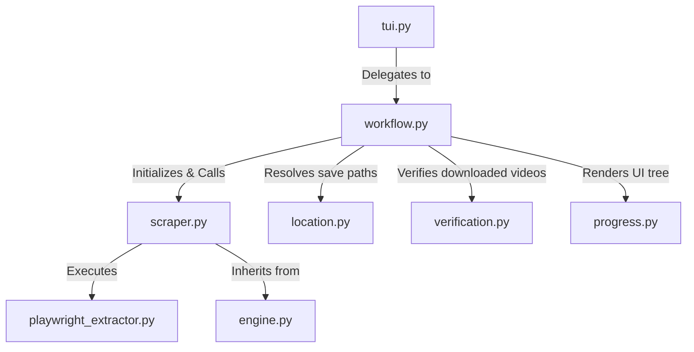

# OHentai Scraper Architecture

## Directory Structure
```
/home/valse-de-anshu/.config/zine scraper/scrapers/ohentai
├── __init__.py
├── engine.py
├── location.py
├── progress.py
├── scraper.py
├── site_config.json
├── tui.py
├── verification.py
└── workflow.py
```

## Module Interactions (Mermaid Graph)


## Detailed File Explanations

### `__init__.py`
Standard Python initialization package file.

### `scraper.py`
A highly customized video scraper targeting ohentai.org.
**Explicit Execution Path**:
- `get_metadata_and_videos`: Acknowledges that OHentai is protected by heavy Cloudflare routing. To extract the HTML safely, it invokes a subprocess executing `playwright_extractor.py` (a headless browser bridge). 
- Once the JSON payload with raw HTML is returned from Playwright, it uses `BeautifulSoup` to parse out the Title, Tags, Description, and Thumbnail.
- It scans all `href` links for `detail.php?vid=`. It maps literal strings like "Episode 2" to aggregate a complete episode list for the series, sorts them numerically, and passes them back for downstream downloading via yt-dlp integration (handled further down the stack).

### `engine.py`
Contains the `OhentaiEngine` logic.
**Explicit Execution Path**:
- Manages standard HTTP sessions where Cloudflare allows, providing the base capabilities. For actual video downloading, it interfaces with the broader `VideoEngine` to pass the URLs acquired by the scraper into external binaries like yt-dlp.

### `workflow.py`
The primary execution controller.
**Explicit Execution Path**:
- Requests the metadata from `scraper.py`.
- Requests the save destination from `location.py`.
- Initiates the download sequence by iterating through the episode URLs, tracking them via `verification.py`, and rendering progress updates to the CLI.

### `location.py`
TUI interface for directory selection.
**Explicit Execution Path**:
- Tailored for NSFW Anime/Video structures. It prompts the user via a terminal menu to define if this goes into a custom directory or the default structured library.

### `verification.py`
Checks the integrity of downloaded episodes.
**Explicit Execution Path**:
- Verifies the existence of `.mp4` or `.mkv` files inside the target folder, updating the central database tracker to prevent redownloads of heavy video assets.

### `site_config.json`
Holds simple configuration metadata for the OHentai module.

### `tui.py`
Simple adapter script that receives the terminal payload and passes control to `workflow.py`.

### `progress.py`
Renders the CLI UI. Uses `rich.tree` to visualize episode lists, cover statuses, and active video download progress bars in an organized manner.
