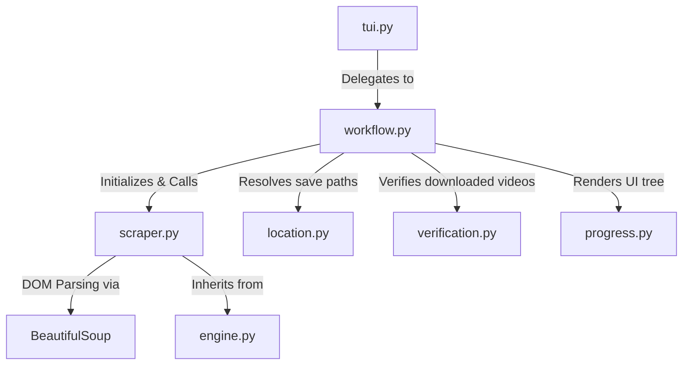

# OppaiStream Scraper Architecture

## Directory Structure
```
/home/valse-de-anshu/.config/zine scraper/scrapers/oppai_stream
├── __init__.py
├── engine.py
├── location.py
├── progress.py
├── scraper.py
├── site_config.json
├── tui.py
├── verification.py
├── workflow.py
└── oppai_stream_toon/
```

## Module Interactions (Mermaid Graph)


## Detailed File Explanations

### `__init__.py`
Standard Python initialization file establishing the directory as a package.

### `scraper.py`
A video scraping implementation for OppaiStream.
**Explicit Execution Path**:
- `get_metadata_and_videos`: Distinguishes between a series overview page and a direct video `/watch?e=` page.
- Extracts the title by parsing the `h1` or `<title>` tag, meticulously stripping out SEO text (e.g., "Watch", "EP 1 in HD").
- Discovers the cover image by scanning `` tags for keywords like 'thumbnail', 'cover', or matching the video slug. It ensures URL normalization (handling spaces via `urllib.parse.quote`).
- Maps out the episodes by finding all `a` tags pointing to `/watch?e=`. It regex-matches the episode numbers, deduplicates them, and sorts them numerically since OppaiStream natively displays them in reverse order.
- Fetches tags and studio metadata. If tags are missing on the root page, it intelligently pings the first episode URL in the background to scrape the metadata from there.

### `engine.py`
Defines `OppaiStreamEngine`.
**Explicit Execution Path**:
- Sets up customized HTTP sessions to bypass basic protections. Passes the resolved URLs upstream to the core `VideoEngine`, bridging the gap to yt-dlp or ffmpeg for the heavy m3u8/mp4 extraction.

### `workflow.py`
The orchestration script mapping the sequence of events.
**Explicit Execution Path**:
- Pulls metadata from `scraper.py`.
- Hands metadata to `location.py` to establish the target OS folder.
- Passes episode lists to `verification.py` to skip already-downloaded videos.
- Orchestrates the video download pipeline while keeping the `rich` TUI updated via `progress.py`.

### `location.py`
Handles directory mapping for NSFW Video resources.
**Explicit Execution Path**:
- Generates CLI menus using `Selector` to ask if the user wants default or custom save paths, returning the structured directory object.

### `verification.py`
The data integrity layer.
**Explicit Execution Path**:
- Scans directories for existing media (`.mp4`, `.mkv`). Flags episodes as complete in the central tracker or marks them for retrieval if the files are corrupted or missing.

### `site_config.json`
A lightweight configuration block used to define site-specific constants or rate limit parameters.

### `tui.py`
A structural interface file. It captures UI invocations and immediately routes execution into `workflow.py`.

### `progress.py`
Renders the CLI visualization.
**Explicit Execution Path**:
- Utilizes `rich.tree` to draw an aesthetic tree depicting the series metadata, total episodes, active download bars, and cover image presence.

### `oppai_stream_toon/`
A specialized subdirectory. This implies OppaiStream hosts a secondary format (likely webtoons/manga) alongside videos. This subdirectory contains a mirrored architecture (engine, scraper, workflow, etc.) explicitly modified to parse and download image sequences instead of video streams.
