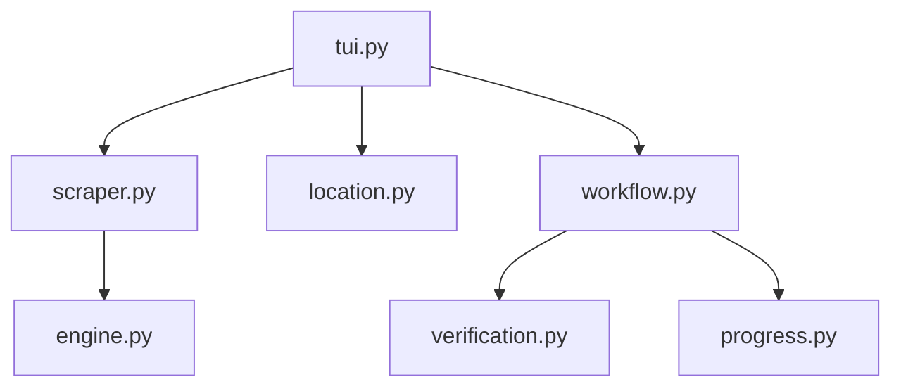

# PornHub Scraper

```text
.
├── __init__.py
├── __pycache__/
├── engine.py
├── location.py
├── progress.py
├── scraper.py
├── tui.py
├── verification.py
└── workflow.py
```

## Architecture and Dependencies



## Detailed File Explanations

### `tui.py`
**What it does:** The text-based user interface entry point for the PornHub scraper, mirroring the system's YouTube scraper architecture.
**Explicit Details:** 
- Distinguishes between two operational routes based on URL input: "Vacuum" mode (downloads all videos from a model/channel page) or "Quick grab" mode (downloads a single isolated video without generating a creator subfolder).
- Uses `active_status` UI components to show a spinner while metadata is loaded synchronously via `scraper.get_metadata_and_videos()`.
- Captures and elegantly displays `RuntimeError` regarding geo-blocks (VPN needed).
- Provides a video quality selection menu (1080p, 720p, 480p, 360p).
- Fetches the final save location via `location.py` and delegates the download orchestration to `workflow.py`.

### `scraper.py`
**What it does:** The primary metadata extractor and link interpreter. It sanitizes input and concurrently fetches detailed metadata for each video.
**Explicit Details:** 
- Defines a regex-heavy `_clean_model_name()` function that decodes HTML entities (e.g., `&#039;`) and aggressively strips out boilerplate suffixes like ` Porn Videos | Pornhub` from page titles.
- Rejects sequential indices and relies heavily on real internal `viewkey` strings extracted from the video URLs to form unique identifiers.
- Uses `ThreadPoolExecutor` (max 20 workers) to massively speed up the retrieval of individual video metadata (duration, views, upload date, likes). To do this as fast as possible, it first attempts to parse embedded `application/ld+json` blocks via standard HTTP requests before falling back to heavier full `yt-dlp` extractions.
- Defines `get_link_type()` to classify links into 'single' or 'model' (including variants like /pornstar/, /channels/, /user/, etc.).

### `engine.py`
**What it does:** Extends the core `VideoEngine` to wrap `yt-dlp` with PornHub-specific configurations (like geo-block detection, cover image downloading, and metadata creation).
**Explicit Details:** 
- Catches known geo-block error substrings (403, 451, "access denied") returned by `yt-dlp` and surfaces them as actionable VPN-related runtime errors.
- Includes `save_metadata()`, which dumps a clean `metadata.json` object. It filters and dynamically creates sub-lists of a model's videos (e.g., "most_viewed", "longest", "top_rated", "latest") using the concurrently fetched metadata from the scraper.
- The `download_pornhub_video()` method uses a dynamically built `yt-dlp` format string to strictly enforce the user's selected resolution preference while forcing MP4 output. It utilizes impersonation (`chrome`) and legacy TLS server connects to bypass standard Cloudflare/bot protections.
- Includes a dedicated `download_avatar()` function which invokes `curl` directly to download model profile pictures (`cover.png`).

### `workflow.py`
**What it does:** The main orchestrator that bridges the TUI, the core file system logic, and the `yt-dlp` downloader.
**Explicit Details:** 
- Evaluates the current mode (Vacuum vs. Quick grab). In Vacuum mode, it guarantees folder collision avoidance by appending the unique creator ID to the directory name if the title already exists.
- In Vacuum mode, it proactively instructs the engine to download the cover image and save the `metadata.json` before starting downloads.
- Calls the standalone `butler/part_cleaner.py` script to sweep out leftover `.part` or `.mp4` chunks from previously interrupted downloads.
- Re-orders the video list chronologically (oldest first) based on `upload_date`. If dates are missing, it assumes the list is newest-first and simply reverses it.
- Wraps the actual engine download call in a retry loop. It manages a Rich `Progress` UI bar using customized yt-dlp hook payloads (evaluating bytes downloaded, speed, and status strings like "Almost done with baking..." during ffmpeg merges).

### `location.py`
**What it does:** Simple interactive module for determining the user's desired download directory for PornHub content.
**Explicit Details:** 
- Functions identically to other modules' `location.py` by relying on `core/paths.py`. It presents an interactive UI allowing the user to either use the default download container directory (e.g., `Zine/Vacuum/pornhub`) or specify a totally custom path on their local drive.
- Verifies the user-input path using the system's Storage Layer to ensure write permissions and disk space are sufficient.

### `progress.py`
**What it does:** Specialized Rich Tree builder to summarize the scraping action visually before downloads begin.
**Explicit Details:** 
- Renders `render_metadata_tree()`, which outputs a sleek "Tokyo Night"-themed UI summary block listing the target destination, total number of videos found, how many are already on disk (existing), and whether a cover photo was successfully downloaded.

### `verification.py`
**What it does:** Performs a strictly regulated idempotency check to avoid double-downloading videos.
**Explicit Details:** 
- Orchestrates a "two-step verification" logic by delegating to the `HistoryLayer`. It ensures that a video ID is both recorded in the local `.zine/history.json` index AND actively exists as an `.mp4` file on the disk.

### `__init__.py`
**What it does:** Standard Python module initializer.
