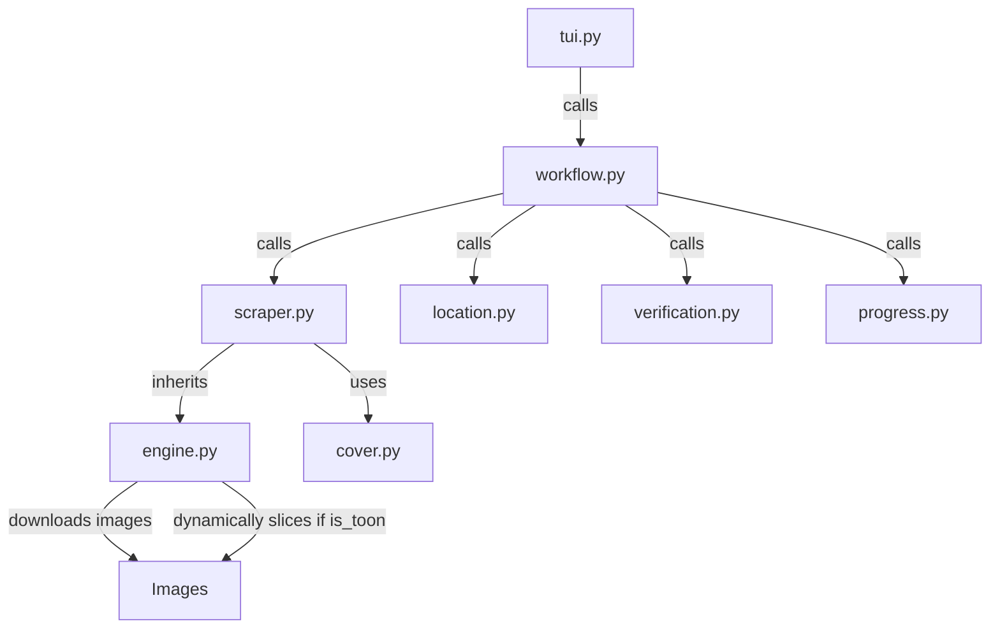

# Hentai18 Scraper

## Directory Structure
```text
hentai18/
├── README.md
├── __init__.py
├── __pycache__/
├── cover.py
├── engine.py
├── location.py
├── progress.py
├── scraper.py
├── tui.py
├── verification.py
└── workflow.py
```

## Architecture Graph


## File Explanations

### `__init__.py`
Standard empty Python module initializer.

### `cover.py`
Contains Hentai18-specific logic to extract the thumbnail cover image URL from the DOM. It looks for `img[src*='/images/thumbs/']` or `div.tit img`, falling back to the core generic extractor if those fail.

### `engine.py`
The base download engine for image scraping. 
- Implements robust `requests` session handling (cookies, user-agents, referers, retries).
- Downloads images concurrently using `ThreadPoolExecutor`.
- Contains a dual-mode saving logic: if the target is flagged as a webtoon (`is_toon`), it uses `Pillow` to stitch and slice the images into continuous 2000px height chunks. Otherwise, it simply moves the downloaded pages as individual files into the chapter folder.

### `location.py`
Presents a TUI using `rich` asking the user where they want to save the manga, categorizing into SFW/NSFW, Ongoing/Completed, or custom paths.

### `progress.py`
Handles UI rendering for download summaries. It uses `rich.tree` to draw a stylized completion tree containing metadata.

### `scraper.py`
Defines `Hentai18Scraper` which inherits from `BaseScraper`. 
- **`get_title_and_chapters`**: Parses the webpage using BeautifulSoup. Extracts descriptions from various possible container classes, authors, and genres. It looks for chapter links matching patterns like `chapter-X` or `ch-X`. It also checks the genres to dynamically set the `is_toon` flag if it detects tags like "webtoon", "manhwa", or "long strip".
- **`process_chapter`**: Target's the chapter page to extract the actual image URLs from containers like `div.item-photo`, `div.read-container`, or `div.page-break`. It filters out ad and UI images, then forwards the clean URLs to the concurrent downloader in `engine.py`.

### `tui.py`
A simple entry-point file that delegates execution to `workflow.py` by calling `run_workflow`.

### `verification.py`
Cross-references the downloaded chapters against the global `history.json` and the physical filesystem (checking for existence of `*.jpg`, `*.png`, etc.). Prevents unnecessary re-downloads of completed chapters and handles legacy directory renaming (`chX` to `ChapterX`).

### `workflow.py`
The central orchestrator for the manga download process:
1. Calls `scraper.get_title_and_chapters()` to get chapter metadata.
2. Calls `location.get_save_path()` to ask the user where to save the files.
3. Invokes `verification.verify_chapters()` to figure out what's missing.
4. Writes local JSON metadata (`meta.json`) inside the hidden `.zine` folder.
5. Initiates a `rich.progress` task and loops through all missing chapters, making calls to `scraper.process_chapter()` in a try-catch block to download content while piping live stats to the UI.
6. Handles graceful recovery of the UI output in case of network failures or terminal artifacts.
