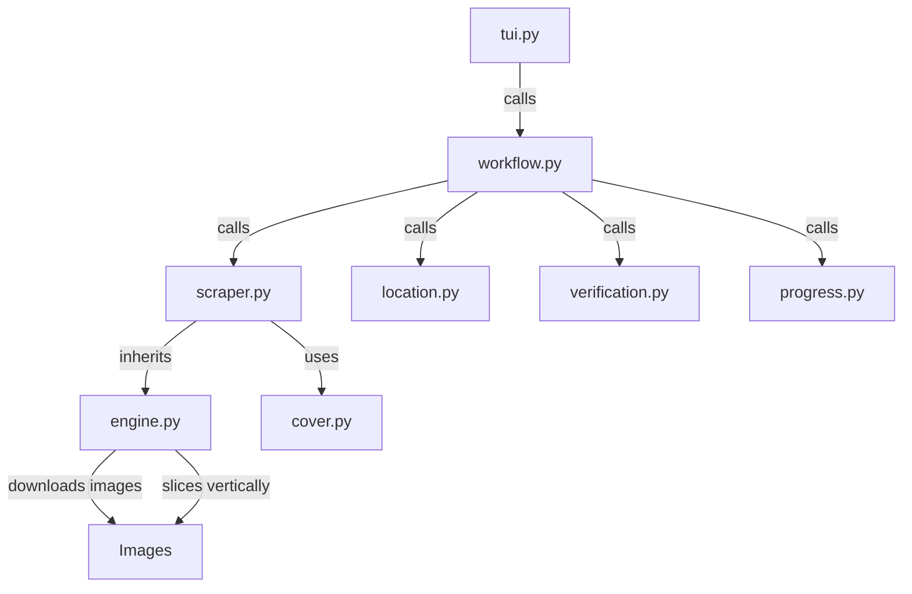

# Hentai20 Scraper

## Directory Structure
```text
hentai20/
├── README.md
├── __init__.py
├── __pycache__/
├── cover.py
├── engine.py
├── location.py
├── progress.py
├── scraper.py
├── tui.py
├── verification.py
└── workflow.py
```

## Architecture Graph


## File Explanations

### `__init__.py`
Standard empty Python module initializer.

### `cover.py`
A minimal passthrough file that delegates cover extraction entirely to the system's `core.generic_cover.extract` function.

### `engine.py`
The base concurrent download engine specifically tuned for webtoons (`scraper_type = "toon"`). 
- It bypasses Cloudflare/bot protections by passing specific `requests` headers and handling custom referers.
- It attempts to download images using `ThreadPoolExecutor`.
- Upon successful download, it ALWAYS feeds the images into a `Pillow` processing pipeline (`slice_and_save`) to stitch the images into a massive vertical canvas and then slice them perfectly into 2000px height chunks.

### `location.py`
Presents a TUI to the user asking where they want to save the toon. It parses out standard categories (SFW/NSFW, Ongoing/Completed) and computes the final `target_dir` for the workflow.

### `progress.py`
Builds a visually appealing `rich.tree` to summarize the metadata of the download session before it starts (e.g. showing Title, Location, Total Chapters, and Cover existence).

### `scraper.py`
Defines `Hentai20Scraper`, extending `BaseScraper`. 
- **`get_title_and_chapters`**: Scrapes the metadata from the `hentai20.io` domain. Finds the title via `h1.entry-title`. Extracts genres from `div.seriestugenre` and tags from `.mgen`. Locates the author via `table.infotable`. Extracts chapter lists primarily from `div.eplister li a` or `div#chapterlist li a`, aggressively parsing numbers out of the URLs or text.
- **`process_chapter`**: Fetches the chapter HTML and extracts the actual image sources from the `div#readerarea img` container, sending them to the engine for concurrent download.

### `tui.py`
The lightweight terminal interface router that immediately hands off execution to `workflow.py`.

### `verification.py`
Cross-references `history.json` and the physical disk. It guarantees that any chapter folder containing valid image files (`*.jpg`, `*.png`, etc.) and possessing a valid history entry will be skipped, saving bandwidth and time.

### `workflow.py`
The main orchestrator for the Hentai20 scraper:
1. Calls `scraper.get_title_and_chapters()` to pull site metadata.
2. Prompts the user for a save path via `location.py`.
3. Creates the target directory and the hidden `.zine/meta.json` file.
4. Downloads the cover image.
5. Cross-checks already downloaded files using `verification.py`.
6. Renders the progress tree, then loops through the missing chapters while updating a live `rich` progress bar.
