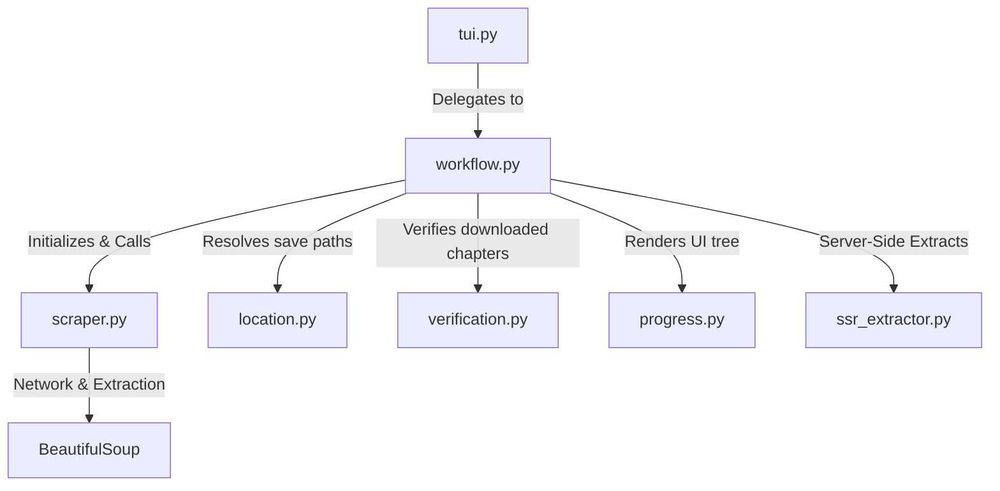

# ManhwaUS Scraper Architecture

## Directory Structure
```
/home/valse-de-anshu/.config/zine scraper/scrapers/manhwaus
├── __init__.py
├── location.py
├── progress.py
├── scraper.py
├── ssr_extractor.py
├── tui.py
├── verification.py
└── workflow.py
```

## Module Interactions (Mermaid Graph)


## Detailed File Explanations

### `__init__.py`
Standard Python initialization file identifying the `manhwaus` directory as a package module.

### `scraper.py`
This module defines the `ManhwaUSScraper` extending `BaseScraper`.
**Explicit Execution Path**:
- `get_title_and_chapters`: Reaches out to the manhwaus URL. Scrapes title from `h1.chapter-name` and strips SEO spam words (like "read online free raw"). Finds chapter anchor tags explicitly looking for `chapter-` in the `href` attribute nested under `ul.row-content-chapter` or `div.panel-manga-chapter`. It extracts the chapter numbers utilizing regex.
- `process_chapter`: Connects to a specific chapter page. It targets `div.container-chapter-reader img` and `div.reading-content img`. It actively filters out any image `src` or `data-src` containing "logo" or "banner" to avoid downloading ad overlays, then feeds the cleaned URLs into the asynchronous engine.

### `workflow.py`
The orchestrator specifically tailored for ManhwaUS.
**Explicit Execution Path**:
- It pulls metadata (title, chapters) from `scraper.py`.
- Coordinates folder creation via `location.py`.
- Tracks downloading state and renders the `rich` UI elements for CLI interaction. It contains extensive logic to resume failed runs, save `meta.json` files, and handle tracker syncing.

### `location.py`
Manages the terminal user interface (TUI) for routing the save path.
**Explicit Execution Path**:
- Interactive prompts for categorizing the comic (SFW/NSFW, Ongoing/Completed).
- Emits structured path configurations to the core `store_layer` to physically allocate folders on the disk.

### `verification.py`
The chapter integrity verification system.
**Explicit Execution Path**:
- Scans target folders for existing image assets (`.png`, `.jpg`).
- Checks internal database to see if the chapter is marked as complete. If the files are absent but marked complete, it flags them for re-download and unmarks the database.
- Purges temporary artifacts.

### `ssr_extractor.py`
A specialized Server-Side Rendering (SSR) fallback extractor.
**Explicit Execution Path**:
- Because modern ManhwaUS sites often hide payload data behind JavaScript, this file uses secondary techniques (possibly evaluating server-side payloads, hydration scripts, or utilizing headless browsers) to grab image lists when standard DOM parsing fails.

### `tui.py`
The entry layer. Captures the scrape command arguments and dynamically shifts execution into `workflow.py`.

### `progress.py`
Handles UI feedback. Renders dynamic `rich` console trees indicating downloaded chapters, missing chapters, cover existence, and overall metadata layout in the terminal.
