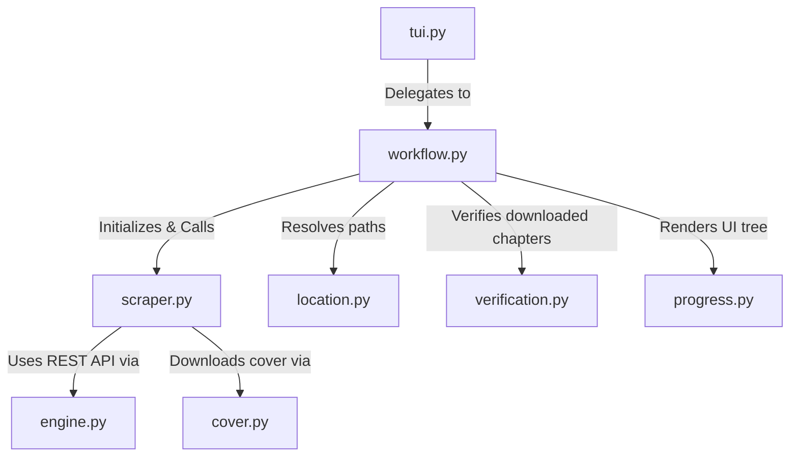

# OmegaScans Scraper Architecture

## Directory Structure
```
/home/valse-de-anshu/.config/zine scraper/scrapers/omegascans
├── __init__.py
├── cover.py
├── engine.py
├── location.py
├── progress.py
├── scraper.py
├── tui.py
├── verification.py
├── workflow.py
└── workflow.py.bak_quickgrab
```

## Module Interactions (Mermaid Graph)


## Detailed File Explanations

### `__init__.py`
Standard Python initialization file establishing module import routes.

### `scraper.py`
Reverse-engineered API scraper for OmegaScans' Next.js frontend.
**Explicit Execution Path**:
- Unlike traditional DOM scraping, this file exclusively uses the OmegaScans REST API (`api.omegascans.org`).
- `get_title_and_chapters`: Parses the URL to grab the `series_slug`. Hits `/series/{series_slug}` to get raw JSON metadata (Title, Author, Tags). Then queries `/chapter/query?series_id={id}` to get a highly structured JSON array of all chapters. Sorts them from oldest to newest.
- `process_chapter`: To get images for a specific chapter, it accesses the `/chapter/{series_slug}/{chapter_slug}` endpoint. It isolates the `chapter_data.images` array, deduplicates the direct CDN links, and immediately delegates the heavy lifting to `download_chapter` imported from `engine.py`.

### `engine.py`
The powerhouse backend script explicitly tuned for OmegaScans.
**Explicit Execution Path**:
- `make_api_session`: Crafts HTTP sessions with specialized headers required to talk to the Omega API without being flagged.
- `download_chapter`: Orchestrates the `ThreadPoolExecutor`. It handles asynchronous, parallel downloads of the image URLs provided by the scraper, manages retries, and executes the `PIL` logic to stitch and slice vertical images into normalized chunks.

### `workflow.py`
The orchestration script mapping the sequence of events.
**Explicit Execution Path**:
- Clears the terminal and pulls metadata from `scraper.py`.
- Requests folder structure from `location.py`.
- Generates `.zine/meta.json` inside the output directory.
- Filters out already downloaded chapters using `verification.py`.
- Iterates over the remaining chapters, piping them into `scraper.process_chapter` and updating the `rich` UI dynamically.

### `location.py`
The directory routing TUI.
**Explicit Execution Path**:
- Displays terminal menus querying the user for categorizations (SFW/NSFW) and resolves the absolute path via the core `store_layer`.

### `verification.py`
The state validator.
**Explicit Execution Path**:
- Checks local folders (e.g. `Chapter1`) for expected image assets. Cross-checks against the global SQLite tracker. Fixes anomalies like empty folders or broken cache states before authorizing a download.

### `cover.py`
Downloads the thumbnail.
**Explicit Execution Path**:
- Small helper script that accepts the cover URL extracted from the API JSON and downloads it to `cover.jpg` inside the manga root folder.

### `tui.py`
A simple pass-through file. Instantiates the TUI flow by executing `workflow.py`.

### `progress.py`
Creates aesthetic terminal outputs.
**Explicit Execution Path**:
- Utilizes the `rich` library to draw a tree representing manga metadata, total chapters, existing verified chunks, and cover art presence.

### `workflow.py.bak_quickgrab`
A backup/legacy script that allowed fast single-chapter downloads without the overhead of full series metadata generation.
