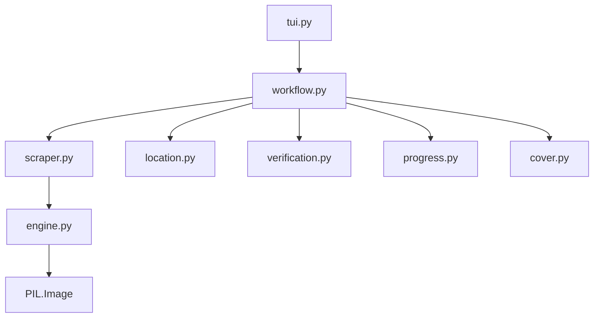

# AsmHentai Scraper

## Directory Tree
```text
.
├── __init__.py
├── cover.py
├── engine.py
├── location.py
├── progress.py
├── scraper.py
├── tui.py
├── verification.py
├── workflow.py
└── workflow.py.bak_quickgrab
```

## Architecture Graph


## Detailed File Explanations

### `__init__.py`
Standard Python package file marking this directory as the `asmhentai` module.

### `cover.py`
A lightweight wrapper that delegates cover extraction logic to the shared `core.generic_cover.extract` function.

### `engine.py`
A highly sophisticated image scraping engine built specifically for manga/toon sites.
- **`download_image`**: Robustly handles HTTP requests by forging `Referer` headers based on the domain or the specific gallery page. It strictly validates response MIME types to prevent downloading ads or tracker pixels. It automatically renames downloaded files to match their true binary format (e.g. converting a `.jpg` url payload to `.webp` locally if the server lied).
- **`process_chapter_multi`**: Executes concurrent image downloading using a `ThreadPoolExecutor` to saturate network bandwidth.
- **`slice_and_save`**: The baking engine. Uses `Pillow` (PIL) to stitch all downloaded pages of a gallery into one gigantic vertical canvas, then automatically slices the canvas down into perfectly standardized 2000px-height chunks. This forces the output to be optimized for infinite-scrolling comic reader applications, regardless of the original source dimensions.

### `location.py`
Calculates the absolute path for storing the gallery on disk.
- **`get_save_path`**: Operates an interactive UI flow prompting the user to classify the gallery as `SFW` or `NSFW`, and `Ongoing` or `Complete`. Builds the final nested taxonomy path or allows a custom directory override.

### `progress.py`
Handles terminal visual feedback.
- **`render_completion_tree`**: Uses `rich.tree` to draw a console tree displaying the destination folder, gallery ID, total page count, and skipped/verified pages.

### `scraper.py`
Contains `AsmHentaiScraper`.
- **`get_title_and_chapters`**: Parses `asmhentai.com` gallery structures (e.g. `/g/{id}/`). It scrapes title, tags, artists, and categories from the DOM.
- **`_download_with_retry`**: Crucially, it extracts a hidden HTML input value (`input#load_dir`) to figure out which underlying CDN shard the gallery is hosted on. It then dynamically constructs image URLs targeting `images.asmhentai.com/{dir_id}/{gallery_id}/{page}.(jpg|png|webp)`.

### `tui.py`
Simple CLI entry point invoking `handle_tui` which passes core instances into the main workflow runner.

### `verification.py`
Handles idempotency and cleanup.
- **`verify_chapters`**: Checks local disk to ensure downloaded galleries contain valid images (`.png`, `.jpg`, `.webp`, `.avif`). It aggressively cleans up `_temp_` directories left behind if the scraper previously crashed mid-bake. Synchronizes its findings with the SQLite `tracker`.

### `workflow.py`
The master orchestrator file for the AsmHentai pipeline.
1. Calls `scraper.py` for metadata and CDN resolution.
2. Creates the library taxonomy folder via `location.py` and writes a rich `.zine/meta.json` payload detailing the gallery's tags and author.
3. Downloads the cover art.
4. Checks local disk via `verification.py` to skip existing galleries.
5. Invokes the engine's download and slice-baking loop. It maintains a `rich.live` progress bar that cycles through states (Downloading pages → Baking slices).
6. Registers a `tui_reconstruct` callback with the `whistleblower` module to gracefully restore the UI and resume downloading if the internet connection is temporarily lost.

### `workflow.py.bak_quickgrab`
A development backup of `workflow.py`, likely preserved while implementing the "Quick grab" bypass logic.
