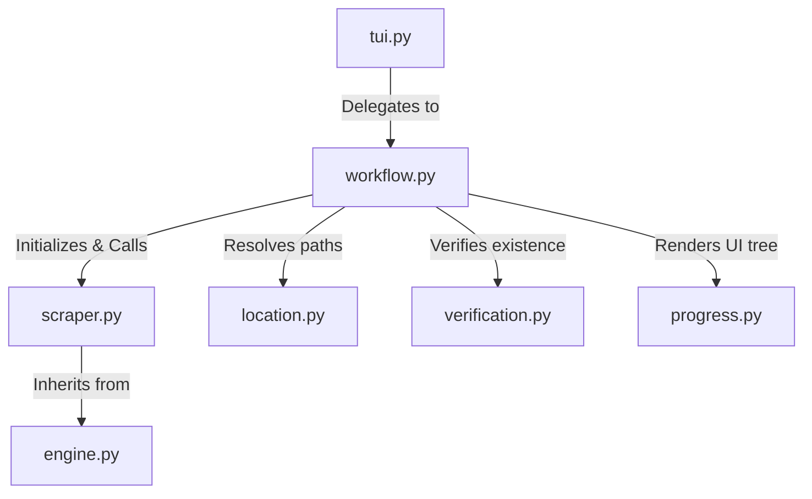

# NHentai Scraper Architecture

## Directory Structure
```
/home/valse-de-anshu/.config/zine scraper/scrapers/nhentai
├── __init__.py
├── engine.py
├── location.py
├── progress.py
├── scraper.py
├── site_config.json
├── tui.py
├── verification.py
└── workflow.py
```

## Module Interactions (Mermaid Graph)


## Detailed File Explanations

### `__init__.py`
Standard initialization package wrapper.

### `scraper.py`
The core parser for nhentai galleries.
**Explicit Execution Path**:
- Initializer normalizes any URL format to the standard `nhentai.net/g/{gallery_id}` base.
- `_fetch_gallery_data`: Implements a 3-tier fallback strategy for metadata: 
  1. API directly via `/api/gallery/{id}`. 
  2. HTML Regex search for `window._gallery` or `JSON.parse`. 
  3. SvelteKit dehydration blocks hunting for `application/json` script tags.
- `get_title_and_chapters`: Organizes the JSON metadata into title, tags, cover urls, and genres. Sets the single gallery as "Chapter 1".
- `process_chapter`: Identifies the `media_id` and image extensions (`j`, `p`, `w`) to synthetically construct image URLs pointing to `i.nhentai.net`. If metadata is totally obscured, it triggers `_download_with_retry` (Plan C) which exhaustively brute-forces image extensions (`.jpg`, `.png`, `.webp`) against the CDN directly.

### `engine.py`
Defines `BaseScraper`.
**Explicit Execution Path**:
- Provides HTTP request masking (Chrome headers).
- Executes `process_chapter_multi` to concurrently download the generated CDN image links.
- Uses PIL in `slice_and_save` to repackage, optimize, and horizontally/vertically arrange images if required, converting everything safely into standard formats.

### `workflow.py`
The orchestrator framework.
**Explicit Execution Path**:
- Triggers metadata extraction.
- Invokes `location.py` to determine saving paths.
- Dumps metadata into `.zine/meta.json`.
- Kicks off the download sequence, displaying multi-threaded rich progress bars in the terminal.

### `location.py`
Provides TUI interactions specifically routed for NSFW content.
**Explicit Execution Path**:
- Bypasses standard generic menus and forces logic targeting NSFW comic libraries. Determines default vs custom directory paths based on terminal input.

### `verification.py`
Integrity verifier.
**Explicit Execution Path**:
- Looks at the `Chapter1` (or gallery) folder, checking if valid images exist and comparing them with the internal SQLite tracker. Handles cleaning up `_temp` folders.

### `site_config.json`
A lightweight JSON payload defining specific attributes for this scraper (e.g., domain name, rate limits, enabled features).

### `tui.py`
The entrypoint interface layer for the UI. Immediately delegates to `workflow.py`.

### `progress.py`
Utilizes `rich.tree` to draw beautiful CLI representations of the gallery metadata, tags, cover status, and overall download completeness.
