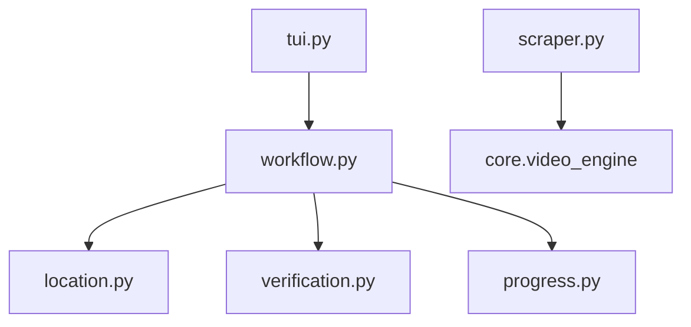

# Generic yt-dlp Scraper

```text
.
├── __init__.py
├── __pycache__/
├── location.py
├── progress.py
├── scraper.py
├── tui.py
├── verification.py
└── workflow.py
```

## Architecture and Dependencies



## Detailed File Explanations

### `tui.py`
**What it does:** The text UI entry point for the generic yt-dlp fallback scraper.
**Explicit Details:** 
- Extremely minimalist. It acts purely as a pass-through module to execute `run_workflow()` from `workflow.py` without requiring specific configuration menus, as it is a generic fallback handler for URLs that aren't officially supported by dedicated modules (like YouTube, PornHub, etc.).

### `scraper.py`
**What it does:** Extracts video and playlist metadata using yt-dlp's generic extractors.
**Explicit Details:** 
- Wraps `core.video_engine.VideoEngine`.
- Attempts to extract playlist data first. If yt-dlp returns a single URL or fails to recognize a playlist, it gracefully falls back to extracting standard single-video metadata.
- Formats standard properties like Channel/Series name, Total Videos, and Thumbnails, pulling from the `yt-dlp` output `info` dictionary (e.g. favoring `uploader`, `channel`, or `title`).

### `workflow.py`
**What it does:** Orchestrates downloading and file system operations for generic media URLs.
**Explicit Details:** 
- Standardizes metadata structures and attempts to download cover/thumbnail art using `scraper.engine.save_metadata()`.
- Implements `butler/part_cleaner.py` to scrub `.part` or unfinished files left over from aborted download attempts.
- Defines a custom interactive terminal rendering loop using `Rich` components (Progress bars, Live trees) displaying download speed, estimated completion times, and a visual representation of the current download queue.
- Re-routes file tracking through the `Tracker` to guarantee accurate log keeping despite using unpredictable generic extractors.

### `location.py`
**What it does:** Path resolution UI for generic media.
**Explicit Details:** 
- Interfaces with the Zine ConfigLayer (`core.config`) to check if the user has assigned a "quick grab" path for music/video downloads.
- If no quick grab is active, it drops back into an interactive terminal menu allowing the user to select the default Zine target directory (e.g., `Zine/Vacuum/ytdlp`) or input a custom absolute path which is validated securely by the Storage Layer.

### `progress.py`
**What it does:** UI generation for the pre-download confirmation screen.
**Explicit Details:** 
- Provides `render_completion_tree()`, a function that takes the parsed metadata, target folder, and currently verified local files, constructing a highly legible `Tree` UI element explicitly communicating to the user exactly where files will go and what will be skipped.

### `verification.py`
**What it does:** Ensures that duplicate files are not downloaded.
**Explicit Details:** 
- A simple passthrough module that hooks into `HistoryLayer.sync_local_history()`. It ensures that the specific track/video ID exists both in the `.zine/history.json` and physically on the disk as a media file before flagging it as verified.
