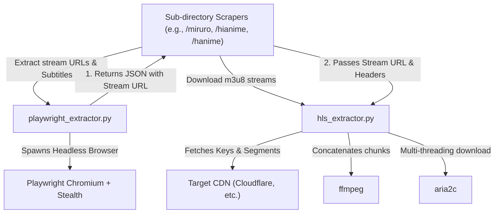

# Scrapers Directory - Root Files Overview

## 1. Directory Tree (Root Files Only)

```text
scrapers/
├── README.md
├── __init__.py
├── hls_extractor.py
└── playwright_extractor.py
```

## 2. Overview of the Root Files

The root files in this directory serve as the foundational backend extraction and downloading engines for the individual site scrapers (which reside in their respective subdirectories). These scripts act as isolated workers that can be invoked across the suite to handle complex stream resolution, JavaScript execution, and resilient video downloading without tightly coupling those processes to the specific scraper's logic.

---

## 3. Web-Like Structure & Connections



- **Integration with Site Scrapers (`scrapers/<site>/`)**: The individual site scrapers orchestrate the workflow. When they encounter an obfuscated video player, they invoke `playwright_extractor.py` (often via a subprocess or async call) to sniff the network traffic and extract the raw `.m3u8` or `.mp4` stream URLs along with subtitles.
- **HLS Downloading**: Once the raw stream URL is obtained, the site scraper calls `hls_extractor.py` to efficiently download the fragmented video. 
- **Decoupling Strategy**: By keeping these tools as standalone CLI-like Python scripts, the system maintains **absolute site-level isolation**. If `playwright` crashes or gets stuck, it does not crash the main scraper monolith. The main scraper simply reads the JSON output from `sys.stdout`.

---

## 4. Super Detailed Explanations

### `__init__.py`
An empty initializer file.
- **What it does:** Marks the `scrapers` directory as a Python package, allowing other modules (like the core orchestrator or shared tools) to import site scrapers dynamically or reference this path as a module.

### `hls_extractor.py`
A highly resilient, anti-bot-bypassing HTTP Live Streaming (HLS) downloader designed to fetch `.m3u8` playlists and assemble `.ts` video chunks into a single file.

**What it actually does:**
- **TLS Fingerprint Spoofing:** Uses the `curl_cffi` library to impersonate a Chrome 124 browser, completely bypassing standard Cloudflare/DDoS-Guard protections that block typical Python `requests`.
- **Bandwidth Selection:** If it encounters a master playlist (`#EXT-X-STREAM-INF`), it automatically parses the file and selects the sub-playlist with the highest available bandwidth.
- **AES-128 Decryption:** Reads `#EXT-X-KEY` tags, fetches the decryption keys, identifies the Initialization Vector (IV), and decrypts every single `.ts` chunk using the `pycryptodome` library (`Crypto.Cipher.AES`).
- **Obfuscation / PNG Header Stripping:** Specifically designed to counter ad-network CDNs (like Vivibebe/Vidstreaming) that disguise video chunks as PNG images. It scans the byte stream for the PNG signature (`\x89PNG`) and the `IEND` marker, slices off the fake image header, and extracts the raw video data underneath.
- **Concurrent Downloading:** Attempts to use `aria2c` for extremely fast, concurrent chunk downloading. If `aria2c` is not installed, it falls back to Python's native `ThreadPoolExecutor` with a thread limit.
- **State Resumption:** Saves chunks to a temporary `_parts` directory. If the download is interrupted, it calculates the sizes of existing chunks and seamlessly resumes where it left off.
- **Progress Broadcasting:** Prints structured JSON messages (status, downloaded_bytes, speed) to `stdout`, which allows the calling scraper/TUI to display a live progress bar.
- **Baking (Concatenation):** Pipes the ordered, decrypted, and cleaned video chunks directly into `ffmpeg` via standard input (`pipe:0`). `ffmpeg` losslessly copies the streams (`-c copy`) and multiplexes them into the final output file without re-encoding.

### `playwright_extractor.py`
An automated, headless Chromium browser orchestration script used to defeat complex JavaScript challenges, React hydration, and dynamic stream generation.

**What it actually does:**
- **Dynamic VENV Bootstrapping:** Since it may be executed in isolated environments, it dynamically crawls up the directory tree to find the project's virtual environment (`.venv`, `env`, etc.) and forcibly injects it into `sys.path` so it can access `playwright` and other dependencies.
- **Headless Stealth Browsing:** Launches Chromium using `playwright_stealth` to strip automation markers (like `webdriver=true`), preventing sites from detecting that a bot is visiting.
- **Network Interception & Sniffing:** Instead of parsing HTML, it hooks into the browser's `page.on("response")` event to listen to every single network request made by the page:
  - **Captures Streams:** Looks for URLs containing `.m3u8`, `videoplayback`, or `.mp4` while actively filtering out known ad-network signatures (`adtng`, `doubleclick`, `ping.gif`).
  - **Captures Subtitles:** Intercepts `.vtt` and `.srt` subtitle files, applying heuristic language detection based on the URL string (e.g., matching "jpn" to Japanese).
  - **API Peeking:** Includes site-specific hooks (like sniffing Miruro's `secure/pipe` JSON API) to extract subtitle tracks before they are even loaded into the DOM.
  - **JWPlayer Bypass:** Parses specialized telemetry pings (like `jwpltx.com` requests containing `mu=` parameters) to find the true, hidden `.mp4` URL when standard streaming URLs are obfuscated.
- **Simulated Interaction:** Navigates to the target page, waits for React/JS frameworks to hydrate, and then forcefully attempts to click the `<video>` element or various common play buttons (`.jw-icon-display`, `.vjs-big-play-button`). This tricks the lazy-loading player into fetching the stream.
- **JSON Output:** After polling and successfully capturing the target stream and subtitles, it gracefully closes the browser and dumps a prefixed JSON string (`JSON_RESULT:{...}`) to standard output, making it extremely easy for the calling scraper to parse the extracted endpoints.
