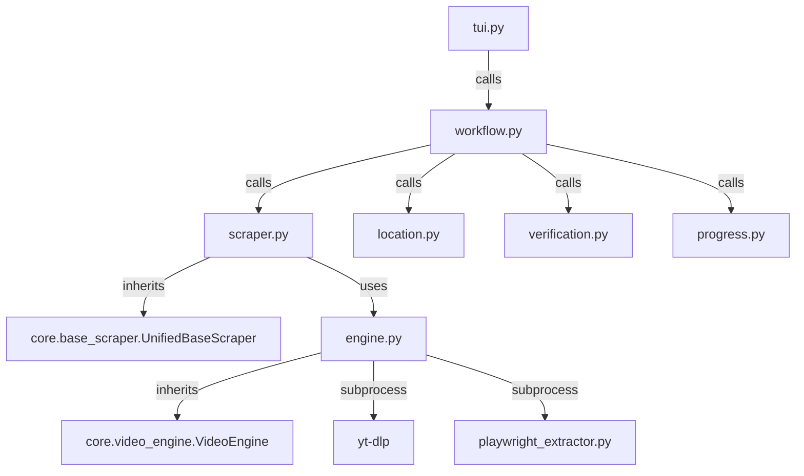

# HanimeRed Scraper

## Directory Structure
```text
hanime_red/
├── README.md
├── __init__.py
├── __pycache__/
├── engine.py
├── location.py
├── progress.py
├── scraper.py
├── site_config.json
├── tui.py
├── verification.py
└── workflow.py
```

## Architecture Graph


## File Explanations

### `__init__.py`
Standard empty Python module initializer.

### `engine.py`
Defines `HanimeRedEngine`, extending the core `VideoEngine`.
- Notably different from the standard Hanime scraper: it first runs the `playwright_extractor.py` subprocess to scrape out subtitle tracks (`.vtt` or `.srt`) before invoking `yt-dlp` to download the main video.
- Formats and writes `metadata.json` for franchises and downloads profile/cover pictures (`cover.jpg`).

### `location.py`
Provides the `rich` text user interface prompt to select between "Default" and "Custom" target save locations. It resolves the final target save path and forces the path string into a specific `hanime_red` subfolder.

### `progress.py`
Draws the `rich.tree` UI component that visually summarizes the intended download state before beginning: Title, Location, Source, Total videos, Existing videos, and Cover image presence.

### `scraper.py`
Defines `HanimeRedScraper`. It visits the URL using `requests` and parses the DOM using `BeautifulSoup`.
- It finds metadata (Studio, Release Date, Summary) by searching for matching text nodes and traversing to adjacent sibling nodes.
- Has specialized logic for crawling series episodes: it extracts the base slug (e.g., removing `-episode-11`), scans the DOM for all anchors matching the pattern, automatically determines the max episode number, and generates the gap URLs ensuring no episodes are skipped.

### `site_config.json`
Configuration file holding the primary domain (`hanime.red`) and the base APIs/Regex patterns for URL slugs.

### `tui.py`
The primary UI logic. It handles fetching the metadata and then presents the terminal menu asking the user to choose their target workflow:
- Single Episode (Quick Grab)
- Whole Franchise (Vacuum: Flat Folder)
- Whole Franchise (Vacuum: Nested Subfolders)
Passes the configurations down to `workflow.py`.

### `verification.py`
Checks idempotency by ensuring a video doesn't get downloaded twice. Relies on the `HistoryLayer` to perform a two-step verification: confirming the video is tracked in `.zine/history.json` and physically present as an `.mp4` on disk.

### `workflow.py`
The overarching orchestration file:
1. Calculates safe folder names avoiding collisions.
2. Cleans up `.part` chunks using `butler.part_cleaner`.
3. Calls the engine to save `metadata.json` and download the `cover.jpg` image.
4. Loops over every episode, invokes `verify_videos`, and executes the download using a dynamic `rich.progress` bar.
5. Provides a `tui_reconstruct` callback to seamlessly restore the terminal UI in the event of an internet reconnect.
