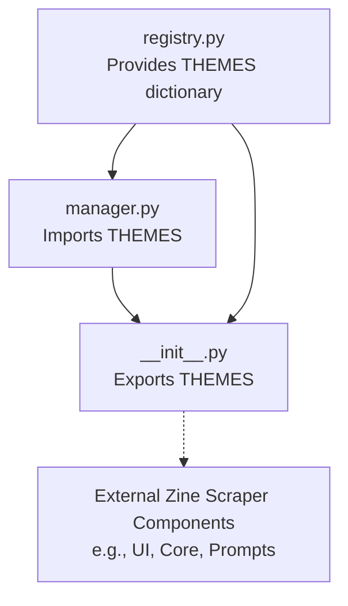

# Zine Scraper - Theme Module

## 🌳 Directory Tree
```text
theme/
├── README.md       # (This file) Documentation of the theme module
├── __init__.py     # Module initializer and exports
├── manager.py      # Core theme application logic and ANSI extractors
└── registry.py     # Massive dictionary of beautiful, calming dark themes
```

## 🕸️ Web-Like Structure & Dependencies

The `theme` module follows a clean, unidirectional dependency flow designed for easy consumption by the broader `Zine Scraper` ecosystem:

*   **`registry.py`**: The foundational data layer. It has zero internal dependencies.
*   **`manager.py`**: The logic layer. It imports the `THEMES` dictionary from `registry.py` to retrieve color data and relies on `rich.style.Style` for terminal formatting.
*   **`__init__.py`**: The public API layer. It imports from both `registry.py` and `manager.py` to expose a clean, top-level interface.

**Dependency Graph:**


---

## 📄 File Explanations (Super Detailed)

### 1. `registry.py`
**What it is:** The central database and configuration file for visual styles.
**What it actually does:** It contains a massive Python dictionary named `THEMES`. This dictionary defines 60 carefully curated terminal color palettes (e.g., `tokyo-night-storm`, `catppuccin`, `dracula`, `nord`). For each theme, it maps 12 specific semantic UI elements to color hex codes or `Rich` text style tags:
*   `info`: Standard informational text color.
*   `warning`: Warning text color.
*   `error`: Bold red/danger color for errors.
*   `success`: Bold green color for successful operations.
*   `site`: Accent color highlighting scraped site names.
*   `title`: Main header and title text color.
*   `count`: Counter and number highlighting color.
*   `menu`: General menu and UI border color.
*   `selected`: Active selection highlight for interactive TTY prompts.
*   `unselected`: Inactive/dimmed color for unselected items.
*   `tree.line`: Subdued color used for drawing structural UI tree branches.
*   `sexy_pink`: A distinct accent color matching specific branding aesthetic needs.

### 2. `manager.py`
**What it is:** The runtime logic handler for dynamic terminal styling.
**What it actually does:** It provides two critical utility functions for manipulating the terminal UI at runtime:
1.  **`apply_theme(console, theme_name: str)`**: 
    *   Takes a `rich.Console` instance and a `theme_name`.
    *   Fetches the corresponding dictionary of style strings from `registry.THEMES`. It defaults to the `tokyo-night-storm` fallback if the requested theme is missing.
    *   Iterates through the semantic keys and injects them directly into the active console's underlying theme stack (`console._theme_stack._entries[-1]`). 
    *   It uses `Style.parse(style_str)` to convert string declarations into native `Rich` style objects, allowing the application to live-update its entire color palette on the fly without needing a restart.
2.  **`get_theme_input_ansi(console) -> str`**: 
    *   Extracts the raw ANSI escape sequence corresponding to the active theme's `selected` color. 
    *   It accesses the active console's theme stack, parses the TrueColor (RGB) properties of the `selected` style, and formats an exact ANSI string (`\033[38;2;R;G;Bm`). 
    *   If parsing fails, it safely falls back to a hardcoded `#bb9af7` (Lavender) sequence. This is essential for components that bypass `Rich` (like standard `input()` prompts) but still need to visually match the user's active theme.

### 3. `__init__.py`
**What it is:** The package entry point and API exposure layer.
**What it actually does:** It converts the `theme` directory into a standard, importable Python package. By explicitly importing `THEMES` from `registry.py`, and `apply_theme` & `get_theme_input_ansi` from `manager.py`, it flattens the import structure. This allows external scripts across the Zine Scraper codebase to simply write `from theme import THEMES, apply_theme` instead of routing through exact file paths. It acts as a clean facade, hiding the internal separation of data and logic from the rest of the application.
